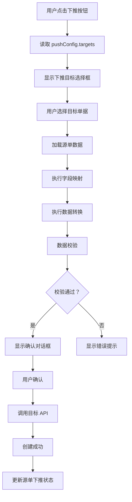

# ERP 配置化页面优化方案 2026-03-22

> 🎯 **目标**: 构建灵活自由快速配置化的公共 ERP 模块  
> 📦 **适用范围**: RuoYi-WMS + Vue 3 + Element Plus  
> 🚀 **核心理念**: 配置驱动 > 代码开发

---

## 📋 目录

1. [现有架构分析](#现有架构分析)
2. [优化目标与需求](#优化目标与需求)
3. [核心功能优化方案](#核心功能优化方案)
4. [配置结构升级](#配置结构升级)
5. [下推机制设计](#下推机制设计)
6. [权限审批配置化](#权限审批配置化)
7. [实施路线图](#实施路线图)

---

## 现有架构分析

### ✅ 已有优势

#### 1. 配置化驱动
- JSON 配置控制页面行为
- 支持搜索、表格、表单、抽屉配置
- 字典数据自动翻译

#### 2. 快速复用
- `copy-module-v2.ps1` 脚本一键复制
- 标准化的组件结构
- 统一的样式规范

#### 3. 灵活渲染
- 支持多种字段类型（input、select、date 等）
- 支持多种渲染方式（text、tag、currency、percent 等）
- 支持展开行和抽屉详情

### ⚠️ 待优化点

1. ❌ **缺少下推机制配置** - 无法配置单据下推流程
2. ❌ **缺少接收下推配置** - 无法配置接收上游单据
3. ❌ **权限配置不够灵活** - 硬编码权限判断逻辑
4. ❌ **审批流程未配置化** - 审核/反审核逻辑需编码实现
5. ❌ **按钮功能扩展性弱** - 自定义按钮需修改模板

---

## 优化目标与需求

### 🎯 五大核心目标

#### 1️⃣ 列表显示 + 增删改查按钮功能

**现状**: 基础 CRUD 已实现，但扩展性不足

**优化方向**:
- ✅ 工具栏按钮完全配置化
- ✅ 行操作按钮可配置
- ✅ 批量操作可配置
- ✅ 按钮权限动态控制

#### 2️⃣ 新增/查看/修改页面的主表 + 附表数据区

**现状**: 支持页签形式的明细表格和成本表单

**优化方向**:
- ✅ 主表字段动态生成
- ✅ 附表（页签）数量不限
- ✅ 每个页签可是表格/表单/描述列表
- ✅ 页签间数据联动

#### 3️⃣ 权限、审批条件化配置

**现状**: 权限通过 permissionPrefix 控制

**优化方向**:
- ✅ 权限点细粒度配置（按钮级、字段级）
- ✅ 审批状态流转配置化
- ✅ 审批条件规则引擎
- ✅ 多级审批流程配置

#### 4️⃣ 下推机制 - 可下推的模块列表配置

**现状**: 无下推机制

**优化方向**:
- ✅ 配置可下推的目标模块
- ✅ 下推字段映射关系
- ✅ 下推数据转换规则
- ✅ 下推按钮动态生成

#### 5️⃣ 接收下推机制配置

**现状**: 无接收下推机制

**优化方向**:
- ✅ 配置可接收的源模块
- ✅ 接收字段映射
- ✅ 数据校验规则
- ✅ 自动生成关联单据

---

## 核心功能优化方案

### 1️⃣ 列表显示 + 增删改查增强

#### 配置示例

```json
{
  "actionConfig": {
    "toolbar": [
      {
        "type": "primary",
        "label": "新增",
        "icon": "Plus",
        "permission": "k3:saleOrder:add",
        "handler": "handleAdd",
        "position": "left",
        "visible": true,
        "disabled": false
      },
      {
        "type": "success",
        "label": "审核",
        "icon": "CircleCheck",
        "permission": "k3:saleOrder:audit",
        "handler": "handleAudit",
        "disabled": "multiple",
        "confirm": {
          "show": true,
          "message": "是否确认审核选中的 {count} 条数据？",
          "type": "warning"
        }
      },
      {
        "type": "info",
        "label": "下推",
        "icon": "Download",
        "permission": "k3:saleOrder:push",
        "handler": "handlePush",
        "dropdown": {
          "show": true,
          "optionsField": "pushTargets",
          "clickHandler": "handlePushTarget"
        }
      }
    ],
    "row": [
      {
        "type": "primary",
        "label": "查看",
        "icon": "View",
        "handler": "handleViewDetail",
        "permission": "k3:saleOrder:view"
      },
      {
        "type": "success",
        "label": "编辑",
        "icon": "Edit",
        "handler": "handleUpdate",
        "permission": "k3:saleOrder:edit",
        "visible": "row.fDocumentStatus === 'Z'"
      }
    ]
  }
}
```

#### 新增功能说明

**按钮可见性条件**:
```javascript
// 支持表达式判断
visible: "row.fDocumentStatus === 'Z'"  // 仅暂存状态可编辑
```

**下拉按钮组**:
```json
{
  "dropdown": {
    "show": true,
    "optionsField": "pushTargets",  // 从配置读取下推目标
    "clickHandler": "handlePushTarget"
  }
}
```

---

### 2️⃣ 主表 + 附表数据区增强

#### 配置示例

```json
{
  "formConfig": {
    "dialogWidth": "1400px",
    "labelWidth": "120px",
    "sections": [
      {
        "title": "基本信息",
        "icon": "Document",
        "columns": 4,
        "fields": [
          {
            "field": "fBillNo",
            "label": "单据编号",
            "component": "input",
            "span": 6,
            "required": true,
            "rules": [
              { "required": true, "message": "单据编号不能为空", "trigger": "blur" }
            ]
          }
        ]
      }
    ],
    "formTabs": {
      "enabled": true,
      "tabs": [
        {
          "name": "entry",
          "label": "销售订单明细",
          "icon": "Document",
          "type": "table",
          "table": {
            "addRow": true,
            "deleteRow": true,
            "copyRow": true,
            "batchEdit": true,
            "columns": [
              { 
                "prop": "fPlanMaterialId", 
                "label": "物料编码", 
                "width": 120, 
                "editable": true, 
                "required": true,
                "component": "select",
                "dictionary": "material",
                "changeEvent": "onMaterialChange"
              },
              { 
                "prop": "fQty", 
                "label": "数量", 
                "width": 100, 
                "editable": true, 
                "type": "number", 
                "required": true,
                "defaultValue": 0,
                "changeEvent": "onQtyChange"
              }
            ]
          }
        },
        {
          "name": "cost",
          "label": "成本暂估",
          "icon": "Money",
          "type": "form",
          "columns": 4,
          "fields": [
            { 
              "field": "fHyf", 
              "label": "海运费 (外币)", 
              "component": "input-number", 
              "span": 6,
              "props": { "min": 0, "precision": 2, "step": 0.01 },
              "calculation": "sum(entryList, fAmount)"  // 自动计算
            }
          ]
        },
        {
          "name": "attachment",
          "label": "附件",
          "icon": "Paperclip",
          "type": "custom",
          "component": "AttachmentUploader",
          "props": {
            "maxCount": 10,
            "maxSize": "10MB",
            "accept": ".pdf,.doc,.xls,.jpg,.png"
          }
        }
      ]
    }
  }
}
```

#### 新增功能说明

**附表类型支持**:
- `table`: 明细表格（可编辑）
- `form`: 表单形式
- `descriptions`: 描述列表（只读）
- `custom`: 自定义组件

**字段联动**:
```javascript
changeEvent: "onMaterialChange"  // 字段变化时触发事件
```

**自动计算**:
```javascript
calculation: "sum(entryList, fAmount)"  // 自动汇总明细金额
```

---

### 3️⃣ 权限审批配置化

#### 权限配置

```json
{
  "permissionConfig": {
    "prefix": "k3:saleOrder",
    "actions": {
      "add": { 
        "code": "add", 
        "label": "新增",
        "defaultRole": ["sales", "admin"]
      },
      "edit": { 
        "code": "edit", 
        "label": "编辑",
        "defaultRole": ["sales", "admin"],
        "condition": "row.fDocumentStatus === 'Z'"  // 仅暂存可编辑
      },
      "delete": { 
        "code": "delete", 
        "label": "删除",
        "defaultRole": ["admin"],
        "condition": "row.fDocumentStatus === 'Z'"
      },
      "audit": { 
        "code": "audit", 
        "label": "审核",
        "defaultRole": ["manager"],
        "condition": "row.fDocumentStatus === 'A' && row.fBillAmount > 10000"
      },
      "unAudit": { 
        "code": "unAudit", 
        "label": "反审核",
        "defaultRole": ["manager"],
        "condition": "row.fDocumentStatus === 'C'"
      },
      "push": { 
        "code": "push", 
        "label": "下推",
        "defaultRole": ["sales"],
        "condition": "row.fDocumentStatus === 'C'"
      }
    },
    "fields": {
      "fBillAmount": {
        "view": ["sales", "admin", "manager"],
        "edit": ["sales", "admin"],
        "hidden": []
      },
      "fCostData": {
        "view": ["admin", "manager"],
        "edit": [],
        "hidden": ["sales"]
      }
    }
  }
}
```

#### 审批流程配置

```json
{
  "approvalConfig": {
    "enabled": true,
    "workflow": [
      {
        "step": 1,
        "name": "销售经理审核",
        "role": "sales_manager",
        "condition": "fBillAmount <= 50000",
        "action": "audit"
      },
      {
        "step": 2,
        "name": "财务总监审核",
        "role": "finance_manager",
        "condition": "fBillAmount > 50000",
        "action": "audit"
      },
      {
        "step": 3,
        "name": "总经理审核",
        "role": "general_manager",
        "condition": "fBillAmount > 100000",
        "action": "final_audit"
      }
    ],
    "statusMap": {
      "Z": "暂存",
      "A": "待审核",
      "B": "审核中",
      "C": "已审核",
      "D": "已终止"
    }
  }
}
```

---

### 4️⃣ 下推机制设计

#### 下推配置（源单据）

```json
{
  "pushConfig": {
    "enabled": true,
    "label": "下推",
    "targets": [
      {
        "targetModule": "deliveryOrder",
        "targetLabel": "发货通知单",
        "targetApi": "/k3/delivery-order/addFromSource",
        "icon": "Download",
        "permission": "k3:saleOrder:push:delivery",
        "mapping": {
          "sourceToTarget": {
            "fbillNo": "sourceBillNo",
            "fdate": "bizDate",
            "fCustomerNumber": "customerNumber",
            "fOraBaseProperty": "customerName"
          },
          "entryMapping": {
            "fPlanMaterialId": "materialCode",
            "fPlanMaterialName": "materialName",
            "fQty": "qty",
            "fPrice": "price"
          },
          "defaultValue": {
            "fDocumentStatus": "Z",
            "fCreatorId": "${currentUser}",
            "fCreateDate": "${now}"
          },
          "transformation": {
            "fAmount": "qty * price",  // 计算公式
            "fTaxAmount": "fAmount * 0.13"  // 税率 13%
          }
        },
        "validation": {
          "rules": [
            {
              "field": "fQty",
              "rule": "remainingQty > 0",
              "message": "可发数量不足"
            }
          ]
        },
        "confirmation": {
          "show": true,
          "title": "下推发货通知单",
          "formFields": [
            {
              "field": "fDeliveryType",
              "label": "发货方式",
              "component": "select",
              "options": [
                { "label": "快递", "value": "express" },
                { "label": "物流", "value": "logistics" },
                { "label": "自提", "value": "pickup" }
              ],
              "required": true
            }
          ]
        }
      },
      {
        "targetModule": "invoice",
        "targetLabel": "开票申请单",
        "targetApi": "/k3/invoice/addFromSource",
        "icon": "File",
        "mapping": {
          "sourceToTarget": {
            "fbillNo": "sourceBillNo",
            "fCustomerNumber": "customerNumber",
            "fBillAmount": "amount"
          },
          "entryMapping": {},
          "defaultValue": {
            "fInvoiceType": "special",
            "fDocumentStatus": "Z"
          }
        }
      }
    ]
  }
}
```

#### 下推执行流程



---

### 5️⃣ 接收下推机制配置

#### 接收配置（目标单据）

```json
{
  "receiveConfig": {
    "enabled": true,
    "sources": [
      {
        "sourceModule": "saleOrder",
        "sourceLabel": "销售订单",
        "sourceApi": "/k3/sale-order/get",
        "mapping": {
          "targetToSource": {
            "sourceBillNo": "fbillNo",
            "bizDate": "fdate",
            "customerNumber": "fCustomerNumber"
          },
          "entryMapping": {
            "materialCode": "fPlanMaterialId",
            "materialName": "fPlanMaterialName",
            "qty": "fQty",
            "price": "fPrice"
          },
          "defaultValue": {
            "fDocumentStatus": "Z",
            "fCreatorId": "${currentUser}"
          },
          "transformation": {
            "fQty": "MIN(source.fQty, source.fRemainingQty)",  // 取可发数量
            "fAmount": "fQty * fPrice"
          }
        },
        "validation": {
          "rules": [
            {
              "field": "sourceBillNo",
              "rule": "exists",
              "message": "源单不存在"
            },
            {
              "field": "sourceBillNo",
              "rule": "source.fDocumentStatus === 'C'",
              "message": "源单未审核"
            },
            {
              "field": "qty",
              "rule": "qty <= source.fRemainingQty",
              "message": "数量超过可发数量"
            }
          ]
        },
        "linkage": {
          "updateSource": true,
          "updateField": "fPushedQty",  // 更新源单已下推数量
          "updateFormula": "fPushedQty + current.qty"
        }
      },
      {
        "sourceModule": "purchaseOrder",
        "sourceLabel": "采购订单",
        "sourceApi": "/k3/purchase-order/get",
        "mapping": {
          "targetToSource": {
            "sourceBillNo": "fbillNo",
            "supplierNumber": "fSupplierNumber"
          }
        }
      }
    ]
  }
}
```

#### 接收下推 UI 交互

```json
{
  "receiveUI": {
    "trigger": {
      "type": "button",
      "label": "选源单",
      "icon": "Search",
      "position": "toolbar",
      "dialog": {
        "width": "1200px",
        "title": "选择源单"
      }
    },
    "selectionDialog": {
      "searchable": true,
      "filterFields": ["fbillNo", "fCustomerNumber", "fdate"],
      "table": {
        "rowKey": "id",
        "columns": [
          { "prop": "fbillNo", "label": "单据编号", "width": 150 },
          { "prop": "fCustomerNumber", "label": "客户编码", "width": 120 },
          { "prop": "fdate", "label": "日期", "width": 120 },
          { "prop": "fBillAmount", "label": "金额", "width": 120 },
          { "prop": "fDocumentStatus", "label": "状态", "width": 80 }
        ]
      },
      "multiSelect": false,
      "confirm": {
        "label": "确定",
        "handler": "handleSelectSource"
      }
    }
  }
}
```

---

## 配置结构升级

### 完整配置结构

```json
{
  "pageConfig": {},           // 页面基本配置
  "apiConfig": {},            // API 方法映射 ⭐⭐⭐
  "businessConfig": {},       // 业务命名配置 ⭐⭐
  "searchConfig": {},         // 搜索字段配置
  "tableConfig": {},          // 表格列配置
  "formConfig": {},           // 表单分区配置（主表 + 附表）
  "drawerConfig": {},         // 抽屉详情配置
  "actionConfig": {},         // 按钮操作配置
  "permissionConfig": {},     // 权限配置（新增）
  "approvalConfig": {},       // 审批流程配置（新增）
  "pushConfig": {},           // 下推配置（新增）
  "receiveConfig": {},        // 接收下推配置（新增）
  "dictionaryConfig": {},     // 字典数据配置
  "virtualFieldConfig": {}    // 虚拟字段配置
}
```

---

## 下推机制详细设计

### 下推引擎核心逻辑

```javascript
// 下推引擎服务
class PushEngine {
  constructor(config) {
    this.config = config
    this.mappingRules = config.pushConfig.targets
  }

  // 执行下推
  async execute(sourceData, targetModule, confirmData = {}) {
    // 1. 查找目标配置
    const targetConfig = this.mappingRules.find(
      t => t.targetModule === targetModule
    )
    if (!targetConfig) {
      throw new Error('未找到下推目标配置')
    }

    // 2. 字段映射
    const mappedData = this.mapFields(
      sourceData, 
      targetConfig.mapping
    )

    // 3. 数据转换
    const transformedData = this.transformData(
      mappedData, 
      targetConfig.mapping.transformation
    )

    // 4. 应用默认值
    const withDefaults = this.applyDefaults(
      transformedData, 
      targetConfig.mapping.defaultValue
    )

    // 5. 合并确认数据
    const finalData = { ...withDefaults, ...confirmData }

    // 6. 数据校验
    const validation = await this.validate(
      finalData, 
      targetConfig.validation.rules
    )
    if (!validation.valid) {
      throw new Error(validation.message)
    }

    // 7. 调用 API
    const result = await request({
      url: targetConfig.targetApi,
      method: 'post',
      data: finalData
    })

    // 8. 更新源单状态
    if (result.success && targetConfig.linkage) {
      await this.updateSourceStatus(sourceData, result.data)
    }

    return result
  }

  // 字段映射
  mapFields(source, mapping) {
    const target = {}
    
    // 主表映射
    for (const [sourceField, targetField] of Object.entries(mapping.sourceToTarget)) {
      target[targetField] = source[sourceField]
    }
    
    // 明细映射
    if (source.entryList && mapping.entryMapping) {
      target.entryList = source.entryList.map(entry => {
        const mappedEntry = {}
        for (const [sourceField, targetField] of Object.entries(mapping.entryMapping)) {
          mappedEntry[targetField] = entry[sourceField]
        }
        return mappedEntry
      })
    }
    
    return target
  }

  // 数据转换
  transformData(data, transformation) {
    const result = { ...data }
    
    for (const [field, formula] of Object.entries(transformation)) {
      try {
        // 解析并执行公式
        result[field] = this.evaluateFormula(formula, result)
      } catch (error) {
        console.error(`公式计算失败：${formula}`, error)
      }
    }
    
    return result
  }

  // 应用默认值
  applyDefaults(data, defaults) {
    const result = { ...data }
    
    for (const [field, defaultValue] of Object.entries(defaults)) {
      if (result[field] === undefined) {
        // 支持动态默认值
        if (typeof defaultValue === 'string' && defaultValue.startsWith('${')) {
          const varName = defaultValue.slice(2, -1)
          result[field] = this.getVariable(varName)
        } else {
          result[field] = defaultValue
        }
      }
    }
    
    return result
  }

  // 获取变量值
  getVariable(varName) {
    switch (varName) {
      case 'currentUser':
        return store.getState().user.id
      case 'now':
        return dayjs().format('YYYY-MM-DD HH:mm:ss')
      default:
        return varName
    }
  }

  // 数据校验
  async validate(data, rules) {
    for (const rule of rules) {
      const valid = await this.evaluateRule(rule.rule, data)
      if (!valid) {
        return { valid: false, message: rule.message }
      }
    }
    return { valid: true }
  }

  // 更新源单状态
  async updateSourceStatus(sourceData, targetData) {
    const linkage = this.config.pushConfig.targets
      .find(t => t.targetModule === targetData.moduleType).linkage
    
    if (linkage.updateSource) {
      await request({
        url: `/k3/${sourceData.moduleType}/updatePushStatus`,
        method: 'post',
        data: {
          id: sourceData.id,
          pushedField: linkage.updateField,
          pushedValue: linkage.updateFormula
        }
      })
    }
  }
}
```

---

## 权限审批配置化实现

### 权限引擎

```javascript
// 权限检查服务
class PermissionService {
  constructor(config) {
    this.config = config
    this.permissionConfig = config.permissionConfig
  }

  // 检查操作权限
  hasPermission(actionCode, row = null) {
    const action = this.permissionConfig.actions[actionCode]
    if (!action) return false

    // 检查角色
    const userRoles = store.getState().user.roles
    const hasRole = action.defaultRole.some(role => userRoles.includes(role))
    if (!hasRole) return false

    // 检查条件
    if (action.condition) {
      const context = { row, ...this.getContext() }
      return this.evaluateCondition(action.condition, context)
    }

    return true
  }

  // 检查字段权限
  hasFieldPermission(field, action) {
    const fieldConfig = this.permissionConfig.fields[field]
    if (!fieldConfig) return true

    const userRoles = store.getState().user.roles
    
    if (action === 'view') {
      return !fieldConfig.hidden.some(role => userRoles.includes(role))
    } else if (action === 'edit') {
      return fieldConfig.edit.some(role => userRoles.includes(role))
    }

    return true
  }

  // 获取审批状态
  getApprovalStatus(row) {
    const workflow = this.config.approvalConfig.workflow
    const currentStep = workflow.find(step => 
      this.evaluateCondition(step.condition, { row })
    )
    
    return {
      currentStep: currentStep?.name || '已完成',
      nextStep: workflow[workflow.indexOf(currentStep) + 1]?.name,
      canAudit: currentStep && this.hasPermission(currentStep.action, row)
    }
  }
}
```

---

## 实施路线图

### 阶段一：基础增强（1-2 周）

- [ ] 完善按钮配置化（支持 dropdown、visible 条件）
- [ ] 增强表单页签类型（支持 custom 组件）
- [ ] 实现字段级权限控制
- [ ] 优化配置解析器

### 阶段二：下推机制（2-3 周）

- [ ] 实现下推引擎核心逻辑
- [ ] 开发下推 UI 组件（选择对话框、确认表单）
- [ ] 实现字段映射和转换规则
- [ ] 开发接收下推功能
- [ ] 实现源单联动更新

### 阶段三：审批流程（2-3 周）

- [ ] 实现审批工作流配置
- [ ] 开发审批状态机
- [ ] 实现多级审批逻辑
- [ ] 集成消息通知

### 阶段四：优化完善（1-2 周）

- [ ] 性能优化（缓存、懒加载）
- [ ] 用户体验优化（加载状态、错误提示）
- [ ] 文档完善
- [ ] 示例模块开发

---

## 使用示例

### 示例 1：销售订单下推发货通知单

```json
{
  "pushConfig": {
    "targets": [
      {
        "targetModule": "deliveryOrder",
        "targetLabel": "发货通知单",
        "mapping": {
          "sourceToTarget": {
            "fbillNo": "sourceBillNo",
            "fCustomerNumber": "customerNumber"
          },
          "entryMapping": {
            "fPlanMaterialId": "materialCode",
            "fQty": "qty"
          },
          "defaultValue": {
            "fDocumentStatus": "Z",
            "fDeliveryType": "express"
          }
        }
      }
    ]
  }
}
```

### 示例 2：采购订单接收销售订单下推

```json
{
  "receiveConfig": {
    "sources": [
      {
        "sourceModule": "saleOrder",
        "sourceLabel": "销售订单",
        "mapping": {
          "targetToSource": {
            "sourceBillNo": "fbillNo"
          },
          "entryMapping": {
            "materialCode": "fPlanMaterialId",
            "qty": "fQty"
          }
        },
        "validation": {
          "rules": [
            {
              "field": "sourceBillNo",
              "rule": "source.fDocumentStatus === 'C'",
              "message": "源单未审核"
            }
          ]
        }
      }
    ]
  }
}
```

### 示例 3：多级审批流程

```json
{
  "approvalConfig": {
    "enabled": true,
    "workflow": [
      {
        "step": 1,
        "name": "部门经理审核",
        "role": "dept_manager",
        "condition": "fBillAmount <= 10000",
        "action": "audit"
      },
      {
        "step": 2,
        "name": "总监审核",
        "role": "director",
        "condition": "fBillAmount > 10000 && fBillAmount <= 50000",
        "action": "audit"
      },
      {
        "step": 3,
        "name": "副总审核",
        "role": "vp",
        "condition": "fBillAmount > 50000",
        "action": "final_audit"
      }
    ]
  }
}
```

---

## 总结

### 🎯 核心优势

1. **完全配置化** - 无需编码即可实现复杂业务逻辑
2. **灵活扩展** - 支持下推、接收、审批等多种机制
3. **快速复用** - 一个脚本复制整个模块
4. **标准化** - 遵循 RuoYi-WMS 规范

### 📦 交付物

1. ✅ 增强版 pageTemplate 组件
2. ✅ 下推引擎服务
3. ✅ 权限审批引擎
4. ✅ 完整配置示例
5. ✅ 使用文档

### 🚀 下一步

1. 评审优化方案
2. 确定优先级
3. 分阶段实施
4. 测试验证

---

**最后更新**: 2026-03-22  
**适用版本**: RuoYi-WMS + Vue 3 + Element Plus  
**作者**: AI Assistant
