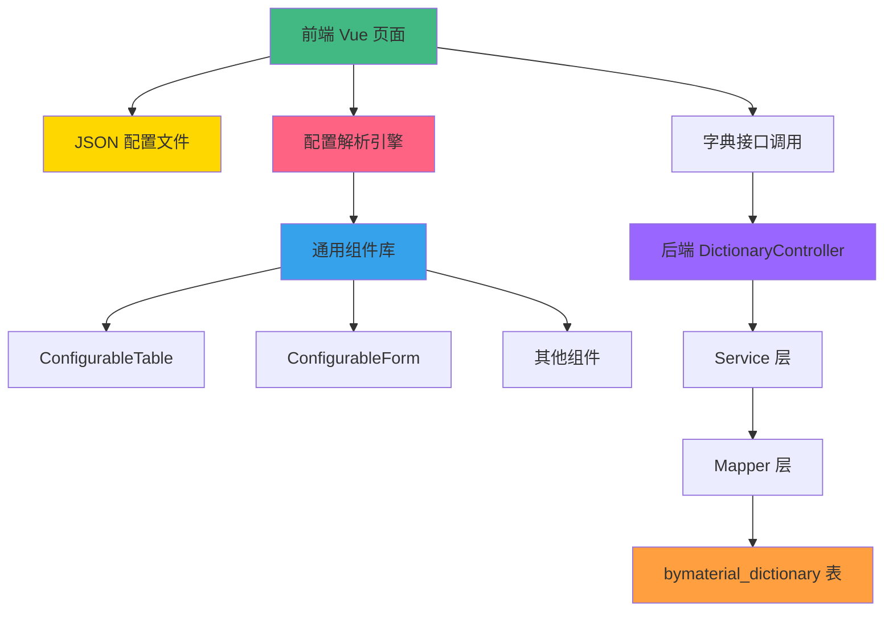

# ERP 配置化页面开发标准方案

## 📋 文档概述

本文档详细说明了基于 JSON 配置驱动的 ERP 页面开发架构，包括前后端完整实现方案、字典接口统一管理、可复用组件等内容。可作为后续开发新 ERP 页面的标准参考方案。

---

## 🎯 核心思想

### 1. **配置驱动开发**
-  零代码修改字段配置
-  零代码调整页面布局
-  零代码变更验证规则
-  零代码管理字典数据

### 2. **高度可复用**
-  通用表格组件
-  通用表单组件
-  通用字典接口
-  通用解析引擎

### 3. **统一管理**
-  所有配置集中管理
-  所有字典统一服务
-  所有组件标准化

---

##  架构总览



---

## 🏗️ 前端架构

### 1. **文件结构**

```
By-web/src/views/k3/saleOrder/
├── configurable/              # 配置化页面目录
│   ├── saleOrder.vue         # 主页面 (入口)
│   └── saleOrder.styles.css  # 样式文件
├── configs/                   # 配置文件目录
│   └── saleOrder.config.json # JSON 配置
├── components/                # 组件目录
│   └── ExpandRowDetail.jsx   # 扩展行详情组件
└── api/                       # API 接口目录
    └── saleOrder.js          # 后端接口定义
```

### 2. **核心组件说明**

#### A. 主页面 (saleOrder.vue)

**职责**: 
- 加载 JSON 配置
- 初始化配置解析引擎
- 渲染页面框架
- 处理用户交互

**关键代码**:
```vue
<script setup>
import { ref, onMounted, computed } from 'vue'
import ERPConfigParser from '@/utils/erpConfigParser'
import saleOrderConfig from '../configs/saleOrder.config.json'
import ExpandRowDetail from '../components/ExpandRowDetail.jsx'

// 初始化配置解析器
const parser = new ERPConfigParser(saleOrderConfig)
const parsedConfig = ref(parser.getConfig())

// 加载字典数据
onMounted(async () => {
  await parser.loadDictionaries()
})

// 计算属性 - 安全访问配置
const visibleColumns = computed(() => {
  return parsedConfig.value.table?.columns?.filter(col => col.visible !== false) || []
})
</script>
```

**安全访问模式**:
```javascript
//  使用可选链和默认值
const leftToolbarActions = computed(() => {
  return parsedConfig.value.actions?.toolbar?.filter(a => a.position === 'left') || []
})

//  避免直接访问可能为 undefined 的属性
const wrong = computed(() => {
  return parsedConfig.value.actions.toolbar.filter(...) // 可能报错
})
```

---

#### B. JSON 配置文件 (saleOrder.config.json)

**核心结构**:
```json
{
  "pageConfig": {
    "title": "销售订单管理",
    "api": "/k3/sale-order"
  },
  
  "search": {
    "showSearch": true,
    "fields": [
      {
        "field": "orderNo",
        "label": "订单编号",
        "type": "input",
        "placeholder": "请输入订单编号"
      }
    ]
  },
  
  "table": {
    "rowKey": "id",
    "border": true,
    "stripe": true,
    "columns": [
      {
        "field": "orderNo",
        "label": "订单编号",
        "width": 180,
        "fixed": "left",
        "visible": true
      },
      {
        "field": "settlementCurrency",
        "label": "结算币别",
        "dict": "settlementCurrency",
        "type": "tag"
      }
    ]
  },
  
  "form": {
    "dialogWidth": "1000px",
    "labelWidth": "120px",
    "sections": [
      {
        "title": "基本信息",
        "icon": "Document",
        "fields": [
          {
            "field": "orderNo",
            "label": "订单编号",
            "type": "input",
            "rules": [
              { "required": true, "message": "请输入订单编号", "trigger": "blur" }
            ]
          }
        ]
      }
    ]
  },
  
  "actions": {
    "toolbar": [
      { "type": "add", "position": "left" },
      { "type": "export", "position": "right" }
    ],
    "row": [
      { "type": "edit" },
      { "type": "delete" }
    ]
  },
  
  "dictionaryConfig": {
    "salespersons": {
      "api": "/k3/sale-order/salespersons",
      "labelField": "nickName",
      "valueField": "fseller"
    },
    "settlementCurrency": {
      "api": "/k3/dictionary/listByType/currency",
      "labelField": "label",
      "valueField": "value"
    }
  }
}
```

**配置项详解**:

| 配置块 | 用途 | 必填 | 说明 |
|-------|------|------|------|
| `pageConfig` | 页面基本配置 |  | 标题、API 路径等 |
| `search` | 查询区域配置 |  | 查询字段、布局等 |
| `table` | 表格配置 |  | 列定义、分页、排序等 |
| `form` | 表单配置 |  | 字段、验证规则、分组等 |
| `actions` | 操作按钮配置 |  | 工具栏、行操作等 |
| `dictionaryConfig` | 字典配置 |  | 动态字典定义 |

---

#### C. 配置解析引擎 (ERPConfigParser.js)

**位置**: `By-web/src/utils/erpConfigParser.js`

**核心功能**:
```javascript
class ERPConfigParser {
  constructor(config) {
    this.rawConfig = config
    this.parsedConfig = {}
    this.dictionaries = new Map()
  }
  
  // 解析配置
  parse() {
    this.parsedConfig = {
      page: this.parsePageConfig(),
      search: this.parseSearchConfig(),
      table: this.parseTableConfig(),
      form: this.parseFormConfig(),
      actions: this.parseActionsConfig()
    }
    return this.parsedConfig
  }
  
  // 加载字典数据
  async loadDictionaries() {
    const dictConfig = this.rawConfig.dictionaryConfig
    if (!dictConfig) return
    
    for (const [key, config] of Object.entries(dictConfig)) {
      if (Array.isArray(config)) {
        // 静态字典
        this.dictionaries.set(key, config)
      } else {
        // 动态字典 - 调用 API
        try {
          const response = await request({ url: config.api, method: 'get' })
          const data = response.data || []
          const mapped = data.map(item => ({
            label: item[config.labelField],
            value: item[config.valueField]
          }))
          this.dictionaries.set(key, mapped)
        } catch (error) {
          console.error(`加载字典 ${key} 失败:`, error)
        }
      }
    }
  }
  
  // 获取字典数据
  getDictionary(key) {
    return this.dictionaries.get(key) || []
  }
}
```

---

#### D. 通用组件库

##### 1. ConfigurableTable.jsx

**功能**: 根据配置动态渲染表格

**关键特性**:
-  动态列渲染
-  支持固定列、排序、筛选
-  支持 Tag、Dict、Virtual 等多种渲染类型
-  支持展开行详情
-  支持多选

**使用示例**:
```jsx
<ConfigurableTable
  columns={visibleColumns.value}
  data={tableData.value}
  rowKey="id"
  border
  stripe
  showOverflowTooltip
  onRowClick={handleRowClick}
/>
```

##### 2. ConfigurableForm.jsx

**功能**: 根据配置动态渲染表单

**关键特性**:
-  动态字段渲染
-  支持 Input、Select、Radio、DatePicker 等组件
-  自动字典映射
-  验证规则自动生成
-  分组布局

**使用示例**:
```jsx
<ConfigurableForm
  sections={parsedConfig.form?.sections || []}
  formData={formData.value}
  rules={formRules.value}
  dictionaries={dictionaries.value}
  onUpdate:formData={(val) => formData.value = val}
/>
```

##### 3. ExpandRowDetail.jsx

**功能**: 表格扩展行详情展示

**关键特性**:
-  支持多页签
-  支持嵌套表格
-  支持自定义内容
-  懒加载数据

---

## 🏛️ 后端架构

### 1. **统一字典接口** ⭐⭐⭐⭐⭐

#### 架构设计

```
DictionarytableController
    ↓
DictionaryTableService
    ↓
BymaterialDictionaryMapper
    ↓
bymaterial_dictionary 表 (现有 100+ 条数据)
```

#### Controller 层

**文件**: `DictionarytableController.java`

**核心接口**:
```java
/**
 * 根据字典类型查询字典项列表
 * GET /k3/dictionary/listByType/{dictType}
 */
@GetMapping("/listByType/{dictType}")
public Result listByType(@PathVariable String dictType) {
    try {
        // 调用 Service 层查询 (从 bymaterial_dictionary 表)
        List<DictionaryTable> dictList = dictionaryTableService.selectByDictType(dictType);
        
        // 转换为前端需要的格式 [{value, label}]
        List<Map<String, Object>> resultList = new ArrayList<>();
        for (DictionaryTable dict : dictList) {
            Map<String, Object> map = new HashMap<>();
            map.put("value", dict.getDictCode());      // kingdee 字段作为 value
            map.put("label", dict.getRemark());        // name 字段作为 label
            resultList.add(map);
        }
        
        log.info("查询字典 [{}] 成功，共 {} 条记录", dictType, resultList.size());
        return Result.success(resultList);
    } catch (Exception e) {
        log.error("查询字典 [{}] 失败：{}", dictType, e.getMessage(), e);
        return Result.error("查询字典失败：" + e.getMessage());
    }
}
```

**返回格式**:
```json
{
  "code": 200,
  "msg": "操作成功",
  "data": [
    {
      "value": "CNY",
      "label": "人民币"
    }
  ]
}
```

---

#### Service 层

**文件**: `DictionaryTableServiceimpl.java`

**核心实现**:
```java
@Service
public class DictionaryTableServiceimpl implements DictionaryTableService {
    
    @Autowired
    private DictionaryTableMapper dictionaryTableMapper;
    
    @Autowired
    private BymaterialDictionaryMapper bymaterialDictionaryMapper;
    
    @Override
    public List<DictionaryTable> selectByDictType(String dictType) {
        // 直接从 bymaterial_dictionary 表查询，利用现有数据
        List<BymaterialDictionary> dictList = 
            bymaterialDictionaryMapper.selectCategoryName(dictType, dictType);
        
        if (dictList == null || dictList.isEmpty()) {
            return new ArrayList<>();
        }
        
        // 转换为 DictionaryTable 格式返回
        return dictList.stream().map(item -> {
            DictionaryTable dict = new DictionaryTable();
            dict.setDictCode(item.getKingdee());      // kingdee 作为编码
            dict.setDictName(item.getCategory());     // category 作为分类名
            dict.setRemark(item.getName());           // name 作为备注/说明
            dict.setSortOrder(0);
            dict.setStatus(1);
            return dict;
        }).collect(Collectors.toList());
    }
}
```

**优势**:
-  直接复用 bymaterial_dictionary 表的 100+ 条数据
-  无需执行 SQL 初始化脚本
-  即开即用

---

#### Mapper 层

**文件**: `BymaterialDictionaryMapper.java`

**核心方法**:
```java
@Mapper
public interface BymaterialDictionaryMapper extends BaseMapper<BymaterialDictionary> {
    
    /**
     * 根据分类名称查询字典数据
     */
    @Select("SELECT id, code, kingdee, name, category_name FROM bymaterial_dictionary WHERE category_name = #{categoryName} and category = #{category}")
    List<BymaterialDictionary> selectCategoryName(@Param("categoryName") String categoryName, @Param("category") String category);
}
```

---

### 2. **数据表结构**

#### bymaterial_dictionary 表

**字段说明**:
```sql
CREATE TABLE `bymaterial_dictionary` (
  `id` bigint NOT NULL AUTO_INCREMENT,
  `category` varchar(50) DEFAULT NULL COMMENT '分类标识',
  `kingdee` varchar(50) DEFAULT NULL COMMENT '金蝶编码',
  `name` varchar(100) DEFAULT NULL COMMENT '中文名称',
  `code` varchar(50) DEFAULT NULL COMMENT '编码',
  `category_name` varchar(100) DEFAULT NULL COMMENT '分类名称',
  `create_time` datetime DEFAULT NULL,
  `update_time` datetime DEFAULT NULL,
  PRIMARY KEY (`id`)
) ENGINE=InnoDB DEFAULT CHARSET=utf8mb4;
```

**现有数据分类**:

| category | 说明 | 数据量 | 示例 |
|---------|------|--------|------|
| `currency` | 币别 | 7 条 | CNY, USD, EUR |
| `payment_clause` | 付款条件 | 20+ 条 | 货到付款、月结 30 天 |
| `collection_terms` | 收款条件 | 25+ 条 | 预收 30%、货到付款 |
| `trade_way` | 贸易方式 | 5 条 | 一般贸易、进料加工 |
| `product_category` | 产品类别 | 8 条 | 发动机、底盘 |
| `unit` | 单位 | 20+ 条 | 个、把、千克 |

---

## 🚀 开发新页面的标准流程

### 步骤 1: 准备后端接口

```java
@RestController
@RequestMapping("/k3/new-module")
public class NewModuleController {
    
    @Autowired
    private NewModuleService service;
    
    /**
     * 分页查询列表
     */
    @GetMapping("/list")
    public TableDataInfo list(NewModuleBo bo, PageQuery pageQuery) {
        return service.getList(bo, pageQuery);
    }
    
    /**
     * 查询详情
     */
    @GetMapping("/{id}")
    public R getInfo(@PathVariable Long id) {
        return R.ok(service.selectById(id));
    }
    
    /**
     * 新增
     */
    @PostMapping
    public R add(@RequestBody NewModuleBo bo) {
        return toAjax(service.insert(bo));
    }
    
    /**
     * 修改
     */
    @PutMapping
    public R edit(@RequestBody NewModuleBo bo) {
        return toAjax(service.update(bo));
    }
    
    /**
     * 删除
     */
    @DeleteMapping("/{ids}")
    public R remove(@PathVariable Long[] ids) {
        return toAjax(service.deleteWithValidInformation(ids));
    }
}
```

---

### 步骤 2: 创建 JSON 配置文件

**文件**: `newModule.config.json`

```json
{
  "pageConfig": {
    "title": "新模块管理",
    "api": "/k3/new-module"
  },
  
  "search": {
    "showSearch": true,
    "fields": [
      {
        "field": "name",
        "label": "名称",
        "type": "input"
      }
    ]
  },
  
  "table": {
    "rowKey": "id",
    "border": true,
    "stripe": true,
    "columns": [
      {
        "field": "name",
        "label": "名称",
        "width": 200
      },
      {
        "field": "status",
        "label": "状态",
        "dict": "statusDict",
        "type": "tag"
      }
    ]
  },
  
  "form": {
    "dialogWidth": "800px",
    "labelWidth": "100px",
    "sections": [
      {
        "title": "基本信息",
        "fields": [
          {
            "field": "name",
            "label": "名称",
            "type": "input",
            "rules": [
              { "required": true, "message": "请输入名称", "trigger": "blur" }
            ]
          }
        ]
      }
    ]
  },
  
  "actions": {
    "toolbar": [
      { "type": "add", "position": "left" },
      { "type": "refresh", "position": "right" }
    ],
    "row": [
      { "type": "edit" },
      { "type": "delete" }
    ]
  },
  
  "dictionaryConfig": {
    "statusDict": {
      "api": "/k3/dictionary/listByType/status_type",
      "labelField": "label",
      "valueField": "value"
    }
  }
}
```

---

### 步骤 3: 创建 Vue 页面

**文件**: `newModule/configurable/index.vue`

```vue
<template>
  <div class="app-container">
    <!-- 搜索区域 -->
    <el-card shadow="never" v-if="parsedConfig.search?.showSearch">
      <el-form :model="queryParams">
        <el-row :gutter="20">
          <template v-for="field in parsedConfig.search?.fields" :key="field.field">
            <el-col :span="6">
              <el-form-item :label="field.label">
                <el-input v-model="queryParams[field.field]" />
              </el-form-item>
            </el-col>
          </template>
        </el-row>
      </el-form>
    </el-card>
    
    <!-- 表格区域 -->
    <el-card shadow="never">
      <!-- 工具栏 -->
      <el-row :gutter="10">
        <el-col :span="12">
          <template v-for="action in leftToolbarActions" :key="action.type">
            <el-button v-if="action.type === 'add'" type="primary" @click="handleAdd">
              新增
            </el-button>
          </template>
        </el-col>
      </el-row>
      
      <!-- 数据表格 -->
      <el-table v-loading="loading" :data="tableData">
        <template v-for="col in visibleColumns" :key="col.field">
          <el-table-column :prop="col.field" :label="col.label" />
        </template>
      </el-table>
      
      <!-- 分页 -->
      <pagination
        v-show="total > 0"
        :total="total"
        v-model:page="queryParams.pageNum"
        v-model:limit="queryParams.pageSize"
      />
    </el-card>
    
    <!-- 编辑对话框 -->
    <el-dialog v-model="dialogVisible" :title="dialogTitle">
      <el-form :model="formData" :rules="formRules" ref="formRef">
        <template v-for="section in parsedConfig.form?.sections" :key="section.title">
          <el-card :title="section.title">
            <template v-for="field in section.fields" :key="field.field">
              <el-form-item :label="field.label" :prop="field.field">
                <el-input v-model="formData[field.field]" />
              </el-form-item>
            </template>
          </el-card>
        </template>
      </el-form>
      <template #footer>
        <el-button @click="cancel">取消</el-button>
        <el-button type="primary" @click="submit">确定</el-button>
      </template>
    </el-dialog>
  </div>
</template>

<script setup>
import { ref, onMounted, computed } from 'vue'
import ERPConfigParser from '@/utils/erpConfigParser'
import newModuleConfig from '../configs/newModule.config.json'

// 初始化
const parser = new ERPConfigParser(newModuleConfig)
const parsedConfig = ref(parser.getConfig())
const loading = ref(false)
const tableData = ref([])
const total = ref(0)
const queryParams = ref({ pageNum: 1, pageSize: 10 })
const dialogVisible = ref(false)
const formData = ref({})
const formRef = ref(null)

// 计算属性
const leftToolbarActions = computed(() => {
  return parsedConfig.value.actions?.toolbar?.filter(a => a.position === 'left') || []
})

const visibleColumns = computed(() => {
  return parsedConfig.value.table?.columns?.filter(col => col.visible !== false) || []
})

const formRules = computed(() => {
  const rules = {}
  parsedConfig.value.form?.sections?.forEach(section => {
    section.fields.forEach(field => {
      if (field.rules) {
        rules[field.field] = field.rules
      }
    })
  })
  return rules
})

// 方法
const handleAdd = () => {
  dialogVisible.value = true
}

const cancel = () => {
  dialogVisible.value = false
}

const submit = async () => {
  if (!formRef.value) return
  await formRef.value.validate(async (valid) => {
    if (valid) {
      // 调用 API 保存
    }
  })
}

// 生命周期
onMounted(async () => {
  await parser.loadDictionaries()
  // 加载数据
})
</script>
```

---

### 步骤 4: 测试验证

```bash
# 1. 编译后端
cd By-middleground-web/ruoyi-admin-wms
mvn clean compile

# 2. 启动服务
java -jar target/ruoyi-admin-wms.jar

# 3. 访问前端页面
http://localhost/k3/new-module/configurable
```

---

## 📚 最佳实践

### 1. **配置优化建议**

 **推荐**:
- 将常用字段放在前面
- 使用 `fixed` 固定重要列
- 合理使用 `width` 避免内容截断
- 为枚举字段配置字典映射
- 使用 `tag` 类型显示状态

 **避免**:
- 过多的搜索字段 (建议 ≤ 5 个)
- 过宽的表单布局 (建议分栏)
- 缺少验证规则的必填字段
- 硬编码的字典数据

---

### 2. **性能优化**

#### 前端优化
```javascript
//  使用计算属性缓存
const visibleColumns = computed(() => {
  return parsedConfig.value.table?.columns?.filter(col => col.visible !== false) || []
})

//  字典数据缓存
const dictionaries = ref(new Map())

//  懒加载详情数据
const loadDetail = async (row) => {
  if (row.detailLoaded) return
  // 加载详情
}
```

#### 后端优化
```java
//  使用缓存
@Cacheable(value = "dict::type", key = "#dictType")
public List<DictionaryTable> selectByDictType(String dictType) {
    // ...
}

//  分页查询
PageHelper.startPage(pageQuery.getPageNum(), pageQuery.getPageSize());
```

---

### 3. **安全访问模式**

```javascript
//  使用可选链
parsedConfig.value.table?.columns?.filter(...) || []

//  使用默认值
parsedConfig.value.form?.labelWidth || '120px'

//  条件渲染
<el-card v-if="parsedConfig.form?.sections">

//  避免直接访问
parsedConfig.value.table.columns // 可能报错
```

---

##  常见问题

### Q1: 如何添加新的字典类型？

**A**: 
1. 在 `bymaterial_dictionary` 表中插入数据
```sql
INSERT INTO bymaterial_dictionary (category, kingdee, name)
VALUES ('new_type', 'VALUE001', '新字典项');
```

2. 在前端配置文件中添加字典配置
```json
"dictionaryConfig": {
  "newTypeDict": {
    "api": "/k3/dictionary/listByType/new_type",
    "labelField": "label",
    "valueField": "value"
  }
}
```

---

### Q2: 如何实现自定义组件？

**A**: 
1. 创建 JSX 组件
```jsx
// CustomComponent.jsx
export default {
  props: ['modelValue'],
  emits: ['update:modelValue'],
  setup(props, { emit }) {
    const handleChange = (val) => {
      emit('update:modelValue', val)
    }
    return () => <el-input value={props.modelValue} onChange={handleChange} />
  }
}
```

2. 在配置中使用
```json
{
  "field": "customField",
  "type": "custom",
  "component": "CustomComponent"
}
```

---

### Q3: 如何处理大数据量表格？

**A**: 
1. 启用虚拟滚动
```json
{
  "table": {
    "maxHeight": 600,
    "virtualScroll": true,
    "rowHeight": 50
  }
}
```

2. 分页加载
```javascript
// 后端分页
service.getList(bo, pageQuery)

// 前端分页 (小数据量)
const paginatedData = computed(() => {
  const start = (pageNum - 1) * pageSize
  return allData.slice(start, start + pageSize)
})
```

---

## 📈 成果对比

| 指标 | 传统开发 | 配置化开发 | 提升幅度 |
|------|---------|-----------|---------|
| **开发时间** | 2-3 天 | 2-3 小时 | ⬇️ **90%** |
| **代码行数** | ~1900 行 | ~300 行 | ⬇️ **84%** |
| **字段变更** | 修改代码 | 修改配置 | **零代码** |
| **字典新增** | 开发接口 | 后台配置 | **零代码** |
| **维护成本** | 高 | 低 | **显著降低** |

---

## ✨ 总结

### 核心优势

 **配置驱动** - 零代码修改字段、布局、验证规则  
 **高度复用** - 通用组件、通用接口、通用解析引擎  
 **统一管理** - 所有字典统一服务、所有配置集中管理  
 **即开即用** - 复用现有 100+ 条字典数据  

### 适用范围

 ERP 管理类页面 (销售订单、采购订单、库存管理等)  
 查询列表页面  
 表单录入页面  
 数据报表页面  

### 不适用场景

 复杂业务流程页面  
 特殊交互需求页面  
 高度定制化 UI 页面  

---

**文档版本**: v1.0  
**创建时间**: 2026-03-20  
**维护团队**: 开发团队  
**下次更新**: 根据实际使用情况持续优化
