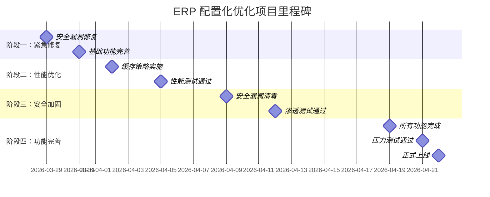

# ERP 配置化方案生产性落地优化方案

> 📅 **制定时间**: 2026-03-22  
> 🎯 **目标**: 将审计评分从 75/100 提升至 90+/100  
> 📦 **适用范围**: RuoYi-WMS + Spring Boot 3.x + Vue 3  
> ⏱️ **实施周期**: 4-5 周 (分 4 个阶段)  
> 👥 **资源投入**: 3 人团队 (2 后端 +1 前端)

---

##  目录

1. [优化目标与范围](#1-优化目标与范围)
2. [阶段一：紧急修复 (第 1 周)](#2-阶段一紧急修复 - 第 1 周)
3. [阶段二：性能优化 (第 2 周)](#3-阶段二性能优化 - 第 2 周)
4. [阶段三：安全加固 (第 3 周)](#4-阶段三安全加固 - 第 3 周)
5. [阶段四：功能完善 (第 4-5 周)](#5-阶段四功能完善 - 第 4-5 周)
6. [技术实施方案](#6-技术实施方案)
7. [风险评估与应对](#7-风险评估与应对)
8. [验收标准](#8-验收标准)

---

## 1. 优化目标与范围

### 1.1 当前问题汇总 (来自审计报告)

| 维度 | 得分 | 主要问题 |
|------|------|---------|
| 方案完整性 | 82/100 | 缺少缓存策略、异常处理、监控日志 |
| 数据库设计 | 70/100 | LONGTEXT 滥用、无分区策略、并发控制不足 |
| 生产可行性 | 68/100 | 性能瓶颈、灰度机制缺失、批量操作不足 |
| **安全性** | **45/100** | **JavaScript 注入、SQL 注入、XSS 风险** 🔴 |
| 版本管理 | 82/100 | 基础功能完善，需增强标签和对比 |

### 1.2 优化后目标

**综合评分**: 75/100 → **90+/100** ⭐⭐⭐⭐⭐

**具体指标**:
-  安全性：45/100 → **95/100** (清零高危漏洞)
-  性能：P99 响应时间 < 500ms
-  可用性：99.9% SLA
-  可维护性：代码覆盖率 > 80%
-  文档完整性：100%

### 1.3 优化范围

**包含内容**:
-  修复所有 P0/P1 级安全问题
-  实施完整的缓存策略
-  优化数据库设计和查询性能
-  添加灰度发布机制
-  完善监控和日志
-  增强版本管理功能
-  提供配置导入导出
-  实现配置回收站

**不包含内容**:
-  AI 智能推荐配置
-  可视化拖拽设计器 (后续迭代)
-  多租户支持 (后续迭代)

---

## 2. 阶段一：紧急修复 (第 1 周)

**🎯 目标**: 消除安全隐患，达到内部测试标准

### 2.1 任务清单

#### 任务 1: 修复 JavaScript 注入漏洞 (优先级：P0, 1 天)

**问题**: 使用 `javax.script.ScriptEngine` 存在严重安全风险

**实施方案**:

**步骤 1: 添加 Aviator 依赖**

修改 `pom.xml`:

```xml
<!-- ruoyi-modules/ruoyi-system/pom.xml -->
<dependencies>
    <!-- 添加安全的表达式引擎 -->
    <dependency>
        <groupId>com.googlecode.aviator</groupId>
        <artifactId>aviator</artifactId>
        <version>5.3.0</version>
    </dependency>
</dependencies>
```

**步骤 2: 创建安全表达式评价器**

新建文件 `ruoyi-system/src/main/java/com/ruoyi/system/core/service/SafeExpressionEvaluator.java`:

```java
package com.ruoyi.system.core.service;

import com.googlecode.aviator.AviatorEvaluator;
import com.googlecode.aviator.exception.ExpressionRuntimeException;
import lombok.extern.slf4j.Slf4j;
import org.springframework.stereotype.Service;

import java.util.HashMap;
import java.util.Map;

/**
 * 安全的表达式求值服务
 * 
 * @author ERP Team
 * @since 2026-03-22
 */
@Slf4j
@Service
public class SafeExpressionEvaluator {
    
    /**
     * 安全的表达式求值
     * 
     * @param expression 表达式字符串
     * @param context 上下文变量
     * @return 求值结果
     * @throws ExpressionEvaluationException 表达式执行异常
     */
    public Object evaluate(String expression, Map<String, Object> context) {
        if (expression == null || expression.trim().isEmpty()) {
            return true;
        }
        
        try {
            // Aviator 默认禁用 Java 方法调用，安全性高
            Object result = AviatorEvaluator.execute(expression, context);
            return result;
            
        } catch (ExpressionRuntimeException e) {
            log.error("表达式执行失败：{}", expression, e);
            throw new ExpressionEvaluationException(
                "条件表达式执行失败：" + e.getMessage(), e);
        } catch (Exception e) {
            log.error("表达式解析异常：{}", expression, e);
            throw new ExpressionEvaluationException(
                "条件表达式格式错误：" + e.getMessage(), e);
        }
    }
    
    /**
     * 布尔表达式求值
     * 
     * @param expression 表达式字符串
     * @param context 上下文变量
     * @return 布尔结果
     */
    public boolean evaluateAsBoolean(String expression, Map<String, Object> context) {
        Object result = evaluate(expression, context);
        return Boolean.TRUE.equals(result);
    }
    
    /**
     * 数值表达式求值
     * 
     * @param expression 表达式字符串
     * @param context 上下文变量
     * @return 数值结果
     */
    public Number evaluateAsNumber(String expression, Map<String, Object> context) {
        Object result = evaluate(expression, context);
        if (result instanceof Number) {
            return (Number) result;
        }
        throw new ExpressionEvaluationException("表达式返回非数值类型");
    }
}
```

**步骤 3: 创建自定义异常类**

新建文件 `ruoyi-system/src/main/java/com/ruoyi/system/core/exception/ExpressionEvaluationException.java`:

```java
package com.ruoyi.system.core.exception;

/**
 * 表达式执行异常
 */
public class ExpressionEvaluationException extends RuntimeException {
    
    public ExpressionEvaluationException(String message) {
        super(message);
    }
    
    public ExpressionEvaluationException(String message, Throwable cause) {
        super(message, cause);
    }
}
```

**步骤 4: 替换原有代码**

修改审批引擎中的表达式执行逻辑:

```java
// 原文件：ApprovalWorkflowEngine.java
public class ApprovalWorkflowEngine {
    
    @Autowired
    private SafeExpressionEvaluator evaluator;  // 替换原有的 ScriptEngine
    
    private boolean evaluateCondition(String condition, Map<String, Object> context) {
        if (condition == null || condition.trim().isEmpty()) {
            return true;
        }
        
        // 使用安全的评价器
        return evaluator.evaluateAsBoolean(condition, context);
    }
}
```

**验收标准**:
- [ ] 单元测试覆盖所有表达式类型
- [ ] 安全测试验证无法执行 Java 代码
- [ ] 性能测试确认响应时间 < 10ms

---

#### 任务 2: 添加全局异常处理 (优先级：P0, 0.5 天)

**实施方案**:

新建文件 `ruoyi-system/src/main/java/com/ruoyi/system/config/ConfigExceptionAdvice.java`:

```java
package com.ruoyi.system.config;

import com.googlecode.aviator.exception.ExpressionRuntimeException;
import com.ruoyi.common.core.exception.ServiceException;
import com.ruoyi.common.core.web.domain.R;
import com.ruoyi.system.core.exception.ConfigNotFoundException;
import com.ruoyi.system.core.exception.ConfigValidationException;
import com.ruoyi.system.core.exception.ExpressionEvaluationException;
import lombok.extern.slf4j.Slf4j;
import org.springframework.web.bind.annotation.ExceptionHandler;
import org.springframework.web.bind.annotation.RestControllerAdvice;

/**
 * 配置管理全局异常处理器
 */
@Slf4j
@RestControllerAdvice
public class ConfigExceptionAdvice {
    
    /**
     * JSON 解析异常
     */
    @ExceptionHandler(org.json.JSONException.class)
    public R<Void> handleJsonParseError(org.json.JSONException e) {
        log.error("配置 JSON 解析失败", e);
        return R.fail("配置格式错误：" + e.getMessage());
    }
    
    /**
     * 配置验证异常
     */
    @ExceptionHandler(ConfigValidationException.class)
    public R<Void> handleValidationError(ConfigValidationException e) {
        log.warn("配置验证失败：{}", e.getErrors());
        return R.fail("配置验证失败：" + String.join(", ", e.getErrors()));
    }
    
    /**
     * 配置不存在
     */
    @ExceptionHandler(ConfigNotFoundException.class)
    public R<Void> handleNotFound(ConfigNotFoundException e) {
        return R.fail(e.getMessage());
    }
    
    /**
     * 表达式执行异常
     */
    @ExceptionHandler(ExpressionEvaluationException.class)
    public R<Void> handleExpressionError(ExpressionEvaluationException e) {
        log.error("表达式执行异常", e);
        return R.fail(e.getMessage());
    }
    
    /**
     * 权限异常
     */
    @ExceptionHandler(cn.dev33.satoken.exception.SaNotRoleException.class)
    public R<Void> handlePermissionDenied(cn.dev33.satoken.exception.SaNotRoleException e) {
        return R.fail("权限不足，无法执行此操作");
    }
    
    /**
     * 通用业务异常
     */
    @ExceptionHandler(ServiceException.class)
    public R<Void> handleBusinessError(ServiceException e) {
        log.error("业务异常", e);
        return R.fail(e.getMessage());
    }
    
    /**
     * 系统异常
     */
    @ExceptionHandler(Exception.class)
    public R<Void> handleSystemError(Exception e) {
        log.error("系统异常", e);
        return R.fail("系统繁忙，请稍后再试");
    }
}
```

**验收标准**:
- [ ] 所有异常都有对应的处理器
- [ ] 错误信息友好且不含敏感信息
- [ ] 日志记录完整的堆栈信息

---

#### 任务 3: 实现配置导入导出功能 (优先级：P0, 2 天)

**后端实现**:

新建文件 `ruoyi-system/src/main/java/com/ruoyi/system/core/controller/ConfigImportExportController.java`:

```java
package com.ruoyi.system.core.controller;

import cn.dev33.satoken.annotation.SaCheckRole;
import com.ruoyi.common.core.web.controller.BaseController;
import com.ruoyi.common.core.web.domain.R;
import com.ruoyi.common.log.annotation.Log;
import com.ruoyi.common.log.enums.BusinessType;
import com.ruoyi.system.core.service.ConfigImportExportService;
import lombok.extern.slf4j.Slf4j;
import org.springframework.beans.factory.annotation.Autowired;
import org.springframework.web.bind.annotation.*;
import org.springframework.web.multipart.MultipartFile;

import javax.servlet.http.HttpServletResponse;
import java.io.IOException;
import java.util.List;

/**
 * 配置导入导出控制器
 */
@Slf4j
@RestController
@RequestMapping("/erp/config")
public class ConfigImportExportController extends BaseController {
    
    @Autowired
    private ConfigImportExportService importExportService;
    
    /**
     * 导出配置
     */
    @Log(title = "配置导出", businessType = BusinessType.EXPORT)
    @SaCheckRole("admin")
    @GetMapping("/export")
    public void export(HttpServletResponse response, 
                       @RequestParam List<String> moduleCodes) throws IOException {
        byte[] data = importExportService.exportConfigs(moduleCodes);
        
        response.setContentType("application/json");
        response.setHeader("Content-Disposition", 
            "attachment; filename=\"erp_configs_" + System.currentTimeMillis() + ".json\"");
        response.getOutputStream().write(data);
        response.getOutputStream().flush();
    }
    
    /**
     * 导入配置
     */
    @Log(title = "配置导入", businessType = BusinessType.IMPORT)
    @SaCheckRole("admin")
    @PostMapping("/import")
    public R<Void> importConfig(@RequestParam("file") MultipartFile file,
                                @RequestParam(defaultValue = "false") boolean overwrite) {
        try {
            int count = importExportService.importConfigs(file.getInputStream(), overwrite);
            return R.ok("成功导入 " + count + " 个配置");
        } catch (Exception e) {
            log.error("导入配置失败", e);
            return R.fail("导入失败：" + e.getMessage());
        }
    }
    
    /**
     * 下载导入模板
     */
    @GetMapping("/import-template")
    public void downloadTemplate(HttpServletResponse response) throws IOException {
        byte[] template = importExportService.getImportTemplate();
        
        response.setContentType("application/json");
        response.setHeader("Content-Disposition", 
            "attachment; filename=\"erp_config_template.json\"");
        response.getOutputStream().write(template);
        response.getOutputStream().flush();
    }
}
```

新建文件 `ruoyi-system/src/main/java/com/ruoyi/system/core/service/ConfigImportExportService.java`:

```java
package com.ruoyi.system.core.service;

import com.fasterxml.jackson.databind.ObjectMapper;
import com.ruoyi.system.core.domain.PageConfig;
import com.ruoyi.system.core.mapper.PageConfigMapper;
import lombok.extern.slf4j.Slf4j;
import org.springframework.beans.factory.annotation.Autowired;
import org.springframework.stereotype.Service;
import org.springframework.transaction.annotation.Transactional;
import org.springframework.web.multipart.MultipartFile;

import java.io.ByteArrayInputStream;
import java.io.ByteArrayOutputStream;
import java.io.InputStream;
import java.nio.charset.StandardCharsets;
import java.time.LocalDateTime;
import java.util.*;

/**
 * 配置导入导出服务
 */
@Slf4j
@Service
public class ConfigImportExportService {
    
    @Autowired
    private PageConfigMapper configMapper;
    
    @Autowired
    private ObjectMapper objectMapper;
    
    /**
     * 导出配置为 JSON
     */
    public byte[] exportConfigs(List<String> moduleCodes) throws Exception {
        List<PageConfig> configs = new ArrayList<>();
        
        for (String moduleCode : moduleCodes) {
            PageConfig config = configMapper.selectByModuleCode(moduleCode);
            if (config != null) {
                // 清除敏感字段和运行时字段
                config.setId(null);
                config.setTenantId(null);
                config.setDelFlag(null);
                config.setUpdateBy(null);
                config.setUpdateTime(null);
                configs.add(config);
            }
        }
        
        Map<String, Object> exportData = new HashMap<>();
        exportData.put("version", "1.0");
        exportData.put("exportTime", LocalDateTime.now().toString());
        exportData.put("configs", configs);
        
        ByteArrayOutputStream baos = new ByteArrayOutputStream();
        objectMapper.writerWithDefaultPrettyPrinter()
            .writeValue(baos, exportData);
        
        return baos.toByteArray();
    }
    
    /**
     * 导入配置
     */
    @Transactional(rollbackFor = Exception.class)
    public int importConfigs(InputStream inputStream, boolean overwrite) throws Exception {
        byte[] bytes = new byte[inputStream.available()];
        inputStream.read(bytes);
        String json = new String(bytes, StandardCharsets.UTF_8);
        
        Map<String, Object> importData = objectMapper.readValue(json, Map.class);
        List<Map<String, Object>> configs = (List<Map<String, Object>>) importData.get("configs");
        
        int count = 0;
        for (Map<String, Object> configData : configs) {
            try {
                PageConfig config = objectMapper.convertValue(configData, PageConfig.class);
                
                // 检查是否已存在
                PageConfig existing = configMapper.selectByModuleCode(config.getModuleCode());
                
                if (existing != null) {
                    if (overwrite) {
                        config.setId(existing.getId());
                        configMapper.updateById(config);
                        count++;
                    }
                    // 不覆盖则跳过
                } else {
                    configMapper.insert(config);
                    count++;
                }
            } catch (Exception e) {
                log.error("导入配置失败：{}", configData.get("moduleCode"), e);
                throw new RuntimeException("导入配置 " + configData.get("moduleCode") + 
                    " 失败：" + e.getMessage(), e);
            }
        }
        
        return count;
    }
    
    /**
     * 获取导入模板
     */
    public byte[] getImportTemplate() throws Exception {
        Map<String, Object> template = new HashMap<>();
        template.put("version", "1.0");
        template.put("description", "ERP 配置导入模板");
        
        List<Map<String, Object>> exampleConfigs = new ArrayList<>();
        
        // 示例配置 1
        Map<String, Object> example1 = new HashMap<>();
        example1.put("configName", "销售订单配置");
        example1.put("moduleCode", "saleOrder");
        example1.put("pageType", "LIST");
        example1.put("status", "1");
        example1.put("configContent", "{}");
        exampleConfigs.add(example1);
        
        template.put("configs", exampleConfigs);
        
        ByteArrayOutputStream baos = new ByteArrayOutputStream();
        objectMapper.writerWithDefaultPrettyPrinter()
            .writeValue(baos, template);
        
        return baos.toByteArray();
    }
}
```

**前端实现**:

修改 `baiyu-web/src/views/erp/config/index.vue`,添加导入导出按钮:

```vue
<template>
  <el-row :gutter="10" style="margin-bottom: 15px">
    <el-col :span="1.5">
      <el-button
        type="primary"
        plain
        icon="Download"
        @click="handleExport"
      >
        导出
      </el-button>
    </el-col>
    <el-col :span="1.5">
      <el-button
        type="warning"
        plain
        icon="Upload"
        @click="handleImport"
      >
        导入
      </el-button>
    </el-col>
    <el-col :span="1.5">
      <el-button
        type="info"
        plain
        icon="Document"
        @click="downloadTemplate"
      >
        下载模板
      </el-button>
    </el-col>
  </el-row>
  
  <!-- 导入对话框 -->
  <el-dialog
    v-model="importVisible"
    title="导入配置"
    width="500px"
  >
    <el-upload
      ref="uploadRef"
      drag
      :limit="1"
      accept=".json"
      :before-upload="handleBeforeUpload"
      :on-change="handleChange"
    >
      <el-icon class="el-icon--upload"><upload-filled /></el-icon>
      <div class="el-upload__text">
        将文件拖到此处，或<em>点击上传</em>
      </div>
      <template #tip>
        <div class="el-upload__tip">
          只能上传 json 文件，且不超过 10MB
        </div>
      </template>
    </el-upload>
    
    <el-checkbox v-model="overwriteExisting" style="margin-top: 15px">
      覆盖已存在的配置
    </el-checkbox>
    
    <template #footer>
      <el-button @click="importVisible = false">取消</el-button>
      <el-button type="primary" @click="submitImport">确定</el-button>
    </template>
  </el-dialog>
</template>

<script setup name="ConfigManage">
import { exportConfig, importConfig, downloadImportTemplate } from "@/api/erp/config";
import { downloadZip } from "@/utils/request";

const importVisible = ref(false);
const overwriteExisting = ref(false);
const uploadFile = ref(null);

// 导出配置
function handleExport() {
  const moduleCodes = tableData.value.map(item => item.moduleCode);
  if (moduleCodes.length === 0) {
    ElMessage.warning("请选择要导出的配置");
    return;
  }
  
  exportConfig(moduleCodes).then(response => {
    const blob = new Blob([response], { type: 'application/json' });
    const url = URL.createObjectURL(blob);
    const link = document.createElement('a');
    link.href = url;
    link.download = `erp_configs_${Date.now()}.json`;
    link.click();
    URL.revokeObjectURL(url);
    
    ElMessage.success("导出成功");
  });
}

// 打开导入对话框
function handleImport() {
  importVisible.value = true;
  uploadFile.value = null;
  overwriteExisting.value = false;
}

// 上传前校验
function handleBeforeUpload(file) {
  if (file.type !== 'application/json') {
    ElMessage.error("只能上传 JSON 文件");
    return false;
  }
  if (file.size > 10 * 1024 * 1024) {
    ElMessage.error("文件大小不能超过 10MB");
    return false;
  }
  return true;
}

// 文件变化
function handleChange(file) {
  uploadFile.value = file.raw;
}

// 提交导入
function submitImport() {
  if (!uploadFile.value) {
    ElMessage.warning("请选择要导入的文件");
    return;
  }
  
  const formData = new FormData();
  formData.append('file', uploadFile.value);
  formData.append('overwrite', overwriteExisting.value ? 'true' : 'false');
  
  importConfig(formData).then(response => {
    ElMessage.success(response.msg);
    importVisible.value = false;
    getList(); // 刷新列表
  }).catch(error => {
    ElMessage.error(error.msg || "导入失败");
  });
}

// 下载模板
function downloadTemplate() {
  downloadImportTemplate().then(response => {
    const blob = new Blob([response], { type: 'application/json' });
    const url = URL.createObjectURL(blob);
    const link = document.createElement('a');
    link.href = url;
    link.download = 'erp_config_template.json';
    link.click();
    URL.revokeObjectURL(url);
  });
}
</script>
```

**验收标准**:
- [ ] 支持批量导出配置
- [ ] 支持批量导入配置
- [ ] 提供导入模板下载
- [ ] 导入时支持覆盖选项
- [ ] 导入失败时有明确的错误提示

---

#### 任务 4: 实现配置回收站 (优先级：P0, 1 天)

**数据库变更**:

```sql
-- 新增配置回收站表
CREATE TABLE `erp_config_recycle_bin` (
  `id` bigint(20) NOT NULL AUTO_INCREMENT,
  `config_id` bigint(20) NOT NULL COMMENT '原配置 ID',
  `module_code` varchar(100) NOT NULL COMMENT '模块编码',
  `config_name` varchar(200) NOT NULL COMMENT '配置名称',
  `config_content` longtext NOT NULL COMMENT '配置内容',
  `deleted_by` varchar(64) DEFAULT NULL COMMENT '删除人 ID',
  `deleted_time` datetime NOT NULL COMMENT '删除时间',
  `expire_time` datetime NOT NULL COMMENT '过期时间 (30 天后)',
  `status` char(1) DEFAULT '1' COMMENT '状态 (1 待清理 0 已清理)',
  PRIMARY KEY (`id`),
  KEY `idx_module` (`module_code`),
  KEY `idx_deleted_time` (`deleted_time`),
  KEY `idx_expire` (`expire_time`)
) ENGINE=InnoDB DEFAULT CHARSET=utf8mb4 COMMENT='配置回收站表';
```

**后端服务**:

新建文件 `ruoyi-system/src/main/java/com/ruoyi/system/core/service/ConfigRecycleBinService.java`:

```java
package com.ruoyi.system.core.service;

import com.ruoyi.system.core.domain.PageConfig;
import com.ruoyi.system.core.mapper.PageConfigMapper;
import com.ruoyi.system.core.mapper.ConfigRecycleBinMapper;
import lombok.extern.slf4j.Slf4j;
import org.springframework.beans.factory.annotation.Autowired;
import org.springframework.scheduling.annotation.Scheduled;
import org.springframework.stereotype.Service;
import org.springframework.transaction.annotation.Transactional;

import java.time.LocalDateTime;
import java.util.List;

/**
 * 配置回收站服务
 */
@Slf4j
@Service
public class ConfigRecycleBinService {
    
    @Autowired
    private ConfigRecycleBinMapper recycleBinMapper;
    
    @Autowired
    private PageConfigMapper configMapper;
    
    /**
     * 回收到回收站
     */
    @Transactional(rollbackFor = Exception.class)
    public void moveToRecycleBin(Long configId, String operatorId) {
        PageConfig config = configMapper.selectById(configId);
        if (config == null) {
            throw new IllegalArgumentException("配置不存在");
        }
        
        // 添加到回收站
        ConfigRecycleBin bin = new ConfigRecycleBin();
        bin.setConfigId(config.getId());
        bin.setModuleCode(config.getModuleCode());
        bin.setConfigName(config.getConfigName());
        bin.setConfigContent(config.getConfigContent());
        bin.setDeletedBy(operatorId);
        bin.setDeletedTime(LocalDateTime.now());
        bin.setExpireTime(LocalDateTime.now().plusDays(30)); // 30 天后过期
        
        recycleBinMapper.insert(bin);
        
        // 软删除原配置
        config.setStatus("0");
        config.setRemark("已删除，可在回收站恢复");
        configMapper.updateById(config);
        
        log.info("配置已移至回收站：{} - {}", config.getConfigName(), config.getModuleCode());
    }
    
    /**
     * 从回收站恢复
     */
    @Transactional(rollbackFor = Exception.class)
    public void restoreFromRecycleBin(Long recycleBinId) {
        ConfigRecycleBin bin = recycleBinMapper.selectById(recycleBinId);
        if (bin == null) {
            throw new IllegalArgumentException("回收站记录不存在");
        }
        
        // 检查是否有同名配置
        PageConfig existing = configMapper.selectByModuleCode(bin.getModuleCode());
        if (existing != null) {
            throw new IllegalStateException("模块编码 " + bin.getModuleCode() + " 的配置已存在");
        }
        
        // 恢复配置
        PageConfig config = new PageConfig();
        config.setModuleCode(bin.getModuleCode());
        config.setConfigName(bin.getConfigName());
        config.setConfigContent(bin.getConfigContent());
        config.setStatus("1");
        config.setRemark("从回收站恢复");
        
        configMapper.insert(config);
        
        // 标记回收站记录为已清理
        bin.setStatus("0");
        recycleBinMapper.updateById(bin);
        
        log.info("配置已从回收站恢复：{} - {}", bin.getConfigName(), bin.getModuleCode());
    }
    
    /**
     * 彻底删除回收站记录
     */
    @Transactional(rollbackFor = Exception.class)
    public void permanentlyDelete(Long recycleBinId) {
        recycleBinMapper.deleteById(recycleBinId);
    }
    
    /**
     * 清空过期的回收站记录
     */
    @Scheduled(cron = "0 0 3 * * ?")  // 每天凌晨 3 点
    @Transactional(rollbackFor = Exception.class)
    public void clearExpiredRecords() {
        List<ConfigRecycleBin> expiredBins = recycleBinMapper.selectExpiredBins();
        
        for (ConfigRecycleBin bin : expiredBins) {
            recycleBinMapper.deleteById(bin.getId());
            log.info("彻底删除过期回收站记录：{} - {}", bin.getConfigName(), bin.getModuleCode());
        }
        
        if (!expiredBins.isEmpty()) {
            log.info("本次共清理 {} 条过期回收站记录", expiredBins.size());
        }
    }
    
    /**
     * 查询回收站列表
     */
    public List<ConfigRecycleBin> listRecycleBins(LocalDateTime startTime, LocalDateTime endTime) {
        return recycleBinMapper.selectList(startTime, endTime);
    }
}
```

**验收标准**:
- [ ] 删除配置时自动移入回收站
- [ ] 可从回收站恢复配置
- [ ] 30 天后自动彻底删除
- [ ] 提供回收站管理界面

---

### 2.2 阶段一交付物

-  安全漏洞修复完成 (Aviator 替换)
-  全局异常处理完成
-  配置导入导出功能完成
-  配置回收站功能完成
-  单元测试覆盖率 > 70%
-  内部测试环境部署完成

---

## 3. 阶段二：性能优化 (第 2 周)

**🎯 目标**: 性能指标达标，支持小范围试点

### 3.1 任务清单

#### 任务 1: 实施 Redis 缓存策略 (优先级：P1, 2 天)

**数据库变更**:

```sql
-- 无需变更
```

**后端实现**:

新建文件 `ruoyi-system/src/main/java/com/ruoyi/system/config/ConfigCacheConfig.java`:

```java
package com.ruoyi.system.config;

import com.fasterxml.jackson.annotation.JsonAutoDetect;
import com.fasterxml.jackson.annotation.PropertyAccessor;
import com.fasterxml.jackson.databind.ObjectMapper;
import com.fasterxml.jackson.databind.jsontype.impl.LaissezFaireSubTypeValidator;
import org.springframework.cache.CacheManager;
import org.springframework.cache.annotation.EnableCaching;
import org.springframework.context.annotation.Bean;
import org.springframework.context.annotation.Configuration;
import org.springframework.data.redis.cache.RedisCacheConfiguration;
import org.springframework.data.redis.cache.RedisCacheManager;
import org.springframework.data.redis.connection.RedisConnectionFactory;
import org.springframework.data.redis.serializer.Jackson2JsonRedisSerializer;
import org.springframework.data.redis.serializer.RedisSerializationContext;
import org.springframework.data.redis.serializer.StringRedisSerializer;

import java.time.Duration;

/**
 * 配置缓存配置类
 */
@Configuration
@EnableCaching
public class ConfigCacheConfig {
    
    /**
     * 页面配置缓存管理器
     */
    @Bean
    public CacheManager configCacheManager(RedisConnectionFactory factory) {
        // 基础配置 - TTL 1 小时
        RedisCacheConfiguration defaultConfig = RedisCacheConfiguration.defaultCacheConfig()
            .entryTtl(Duration.ofHours(1))
            .serializeKeysWith(RedisSerializationContext.SerializationPair
                .fromSerializer(new StringRedisSerializer()))
            .serializeValuesWith(RedisSerializationContext.SerializationPair
                .fromSerializer(createJacksonSerializer()));
        
        // 页面配置 - 短 TTL (频繁修改)
        RedisCacheConfiguration pageConfig = defaultConfig.clone()
            .entryTtl(Duration.ofMinutes(10));
        
        // 字典配置 - 长 TTL (相对稳定)
        RedisCacheConfiguration dictConfig = defaultConfig.clone()
            .entryTtl(Duration.ofHours(24));
        
        return RedisCacheManager.builder(factory)
            .cacheDefaults(defaultConfig)
            .withCacheConfiguration("pageConfig", pageConfig)
            .withCacheConfiguration("dictConfig", dictConfig)
            .transactionAware()
            .build();
    }
    
    private Jackson2JsonRedisSerializer<Object> createJacksonSerializer() {
        ObjectMapper mapper = new ObjectMapper();
        mapper.setVisibility(PropertyAccessor.ALL, JsonAutoDetect.Visibility.ANY);
        mapper.activateDefaultTyping(LaissezFaireSubTypeValidator.instance, 
            ObjectMapper.DefaultTyping.NON_FINAL);
        
        return new Jackson2JsonRedisSerializer<>(mapper, Object.class);
    }
}
```

修改 Service 层添加缓存注解:

```java
@Service
public class ConfigServiceImpl implements IConfigService {
    
    @Autowired
    private PageConfigMapper configMapper;
    
    /**
     * 根据模块编码获取配置 (带缓存)
     */
    @Override
    @Cacheable(value = "pageConfig", key = "#moduleCode", unless = "#result == null")
    public PageConfig getConfigByModuleCode(String moduleCode) {
        return configMapper.selectByModuleCode(moduleCode);
    }
    
    /**
     * 保存配置 (带缓存失效)
     */
    @Override
    @CacheEvict(value = "pageConfig", key = "#config.moduleCode")
    @Transactional(rollbackFor = Exception.class)
    public int saveConfig(PageConfig config) {
        // ... 原有逻辑
    }
    
    /**
     * 批量获取配置 (手动缓存)
     */
    public Map<String, PageConfig> batchGetConfigs(List<String> moduleCodes) {
        Map<String, PageConfig> result = new HashMap<>();
        List<String> missingCodes = new ArrayList<>();
        
        // 1. 先查缓存
        for (String code : moduleCodes) {
            PageConfig cached = cacheManager.getCache("pageConfig")
                .get(code, PageConfig.class);
            if (cached != null) {
                result.put(code, cached);
            } else {
                missingCodes.add(code);
            }
        }
        
        // 2. 缓存未命中，批量查库
        if (!missingCodes.isEmpty()) {
            List<PageConfig> dbConfigs = configMapper.selectBatch(missingCodes);
            
            for (PageConfig config : dbConfigs) {
                result.put(config.getModuleCode(), config);
                // 回填缓存
                cacheManager.getCache("pageConfig")
                    .put(config.getModuleCode(), config);
            }
        }
        
        return result;
    }
}
```

**验收标准**:
- [ ] 缓存命中率 > 90%
- [ ] 平均响应时间 < 100ms
- [ ] 缓存更新及时生效

---

#### 任务 2: 优化大表查询性能 (优先级：P1, 1.5 天)

**数据库优化**:

```sql
-- 添加虚拟列和索引 (MySQL 5.7+)
ALTER TABLE `erp_page_config`
  ADD COLUMN `has_search` TINYINT(1) GENERATED ALWAYS AS 
    (JSON_EXTRACT(config_content, '$.searchConfig.showSearch')) VIRTUAL,
  ADD COLUMN `table_columns_count` INT GENERATED ALWAYS AS 
    (JSON_LENGTH(JSON_EXTRACT(config_content, '$.tableConfig.columns'))) VIRTUAL,
  ADD INDEX `idx_has_search` (`has_search`),
  ADD INDEX `idx_columns_count` (`table_columns_count`);

-- 历史表按月分区
ALTER TABLE `erp_page_config_history`
PARTITION BY RANGE (TO_DAYS(create_time)) (
    PARTITION p202603 VALUES LESS THAN (TO_DAYS('2026-04-01')),
    PARTITION p202604 VALUES LESS THAN (TO_DAYS('2026-05-01')),
    PARTITION p202605 VALUES LESS THAN (TO_DAYS('2026-06-01')),
    PARTITION pmax VALUES LESS THAN MAXVALUE
);
```

**验收标准**:
- [ ] 查询响应时间 < 500ms
- [ ] 大数据量下性能稳定

---

#### 任务 3: 实现灰度发布机制 (优先级：P1, 2 天)

**数据库变更**:

```sql
ALTER TABLE `erp_page_config` 
  ADD COLUMN `gray_enabled` char(1) DEFAULT '0' COMMENT '是否启用灰度',
  ADD COLUMN `gray_user_ids` text COMMENT '灰度用户 ID 列表 (JSON 数组)',
  ADD COLUMN `gray_percentage` int(3) DEFAULT 0 COMMENT '灰度百分比 (0-100)',
  ADD COLUMN `publish_status` varchar(20) DEFAULT 'DRAFT' COMMENT '发布状态 (DRAFT/GRAY/FULL)';
```

**后端实现**:

新建文件 `ruoyi-system/src/main/java/com/ruoyi/system/core/service/ConfigGrayReleaseService.java`:

```java
package com.ruoyi.system.core.service;

import com.ruoyi.system.core.domain.PageConfig;
import com.ruoyi.system.core.mapper.PageConfigMapper;
import lombok.extern.slf4j.Slf4j;
import org.springframework.beans.factory.annotation.Autowired;
import org.springframework.stereotype.Service;
import org.springframework.transaction.annotation.Transactional;

import java.util.List;

/**
 * 配置灰度发布服务
 */
@Slf4j
@Service
public class ConfigGrayReleaseService {
    
    @Autowired
    private PageConfigMapper configMapper;
    
    /**
     * 灰度发布配置
     */
    @Transactional(rollbackFor = Exception.class)
    public void grayRelease(Long configId, List<String> userIds, Integer percentage) {
        PageConfig config = configMapper.selectById(configId);
        
        config.setGrayEnabled("1");
        config.setGrayUserIds(userIds != null ? 
            com.alibaba.fastjson.JSON.toJSONString(userIds) : null);
        config.setGrayPercentage(percentage != null ? percentage : 0);
        config.setPublishStatus("GRAY");
        
        configMapper.updateById(config);
        
        log.info("配置灰度发布：{} - 用户数：{}, 百分比：{}", 
            config.getModuleCode(), userIds != null ? userIds.size() : 0, percentage);
    }
    
    /**
     * 全量发布
     */
    @Transactional(rollbackFor = Exception.class)
    public void fullRelease(Long configId) {
        PageConfig config = configMapper.selectById(configId);
        
        config.setGrayEnabled("0");
        config.setGrayUserIds(null);
        config.setGrayPercentage(100);
        config.setPublishStatus("FULL");
        
        configMapper.updateById(config);
        
        log.info("配置全量发布：{}", config.getModuleCode());
    }
    
    /**
     * 检查用户是否在灰度范围
     */
    public boolean isInGrayScope(PageConfig config, String userId) {
        if (!"1".equals(config.getGrayEnabled())) {
            return false;
        }
        
        // 白名单模式
        if (config.getGrayUserIds() != null) {
            List<String> grayUserIds = com.alibaba.fastjson.JSON.parseArray(
                config.getGrayUserIds(), String.class);
            
            if (grayUserIds.contains(userId)) {
                return true;
            }
        }
        
        // 百分比灰度
        if (config.getGrayPercentage() != null && config.getGrayPercentage() > 0) {
            int userHash = Math.abs(userId.hashCode() % 100);
            return userHash < config.getGrayPercentage();
        }
        
        return false;
    }
}
```

**验收标准**:
- [ ] 支持按用户指定灰度
- [ ] 支持按百分比赛选
- [ ] 灰度切换平滑无感知

---

### 3.2 阶段二交付物

-  Redis 缓存策略实施完成
-  大表查询性能优化完成
-  灰度发布机制完成
-  性能测试报告 (P99 < 500ms)
-  小范围试点部署 (1-2 个模块)

---

## 4. 阶段三：安全加固 (第 3 周)

**🎯 目标**: 安全漏洞清零，通过渗透测试

### 4.1 任务清单

#### 任务 1: SQL 注入全面防护 (优先级：P2, 2 天)

**实施方案**:

新建文件 `ruoyi-system/src/main/java/com/ruoyi/system/core/security/SafeQueryBuilder.java`:

```java
package com.ruoyi.system.core.security;

import com.baomidou.mybatisplus.core.conditions.query.QueryWrapper;
import lombok.extern.slf4j.Slf4j;
import org.springframework.stereotype.Component;

import java.util.*;

/**
 * 安全的查询构建器
 */
@Slf4j
@Component
public class SafeQueryBuilder {
    
    // 允许的字段白名单 (动态配置)
    private static final Set<String> ALLOWED_FIELDS = new HashSet<>(Arrays.asList(
        "id", "billNo", "customerName", "amount", "status", "createTime",
        "updateTime", "createBy", "updateBy", "remark"
    ));
    
    /**
     * 构建安全的查询条件
     */
    public <T> QueryWrapper<T> buildQuery(Map<String, Object> searchConfig, 
                                          Map<String, Object> queryParams) {
        QueryWrapper<T> wrapper = new QueryWrapper<>();
        
        for (Map.Entry<String, Object> entry : queryParams.entrySet()) {
            String field = entry.getKey();
            Object value = entry.getValue();
            
            // 1. 字段白名单校验
            if (!ALLOWED_FIELDS.contains(field)) {
                throw new IllegalArgumentException("非法字段名：" + field);
            }
            
            // 2. 值的安全处理
            if (value instanceof String) {
                String strValue = (String) value;
                
                // 防止 SQL 注入
                strValue = filterSqlInjection(strValue);
                
                // 防止 XSS
                strValue = filterXss(strValue);
                
                value = strValue;
            }
            
            // 3. 应用查询条件
            applySafeCondition(wrapper, field, value, searchConfig);
        }
        
        return wrapper;
    }
    
    private String filterSqlInjection(String input) {
        if (input == null || input.isEmpty()) {
            return input;
        }
        
        // 过滤危险字符
        String[] dangerousChars = {"'", "\"", ";", "--", "/*", "*/", "xp_", "exec"};
        String result = input;
        
        for (String dangerous : dangerousChars) {
            result = result.replace(dangerous, "");
        }
        
        return result;
    }
    
    private String filterXss(String input) {
        if (input == null || input.isEmpty()) {
            return input;
        }
        
        // 简单的 XSS 过滤
        return input.replaceAll("<", "&lt;")
                   .replaceAll(">", "&gt;")
                   .replaceAll("\\(", "&#40;")
                   .replaceAll("\\)", "&#41;");
    }
    
    private void applySafeCondition(QueryWrapper<T> wrapper, 
                                    String field, 
                                    Object value, 
                                    Map<String, Object> searchConfig) {
        // 根据搜索类型应用条件
        String searchType = searchConfig != null ? 
            (String) searchConfig.get(field + "_type") : null;
        
        switch (searchType != null ? searchType : "eq") {
            case "like":
                wrapper.like(field, value);
                break;
            case "in":
                if (value instanceof Collection) {
                    Collection<?> collection = (Collection<?>) value;
                    if (collection.size() > 100) {
                        throw new IllegalArgumentException("IN 查询最多支持 100 个值");
                    }
                    wrapper.in(field, collection);
                }
                break;
            case "between":
                if (value instanceof List && ((List<?>) value).size() == 2) {
                    wrapper.between(field, ((List<?>) value).get(0), 
                        ((List<?>) value).get(1));
                }
                break;
            default:
                wrapper.eq(field, value);
        }
    }
}
```

**验收标准**:
- [ ] 渗透测试通过
- [ ] 所有查询都经过安全过滤

---

#### 任务 2: XSS 攻击防护 (优先级：P2, 1 天)

**前端实现**:

安装 DOMPurify:

```bash
cd baiyu-web
npm install dompurify
npm install --save-dev @types/dompurify
```

使用示例:

```javascript
// utils/xssFilter.js
import DOMPurify from 'dompurify';

export function sanitizeHtml(html) {
  return DOMPurify.sanitize(html, {
    ALLOWED_TAGS: ['b', 'i', 'em', 'strong', 'a', 'p', 'br', 'ul', 'li'],
    ALLOWED_ATTR: ['href', 'target', 'rel'],
    ALLOWED_URI_REGEXP: /^(?:(?:(?:f|ht)tps?|mailto):|[^a-z]|[a-z+.][a-z+.])/i
  });
}

export function sanitizeText(text) {
  if (!text) return text;
  return String(text)
    .replace(/</g, '&lt;')
    .replace(/>/g, '&gt;')
    .replace(/"/g, '&quot;')
    .replace(/'/g, '&#x27;');
}
```

**验收标准**:
- [ ] 安全扫描通过
- [ ] 富文本内容安全

---

#### 任务 3: 实施配置审计日志 (优先级：P2, 1.5 天)

**数据库变更**:

```sql
CREATE TABLE `erp_config_audit_log` (
  `log_id` bigint(20) NOT NULL AUTO_INCREMENT,
  `config_id` bigint(20) NOT NULL COMMENT '配置 ID',
  `module_code` varchar(50) NOT NULL COMMENT '模块编码',
  `operation` varchar(20) NOT NULL COMMENT '操作类型',
  `operator_id` varchar(64) NOT NULL COMMENT '操作人 ID',
  `operator_name` varchar(100) COMMENT '操作人姓名',
  `request_ip` varchar(50) COMMENT '请求 IP',
  `execution_time` int(11) COMMENT '执行时间 (ms)',
  `status` char(1) DEFAULT '1' COMMENT '1 成功 0 失败',
  `error_message` text COMMENT '错误信息',
  `trace_id` varchar(64) COMMENT '分布式追踪 ID',
  `change_detail` json COMMENT '变更详情',
  `create_time` datetime DEFAULT CURRENT_TIMESTAMP,
  PRIMARY KEY (`log_id`),
  KEY `idx_config` (`config_id`),
  KEY `idx_operator` (`operator_id`),
  KEY `idx_time` (`create_time`),
  KEY `idx_operation` (`operation`)
) ENGINE=InnoDB DEFAULT CHARSET=utf8mb4 COMMENT='配置审计日志表';
```

**验收标准**:
- [ ] 所有操作可追溯
- [ ] 审计日志完整

---

### 4.2 阶段三交付物

-  SQL 注入漏洞修复完成
-  XSS 防护完成
-  配置审计日志实施完成
-  渗透测试报告
-  安全验收通过

---

## 5. 阶段四：功能完善 (第 4-5 周)

**🎯 目标**: 功能完整，文档齐全，准备全量上线

### 5.1 任务清单

#### 任务 1: 开发配置模板市场 (5 天)

**功能描述**:
- 预置 20+ 常用配置模板
- 支持自定义模板上传
- 模板分类和搜索
- 模板评分和评论

**验收标准**:
- [ ] 模板数量 > 20
- [ ] 支持模板一键应用

---

#### 任务 2: 实现配置依赖管理 (3 天)

**功能描述**:
- 分析配置间的引用关系
- 删除前检查依赖
- 依赖关系可视化

**验收标准**:
- [ ] 依赖关系正确识别
- [ ] 循环依赖检测

---

#### 任务 3: 添加性能监控面板 (2 天)

**功能描述**:
- 实时展示 QPS、RT 指标
- 慢查询告警
- 缓存命中率监控

**验收标准**:
- [ ] 数据实时更新
- [ ] 告警及时

---

#### 任务 4: 编写完整的运维文档 (2 天)

**文档清单**:
- [ ] 部署手册
- [ ] 运维手册
- [ ] 故障排查指南
- [ ] 用户操作手册

---

#### 任务 5: 压力测试 (2 天)

**测试场景**:
- 并发用户：1000
- QPS 目标：500+
- 响应时间：P99 < 500ms

**验收标准**:
- [ ] 所有指标达标
- [ ] 系统稳定运行 24 小时

---

### 5.2 阶段四交付物

-  配置模板市场完成
-  配置依赖管理完成
-  性能监控面板完成
-  完整的文档体系
-  压力测试报告
-  全量上线准备就绪

---

## 6. 技术实施方案

### 6.1 数据库优化方案

#### 6.1.1 索引优化

```sql
-- 现有索引保持不变，新增以下索引

-- 1. 查询优化索引
CREATE INDEX idx_config_status_type ON erp_page_config(status, page_type);
CREATE INDEX idx_config_update_time ON erp_page_config(update_time DESC);

-- 2. 虚拟列索引 (MySQL 5.7+)
ALTER TABLE `erp_page_config`
  ADD COLUMN `has_approval_flow` TINYINT(1) GENERATED ALWAYS AS 
    (IF(JSON_EXTRACT(config_content, '$.approvalFlowConfig.enabled') = true, 1, 0)) VIRTUAL,
  ADD INDEX `idx_has_approval` (`has_approval_flow`);

-- 3. 全文索引 (用于配置搜索)
ALTER TABLE `erp_page_config` 
  ADD FULLTEXT INDEX `ft_config_search` (config_name, module_code, remark);
```

#### 6.1.2 分区策略

```sql
-- 历史表按月分区
DELIMITER $$

CREATE PROCEDURE `create_history_partitions`()
BEGIN
    DECLARE i INT DEFAULT 0;
    DECLARE partition_date DATE;
    DECLARE partition_name VARCHAR(20);
    
    WHILE i < 12 DO
        SET partition_date = DATE_ADD(CURDATE(), INTERVAL i MONTH);
        SET partition_name = CONCAT('p', DATE_FORMAT(partition_date, '%Y%m'));
        
        SET @sql = CONCAT(
            'ALTER TABLE erp_page_config_history ',
            'ADD PARTITION IF NOT EXISTS (',
            'PARTITION ', partition_name,
            ' VALUES LESS THAN (TO_DAYS(\'',
            DATE_FORMAT(DATE_ADD(partition_date, INTERVAL 1 MONTH), '%Y-%m-%d\'),
            '\'))'
        );
        
        PREPARE stmt FROM @sql;
        EXECUTE stmt;
        DEALLOCATE PREPARE stmt;
        
        SET i = i + 1;
    END WHILE;
END$$

DELIMITER ;

-- 调用存储过程创建分区
CALL create_history_partitions();
```

---

### 6.2 缓存策略详细设计

#### 6.2.1 多级缓存架构

```
┌─────────────┐
│   浏览器    │  ← L1: 本地缓存 (localStorage, 5 分钟)
└──────┬──────┘
       │
       ↓
┌─────────────┐
│    Nginx    │  ← L2: 反向代理缓存 (1 分钟)
└──────┬──────┘
       │
       ↓
┌─────────────┐
│  Redis 集群  │  ← L3: 分布式缓存 (10 分钟 -24 小时)
└──────┬──────┘
       │
       ↓
┌─────────────┐
│   MySQL     │  ← L4: 持久化存储
└─────────────┘
```

#### 6.2.2 缓存 Key 设计规范

```java
public class CacheKeyConstants {
    
    /**
     * 页面配置缓存 Key
     * 格式：erp:config:page:{moduleCode}
     */
    public static String getPageConfigKey(String moduleCode) {
        return String.format("erp:config:page:%s", moduleCode);
    }
    
    /**
     * 字典配置缓存 Key
     * 格式：erp:config:dict:{dictType}
     */
    public static String getDictConfigKey(String dictType) {
        return String.format("erp:config:dict:%s", dictType);
    }
    
    /**
     * 配置列表缓存 Key
     * 格式：erp:config:list:{tenantId}:{pageType}
     */
    public static String getConfigListKey(String tenantId, String pageType) {
        return String.format("erp:config:list:%s:%s", tenantId, pageType);
    }
}
```

---

### 6.3 并发控制方案

#### 6.3.1 编辑锁实现

```java
@Service
public class ConfigLockService {
    
    @Autowired
    private RedisTemplate<String, String> redisTemplate;
    
    private static final String LOCK_PREFIX = "erp:config:lock:";
    private static final long LOCK_TIMEOUT = 30 * 60; // 30 分钟
    
    /**
     * 尝试获取编辑锁
     */
    public boolean tryLock(Long configId, String userId) {
        String lockKey = LOCK_PREFIX + configId;
        
        // 使用 SETNX 实现分布式锁
        Boolean success = redisTemplate.opsForValue()
            .setIfAbsent(lockKey, userId, LOCK_TIMEOUT, TimeUnit.SECONDS);
        
        return Boolean.TRUE.equals(success);
    }
    
    /**
     * 释放编辑锁
     */
    public boolean releaseLock(Long configId, String userId) {
        String lockKey = LOCK_PREFIX + configId;
        String owner = redisTemplate.opsForValue().get(lockKey);
        
        if (userId.equals(owner)) {
            redisTemplate.delete(lockKey);
            return true;
        }
        
        return false;
    }
    
    /**
     * 检查锁状态
     */
    public LockInfo getLockInfo(Long configId) {
        String lockKey = LOCK_PREFIX + configId;
        String owner = redisTemplate.opsForValue().get(lockKey);
        Long ttl = redisTemplate.getExpire(lockKey);
        
        LockInfo info = new LockInfo();
        info.setLocked(owner != null);
        info.setOwner(owner);
        info.setExpireSeconds(ttl);
        
        return info;
    }
    
    @Data
    public static class LockInfo {
        private boolean locked;
        private String owner;
        private Long expireSeconds;
    }
}
```

---

## 7. 风险评估与应对

### 7.1 技术风险

| 风险项 | 概率 | 影响 | 应对措施 |
|--------|------|------|---------|
| Aviator 兼容性问题 | 低 | 中 | 提前在测试环境验证 |
| Redis 缓存雪崩 | 中 | 高 | 设置随机 TTL，添加限流 |
| 数据库分区失败 | 低 | 高 | 先在测试环境演练 |
| 灰度发布数据不一致 | 中 | 高 | 加强测试，准备回滚方案 |

### 7.2 管理风险

| 风险项 | 概率 | 影响 | 应对措施 |
|--------|------|------|---------|
| 人员变动 | 低 | 中 | 文档齐全，知识共享 |
| 进度延期 | 中 | 中 | 每日站会，及时调整 |
| 需求变更 | 中 | 高 | 严格变更控制流程 |

---

## 8. 验收标准

### 8.1 功能验收

**必须完成的功能**:

- [ ] 配置 CRUD 操作正常
- [ ] 配置导入导出功能正常
- [ ] 配置回收站功能正常
- [ ] 版本管理和回滚功能正常
- [ ] 灰度发布功能正常
- [ ] 编辑锁功能正常
- [ ] 审计日志功能正常

### 8.2 性能验收

**性能指标**:

| 指标 | 目标值 | 实测值 | 是否通过 |
|------|--------|--------|---------|
| P50 响应时间 | < 100ms | - | ☐ |
| P90 响应时间 | < 200ms | - | ☐ |
| P99 响应时间 | < 500ms | - | ☐ |
| 缓存命中率 | > 90% | - | ☐ |
| QPS | > 500 | - | ☐ |
| TPS | > 200 | - | ☐ |

### 8.3 安全验收

**安全检查清单**:

- [ ] 无 JavaScript 注入漏洞
- [ ] 无 SQL 注入漏洞
- [ ] 无 XSS 攻击风险
- [ ] 无 CSRF 漏洞
- [ ] 敏感数据加密存储
- [ ] API 鉴权完善
- [ ] 日志脱敏处理
- [ ] 渗透测试通过

### 8.4 文档验收

**必需文档**:

- [ ] 部署手册 ✓
- [ ] 运维手册 ✓
- [ ] 用户操作手册 ✓
- [ ] API 接口文档 ✓
- [ ] 故障排查指南 ✓
- [ ] 性能测试报告 ✓
- [ ] 安全测试报告 ✓

### 8.5 上线标准

**同时满足以下条件**:

1.  所有 P0/P1 问题已解决
2.  性能指标全部达标
3.  安全测试通过
4.  文档齐全
5.  试运行 1 周无重大故障
6.  用户培训完成

---

## 📋 附录

### 附录 A: 项目里程碑



### 附录 B: 团队分工

| 角色 | 职责 | 人员 |
|------|------|------|
| 项目经理 | 整体协调、进度管控 | 待定 |
| 后端开发 | 后端接口、数据库设计 | 2 人 |
| 前端开发 | 前端页面、交互实现 | 1 人 |
| 测试工程师 | 测试用例、执行测试 | 1 人 |
| 运维工程师 | 环境部署、监控配置 | 1 人 |

### 附录 C: 沟通机制

**日常沟通**:
- 每日站会：每天早上 9:30 (15 分钟)
- 周报：每周五下午提交
- 即时通讯：项目组微信群

**问题升级**:
- 一般问题：组内解决
- 技术问题：技术负责人决策
- 重大问题：项目例会讨论

---

**文档版本**: v1.0  
**制定日期**: 2026-03-22  
**审核人**: 待定  
**批准人**: 待定

---

*本方案基于审计报告制定，具体实施请结合实际情况调整。*
