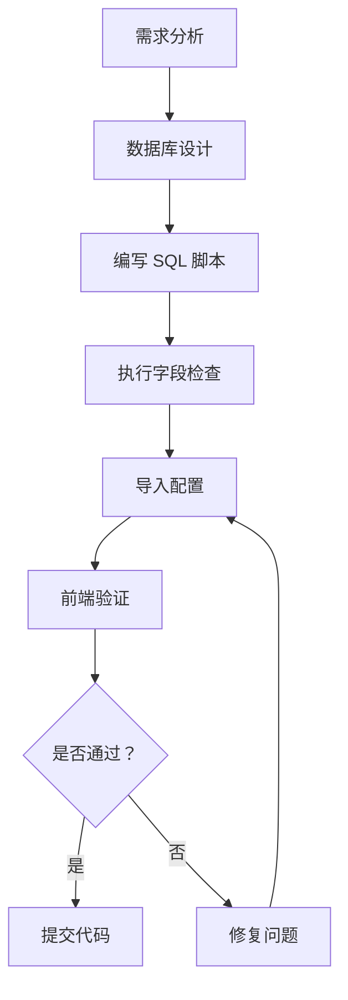

# ERP 页面配置完全指南 v4.0

## 📋 目录

- [1. 架构概述](#1-架构概述)
- [2. 配置数据结构](#2-配置数据结构)
- [3. 数据库表结构](#3-数据库表结构)
- [4. 前端解析引擎](#4-前端解析引擎)
- [5. 配置方法与规范](#5-配置方法与规范)
- [6. 字段一致性检查（强制）](#6-字段一致性检查强制)
- [7. 常见错误与避坑指南](#7-常见错误与避坑指南)
- [8. 最佳实践](#8-最佳实践)

---

## 1. 架构概述

### 1.1 设计理念

**核心思想**: **配置驱动开发 (Config-Driven Development)**

```
┌─────────────┐     ┌──────────────┐     ┌─────────────┐
│  数据库配置  │ ──> │ 前端解析引擎 │ ──> │  动态渲染   │
│  JSON 格式    │     │ ERPConfigParser│     │ Vue 组件    │
└─────────────┘     └──────────────┘     └─────────────┘
```

### 1.2 技术栈

- **后端**: Spring Boot 3.x + RuoYi-WMS 框架
- **前端**: Vue 3 + Element Plus + Vite
- **数据库**: MySQL 8.0
- **配置存储**: `erp_page_config` 表的 JSON 字段

### 1.3 配置拆分策略 (v4.0)

9 个独立 JSON 字段，职责分离:

| 字段名 | 用途 | 示例内容 |
|--------|------|----------|
| `page_config` | 页面基础信息 | pageId, pageName, permission |
| `form_config` | 表单布局与字段 | dialogWidth, fields[] |
| `table_config` | 表格列配置 | columns[], pagination |
| `search_config` | 查询表单配置 | fields[], defaultExpand |
| `action_config` | 按钮操作配置 | toolbar[], row[] |
| `api_config` | API 接口配置 | baseUrl, methods{} |
| `dict_config` | 字典数据源配置 | dictionaries{}, builder |
| `business_config` | 业务规则配置 | messages{}, entityName |
| `detail_config` | 详情页签配置 | detail.tabs[] |

---

## 2. 配置数据结构

### 2.1 完整配置树

```javascript
{
  // 1. page_config - 页面基础配置
  page_config: {
    pageId: "saleorder",
    pageName: "销售订单管理",
    permission: "k3:saleorder:query",
    layout: "standard",
    apiPrefix: "/erp/engine",
    tableName: "t_sale_order"
  },
  
  // 2. form_config - 表单配置
  form_config: {
    formConfig: {
      dialogWidth: "1400px",
      labelWidth: "120px",
      layout: "horizontal"
    },
    fields: [
      {
        field: "FBillNo",
        label: "单据编号",
        component: "input",
        span: 6,
        required: true,
        rules: [{required: true, message: "不能为空", trigger: "blur"}],
        props: {maxlength: 100, clearable: true}
      }
      // ... 更多字段
    ]
  },
  
  // 3. table_config - 表格列配置
  table_config: {
    tableName: "t_sale_order",
    primaryKey: "id",
    columns: [
      {type: "selection", width: 55, fixed: "left"},
      {type: "expand", width: 100, fixed: "left", label: "详情"},
      {
        prop: "FBillNo",
        label: "单据编号",
        width: 150,
        fixed: "left",
        align: "left",
        visible: true,
        resizable: true,
        renderType: "text"
      },
      {
        prop: "FDocumentStatus",
        label: "单据状态",
        width: 140,
        align: "center",
        visible: true,
        renderType: "tag",
        dictionary: "f_document_status"
      }
      // ... 更多列
    ],
    pagination: {
      defaultPageSize: 10,
      pageSizeOptions: [10, 20, 50, 100]
    }
  },
  
  // 4. search_config - 查询表单配置
  search_config: {
    showSearch: true,
    defaultExpand: true,
    fields: [
      {
        field: "beginDate",
        label: "开始日期",
        component: "date",
        props: {
          placeholder: "选择开始日期",
          valueFormat: "YYYY-MM-DD",
          style: {width: "160px"}
        },
        defaultValue: "2010-01-01",
        queryOperator: "gte"
      },
      {
        field: "FSalerId",
        label: "销售员",
        component: "select",
        dictionary: "salespersons",
        props: {
          placeholder: "选择销售员",
          clearable: true,
          filterable: true,
          style: {width: "120px"}
        },
        queryOperator: "eq"
      }
      // ... 更多字段
    ]
  },
  
  // 5. action_config - 按钮操作配置
  action_config: {
    toolbar: [
      {
        key: "add",
        label: "新增",
        icon: "Plus",
        permission: "k3:saleorder:add",
        type: "primary",
        position: "left",
        handler: "handleAdd"
      },
      {
        key: "delete",
        label: "删除",
        icon: "Delete",
        permission: "k3:saleorder:remove",
        type: "danger",
        position: "left",
        disabled: "multiple",
        handler: "handleDelete",
        confirm: "是否确认删除选中的 {count} 条数据？"
      }
      // ... 更多按钮
    ],
    row: []
  },
  
  // 6. api_config - API 接口配置
  api_config: {
    baseUrl: "/api/saleorder",
    methods: {
      list: {
        url: "/list",
        method: "GET",
        description: "查询销售订单列表"
      },
      get: {
        url: "/{id}",
        method: "GET",
        description: "获取销售订单详情"
      },
      add: {
        url: "/add",
        method: "POST",
        description: "新增销售订单"
      }
      // ... 更多接口
    }
  },
  
  // 7. dict_config - 字典数据源配置
  dict_config: {
    builder: {
      enabled: true
    },
    dictionaries: {
      salespersons: {
        type: "api",
        config: {
          api: "/erp/engine/dict/union/salespersons",
          useGlobalCache: true,
          cacheKey: "salespersons_dict",
          cacheTTL: 86400000
        }
      },
      customers: {
        type: "dynamic",
        table: "bd_customer",
        conditions: [
          {field: "deleted", operator: "isNull"}
        ],
        orderBy: [
          {field: "fname", direction: "ASC"}
        ],
        fieldMapping: {
          valueField: "fnumber",
          labelField: "fname"
        },
        config: {
          api: "/erp/engine/dict/union/customers",
          useGlobalCache: true
        }
      }
      // ... 更多字典
    },
    globalCacheSettings: {
      enabled: true,
      defaultTTL: 300000
    }
  },
  
  // 8. business_config - 业务规则配置
  business_config: {
    messages: {
      selectOne: "请选择一条数据",
      confirmDelete: "是否确认删除选中的 {count} 条数据？",
      success: {
        add: "新增成功",
        edit: "修改成功",
        delete: "删除成功"
      },
      error: {
        load: "加载数据失败",
        save: "保存失败"
      }
    },
    entityName: "销售订单",
    entityNameSingular: "订单",
    dialogTitle: {
      add: "新增{entityName}",
      edit: "修改{entityName}"
    },
    drawerTitle: "{entityName}详情 - {billNo}"
  },
  
  // 9. detail_config - 详情页签配置 ⚠️ 重点
  detail_config: {
    detail: {
      enabled: true,
      displayType: "drawer",
      title: "{entityName}详情 - {billNo}",
      width: "60%",
      direction: "rtl",
      loadStrategy: "lazy",
      tabs: [
        // ✅ 表格类型页签
        {
          name: "entry",
          label: "销售订单明细",
          icon: "Document",
          type: "table",              // ⚠️ 必须显式指定
          dataField: "entryList",     // ⚠️ 数据存储在 currentDetailRow.entryList
          tableName: "t_sale_order_entry",
          queryConfig: {
            enabled: true,
            defaultConditions: [
              {
                field: "FBillNo",
                operator: "eq",
                value: "${billNo}",   // ⚠️ 模板变量，运行时替换
                description: "按订单编号查询明细"
              }
            ],
            defaultOrderBy: [
              {field: "FPlanMaterialId", direction: "ASC"}
            ]
          },
          table: {                    // ⚠️ 表格配置在 tab.table 下
            border: true,
            stripe: true,
            maxHeight: "500",
            showOverflowTooltip: true,
            columns: [                // ⚠️ 列定义在这里
              {
                prop: "FPlanMaterialId",
                label: "物料编码",
                width: 120,
                align: "center",
                sortable: true
              },
              {
                prop: "FQty",
                label: "数量",
                width: 100,
                align: "right",
                renderType: "number",
                precision: 4
              }
              // ... 更多列
            ]
          }
        },
        
        // ✅ 表单类型页签 ⚠️ 高频错误点
        {
          name: "cost",
          label: "成本暂估",
          icon: "Money",
          type: "form",               // ⚠️ 必须显式指定为 form
          dataField: "costData",      // ⚠️ 数据存储在 currentDetailRow.costData
          tableName: "t_sale_order_cost",
          queryConfig: {
            enabled: true,
            defaultConditions: [
              {
                field: "FBillNo",
                operator: "eq",
                value: "${billNo}",
                description: "按订单编号查询成本"
              }
            ],
            defaultOrderBy: [
              {field: "FID", direction: "ASC"}
            ]
          },
          form: {                     // ⚠️ 表单配置在 tab.form 下
            layout: "horizontal",
            labelWidth: 140,
            columns: 3,
            fields: [                 // ⚠️ 字段定义在这里 (不是 tab.fields!)
              {
                prop: "F_hyf",
                label: "海运费 (外币)",
                span: 8,
                component: "input-number",
                renderType: "currency",
                precision: 2,
                readonly: true
              },
              {
                prop: "FBillAllAmount",
                label: "价税合计",
                span: 8,
                component: "input-number",
                renderType: "currency",
                precision: 2,
                readonly: true
              }
              // ... 更多字段
            ]
          }
        },
        
        // ✅ 描述列表类型页签
        {
          name: "info",
          label: "基本信息",
          icon: "Info",
          type: "descriptions",
          dataField: "mainData",
          fields: [                   // ⚠️ 直接放在根级别
            {prop: "FBillNo", label: "单据编号"},
            {prop: "FDate", label: "日期"}
          ]
        }
      ]
    }
  }
}
```

---

## 3. 数据库表结构

### 3.1 核心表：erp_page_config

```sql
CREATE TABLE `erp_page_config` (
  `config_id` INT PRIMARY KEY AUTO_INCREMENT COMMENT '配置 ID',
  `module_code` VARCHAR(50) NOT NULL COMMENT '模块编码 (如:saleorder)',
  `config_name` VARCHAR(100) NOT NULL COMMENT '配置名称',
  `config_type` VARCHAR(20) DEFAULT 'PAGE' COMMENT '配置类型:PAGE/MENU/BUTTON',
  
  -- ✨ 9 个 JSON 配置字段
  `page_config` JSON COMMENT '页面基础配置',
  `form_config` JSON COMMENT '表单配置',
  `table_config` JSON COMMENT '表格列配置',
  `search_config` JSON COMMENT '查询表单配置',
  `action_config` JSON COMMENT '按钮操作配置',
  `api_config` JSON COMMENT 'API 接口配置',
  `dict_config` JSON COMMENT '字典数据源配置',
  `business_config` JSON COMMENT '业务规则配置',
  `detail_config` JSON COMMENT '详情页签配置',
  
  -- 版本控制
  `version` INT DEFAULT 1 COMMENT '版本号',
  `status` CHAR(1) DEFAULT '1' COMMENT '状态:0 禁用 1 启用',
  `is_public` CHAR(1) DEFAULT '0' COMMENT '是否公共配置:0 私有 1 公共',
  
  -- 审计字段
  `create_by` VARCHAR(64) DEFAULT '' COMMENT '创建人',
  `create_time` DATETIME DEFAULT CURRENT_TIMESTAMP COMMENT '创建时间',
  `update_by` VARCHAR(64) DEFAULT '' COMMENT '更新人',
  `update_time` DATETIME DEFAULT CURRENT_TIMESTAMP ON UPDATE CURRENT_TIMESTAMP COMMENT '更新时间',
  `remark` VARCHAR(500) DEFAULT '' COMMENT '备注',
  
  UNIQUE KEY `uk_module_code` (`module_code`, `config_type`),
  KEY `idx_status` (`status`)
) ENGINE=InnoDB DEFAULT CHARSET=utf8mb4 COMMENT='ERP 页面配置表';
```

### 3.2 历史表：erp_page_config_history

用于配置变更追溯:

```sql
CREATE TABLE `erp_page_config_history` (
  `history_id` BIGINT PRIMARY KEY AUTO_INCREMENT,
  `config_id` INT NOT NULL COMMENT '原配置 ID',
  `module_code` VARCHAR(50) NOT NULL,
  `snapshot_data` JSON NOT NULL COMMENT '配置快照 (包含所有 9 个字段)',
  `change_reason` VARCHAR(500) COMMENT '变更原因',
  `create_time` DATETIME DEFAULT CURRENT_TIMESTAMP,
  `create_by` VARCHAR(64) DEFAULT '',
  
  KEY `idx_config_id` (`config_id`),
  KEY `idx_module_time` (`module_code`, `create_time`)
) ENGINE=InnoDB DEFAULT CHARSET=utf8mb4 COMMENT='ERP 页面配置历史表';
```

---

## 4. 前端解析引擎

### 4.1 核心文件结构

```
baiyu-web/src/views/erp/
├── utils/
│   ├── ERPConfigParser.mjs          # 核心解析器
│   ├── validateTabConfig.js          # 配置校验器 ⭐ 新增
│   ├── multiTableQueryBuilder.js     # 多表查询构建器
│   └── DictionaryManager.js          # 字典管理器
├── pageTemplate/
│   └── configurable/
│       └── BusinessConfigurable.vue  # 主渲染组件
```

### 4.2 解析流程

```javascript
// BusinessConfigurable.vue
import ERPConfigParser from '@/views/erp/utils/ERPConfigParser.mjs'
import { validateAllTabs } from '@/views/erp/utils/validateTabConfig.js'

// 1. 加载配置
const rawConfig = await ERPConfigParser.loadFromDatabase(moduleCode)

// 2. 解析配置
const parser = new ERPConfigParser(rawConfig)
const parsedConfig = parser.parse()

// 3. 🔍 自动校验 (开发环境)
validateDrawerTabs()

// 4. 渲染页面
// Vue 响应式系统自动更新
```

### 4.3 详情页签解析逻辑

#### 4.3.1 数据加载流程

```javascript
// BusinessConfigurable.vue#loadSubTablesByBillNo
const loadSubTablesByBillNo = async (billNo) => {
  const moduleCode = currentConfig.value?.moduleCode
  
  // 1. 解析子表格配置
  const subTableConfigs = multiTableQueryBuilder.parseSubTableConfigs(
    currentConfig.value
  )
  
  // 2. 并行查询所有子表
  const results = await multiTableQueryBuilder.queryAllSubTables(
    moduleCode,
    subTableConfigs,
    { billNo } // 上下文，用于替换 ${billNo}
  )
  
  // 3. 存储到响应式变量
  if (results.entry) {
    entryList.value = results.entry.data
    currentDetailRow.value.entryList = results.entry.data
  }
  
  if (results.cost) {
    costData.value = results.cost.data[0] || {}
    currentDetailRow.value.costData = results.cost.data[0] || {}
  }
}
```

#### 4.3.2 字段解析逻辑 ⚠️ 关键

```javascript
// BusinessConfigurable.vue#getFormFields
const getFormFields = (tab) => {
  // ✅ 优先从 tab.form.fields 读取 (标准格式)
  if (tab.form && Array.isArray(tab.form.fields)) {
    return tab.form.fields
  }
  
  // ⚠️ 降级：从 tab.fields 读取 (兼容旧格式)
  if (Array.isArray(tab.fields)) {
    return tab.fields
  }
  
  return []
}
```

#### 4.3.3 渲染逻辑

```vue
<!-- 表单类型页签 -->
<div v-else-if="tab.type === 'form'" class="tab-content">
  <el-form :model="getTabData(tab)" label-width="120px" size="small">
    <el-row :gutter="20">
      <!-- ✅ 使用 getFormFields 获取字段 -->
      <el-col
        v-for="field in getFormFields(tab)"
        :key="field.prop"
        :span="field.span || 12"
      >
        <el-form-item :label="field.label">
          <span v-if="field.renderType === 'currency'">
            {{ formatAmount(getFieldValue(getTabData(tab), field.prop)) }}
          </span>
          <span v-else>
            {{ getFieldValue(getTabData(tab), field.prop) ?? '-' }}
          </span>
        </el-form-item>
      </el-col>
    </el-row>
  </el-form>
</div>
```

### 4.4 自动校验机制

```javascript
// validateTabConfig.js
export function validateTabConfig(tab) {
  const errors = []
  const warnings = []
  
  // 基础检查
  if (!tab.name) errors.push('缺少必填字段：name')
  if (!tab.label) errors.push('缺少必填字段：label')
  if (!tab.dataField) errors.push('缺少必填字段：dataField')
  
  // 类型特定检查
  const type = tab.type || 'table'
  
  if (type === 'form') {
    const hasFormFields = tab.form && Array.isArray(tab.form.fields)
    const hasFields = Array.isArray(tab.fields)
    
    // ⚠️ 高频错误：字段路径不正确
    if (!hasFormFields && !hasFields) {
      errors.push(
        `表单类型页签 "${tab.name}" 缺少字段配置：` +
        `需要在 tab.form.fields 或 tab.fields 中定义`
      )
    }
  }
  
  if (type === 'table') {
    const hasTableColumns = tab.table && Array.isArray(tab.table.columns)
    const hasColumns = Array.isArray(tab.columns)
    
    if (!hasTableColumns && !hasColumns) {
      errors.push(
        `表格类型页签 "${tab.name}" 缺少列配置：` +
        `需要在 tab.table.columns 或 tab.columns 中定义`
      )
    }
  }
  
  return { valid: errors.length === 0, errors, warnings }
}
```

---

## 5. 配置方法与规范

### 5.1 标准配置流程

#### Step 1: 分析业务需求

```markdown
需求清单:
- [ ] 模块名称：销售订单管理
- [ ] 主表：t_sale_order
- [ ] 子表 1: t_sale_order_entry (明细)
- [ ] 子表 2: t_sale_order_cost (成本)
- [ ] 需要详情页：是
- [ ] 需要审批流：是
- [ ] 需要下推：是
```

#### Step 2: 准备 SQL 脚本

```sql
-- 文件名：销售订单初始化配置.sql
-- 位置：baiyu-web/src/views/erp/脚本库/

USE test;

-- 清理旧配置
DELETE FROM erp_page_config WHERE module_code = 'saleorder';

-- 插入新配置
INSERT INTO erp_page_config (
  module_code, config_name, config_type,
  page_config, form_config, table_config,
  search_config, action_config, api_config,
  dict_config, business_config, detail_config,
  version, status, is_public, create_by, remark
) VALUES (
  'saleorder', '销售订单管理', 'PAGE',
  -- page_config
  '{"pageId":"saleorder","pageName":"销售订单管理",...}',
  -- form_config
  '{"formConfig":{"dialogWidth":"1400px"},...}',
  -- table_config
  '{"tableName":"t_sale_order","columns":[...]}',
  -- search_config
  '{"showSearch":true,"fields":[...]}',
  -- action_config
  '{"toolbar":[...],"row":[]}',
  -- api_config
  '{"baseUrl":"/api/saleorder","methods":{...}}',
  -- dict_config
  '{"builder":{"enabled":true},"dictionaries":{...}}',
  -- business_config
  '{"messages":{...},"entityName":"销售订单"}',
  -- detail_config ⚠️ 重点
  '{"detail":{"enabled":true,"tabs":[...]}}',
  1, '1', '0', 'admin', '销售订单配置 v4.0'
);
```

#### Step 3: 执行 SQL 导入

```bash
# 方式 1: MySQL 命令行
mysql -u root -p test < 销售订单初始化配置.sql

# 方式 2: Navicat / DBeaver
# 打开 SQL 文件 -> 运行
```

#### Step 4: 验证配置

```sql
-- 检查配置是否导入成功
SELECT 
  config_id,
  module_code,
  config_name,
  JSON_LENGTH(detail_config) AS detail_tabs_count
FROM erp_page_config
WHERE module_code = 'saleorder';

-- 检查详情页签数量
SELECT 
  JSON_LENGTH(JSON_EXTRACT(detail_config, '$.detail.tabs')) AS tabs_count
FROM erp_page_config
WHERE module_code = 'saleorder';
```

#### Step 5: 前端验证

1. 访问页面：`http://localhost/saleorder`
2. 打开浏览器控制台 (F12)
3. 查看是否有配置校验报告:

```
📑 [详情页签配置校验报告]
✅ 所有页签配置校验通过
📊 统计：共 2 个页签，成功 2 个，失败 0 个
```

---

### 5.2 配置规范细则

#### 5.2.1 命名规范

```javascript
// ✅ 正确：snake_case
{
  field: "FBillNo",           // 数据库字段名
  prop: "FPlanMaterialId",    // 表格列 prop
  dataField: "entryList"      // 数据字段名
}

// ❌ 错误：camelCase
{
  field: "fBillNo",           // ❌ 大小写不一致
  prop: "fPlanMaterialId"     // ❌ 大小写不一致
}
```

#### 5.2.2 类型映射规范

| 数据库类型 | 前端 component | renderType | 示例 |
|-----------|---------------|------------|------|
| VARCHAR | input | text | FBillNo |
| DECIMAL | input-number | currency | FBillAmount |
| DATE | date | date | FDate |
| DATETIME | date-picker | datetime | FCreateDate |
| TINYINT | select | tag | FDocumentStatus |
| TEXT | textarea | text | FRemark |

#### 5.2.3 字典配置规范

```javascript
// ✅ 推荐：使用 API 统一接口
dict_config: {
  builder: {
    enabled: true
  },
  dictionaries: {
    salespersons: {
      type: "api",
      config: {
        api: "/erp/engine/dict/union/salespersons",
        useGlobalCache: true
      }
    }
  }
}

// ⚠️ 注意：普通字典不需要配置
// 前端会自动从 /erp/engine/dict/all 获取
```

#### 5.2.4 权限配置规范

```javascript
// ✅ 标准格式
action_config: {
  toolbar: [
    {
      key: "add",
      label: "新增",
      permission: "k3:saleorder:add"  // ⚠️ 权限标识
    }
  ]
}

// 权限标识规则：k3:{module}:{action}
// k3:saleorder:add      - 新增
// k3:saleorder:edit     - 修改
// k3:saleorder:delete   - 删除
// k3:saleorder:query    - 查询
// k3:saleorder:audit    - 审核
// k3:saleorder:unAudit  - 反审核
// k3:saleorder:push     - 下推
```

---

## 6. 字段一致性检查（强制）⭐

### 6.1 为什么必须检查？

**血泪教训**: 配置字段与数据库字段不一致会导致:
- ❌ 页面显示空白
- ❌ 查询无结果
- ❌ 保存失败
- ❌ 数据错乱

### 6.2 检查清单

#### Check 1: 主表字段验证

```sql
-- 1. 获取配置中的字段列表
SELECT 
  JSON_UNQUOTE(JSON_EXTRACT(field, '$.field')) AS field_name
FROM erp_page_config,
JSON_TABLE(form_config->'$.fields', '$[*]' COLUMNS(
  field JSON PATH '$'
)) AS jt
WHERE module_code = 'saleorder';

-- 2. 获取数据库实际字段
DESCRIBE t_sale_order;

-- 3. 对比差异
-- 手动对比或使用以下脚本:
```

**自动化脚本**:

```sql
-- 文件名：verify-saleorder-fields.sql
DELIMITER $$

CREATE PROCEDURE verify_saleorder_fields()
BEGIN
  -- 配置中的字段
  CREATE TEMPORARY TABLE config_fields (
    field_name VARCHAR(100)
  );
  
  INSERT INTO config_fields
  SELECT JSON_UNQUOTE(JSON_EXTRACT(field, '$.field'))
  FROM erp_page_config,
  JSON_TABLE(form_config->'$.fields', '$[*]' COLUMNS(
    field JSON PATH '$'
  )) AS jt
  WHERE module_code = 'saleorder';
  
  -- 数据库中的字段
  CREATE TEMPORARY TABLE db_fields (
    field_name VARCHAR(100)
  );
  
  INSERT INTO db_fields
  SELECT COLUMN_NAME
  FROM INFORMATION_SCHEMA.COLUMNS
  WHERE TABLE_SCHEMA = 'test'
    AND TABLE_NAME = 't_sale_order';
  
  -- 找出配置有但数据库没有的字段 ❌
  SELECT 
    '❌ 配置中存在但数据库缺失的字段' AS issue_type,
    c.field_name
  FROM config_fields c
  LEFT JOIN db_fields d ON c.field_name = d.field_name
  WHERE d.field_name IS NULL;
  
  -- 找出数据库有但配置没有的字段 ⚠️
  SELECT 
    '⚠️ 数据库存在但配置缺失的字段' AS issue_type,
    d.field_name
  FROM db_fields d
  LEFT JOIN config_fields c ON d.field_name = c.field_name
  WHERE c.field_name IS NULL;
  
  DROP TEMPORARY TABLE config_fields, db_fields;
END$$

DELIMITER ;

-- 执行检查
CALL verify_saleorder_fields();
```

#### Check 2: 子表字段验证

```sql
-- 明细表字段验证
DESCRIBE t_sale_order_entry;

-- 成本表字段验证
DESCRIBE t_sale_order_cost;

-- 对比配置中的字段
SELECT 
  JSON_UNQUOTE(JSON_EXTRACT(field, '$.prop')) AS column_name
FROM erp_page_config,
JSON_TABLE(detail_config->'$.detail.tabs[0].table.columns', '$[*]' COLUMNS(
  field JSON PATH '$'
)) AS jt
WHERE module_code = 'saleorder';
```

#### Check 3: 查询条件字段验证

```sql
-- 检查 search_config 中的字段
SELECT 
  JSON_UNQUOTE(JSON_EXTRACT(field, '$.field')) AS search_field
FROM erp_page_config,
JSON_TABLE(search_config->'$.fields', '$[*]' COLUMNS(
  field JSON PATH '$'
)) AS jt
WHERE module_code = 'saleorder';

-- 验证这些字段是否在主表中存在
```

### 6.3 快速验证工具

创建 SQL 脚本自动验证:

```sql
-- 文件名：verify-all-fields.sql
-- 用途：一键验证所有配置字段与数据库的一致性

SELECT '========================================' AS '';
SELECT '🔍 开始验证销售订单配置字段一致性' AS '';
SELECT '========================================' AS '';

-- 1. 主表验证
SELECT '【1】主表：t_sale_order' AS check_item;
SELECT 
  COUNT(*) AS config_fields_count
FROM erp_page_config,
JSON_TABLE(form_config->'$.fields', '$[*]' COLUMNS(
  field JSON PATH '$'
)) AS jt
WHERE module_code = 'saleorder';

SELECT 
  COUNT(*) AS db_columns_count
FROM INFORMATION_SCHEMA.COLUMNS
WHERE TABLE_SCHEMA = 'test'
  AND TABLE_NAME = 't_sale_order';

-- 2. 明细表验证
SELECT '【2】明细表：t_sale_order_entry' AS check_item;
SELECT 
  COUNT(*) AS entry_columns_count
FROM erp_page_config,
JSON_TABLE(detail_config->'$.detail.tabs[0].table.columns', '$[*]' COLUMNS(
  field JSON PATH '$'
)) AS jt
WHERE module_code = 'saleorder';

SELECT 
  COUNT(*) AS db_columns_count
FROM INFORMATION_SCHEMA.COLUMNS
WHERE TABLE_SCHEMA = 'test'
  AND TABLE_NAME = 't_sale_order_entry';

-- 3. 成本表验证
SELECT '【3】成本表：t_sale_order_cost' AS check_item;
SELECT 
  COUNT(*) AS cost_fields_count
FROM erp_page_config,
JSON_TABLE(detail_config->'$.detail.tabs[1].form.fields', '$[*]' COLUMNS(
  field JSON PATH '$'
)) AS jt
WHERE module_code = 'saleorder';

SELECT 
  COUNT(*) AS db_columns_count
FROM INFORMATION_SCHEMA.COLUMNS
WHERE TABLE_SCHEMA = 'test'
  AND TABLE_NAME = 't_sale_order_cost';

SELECT '========================================' AS '';
SELECT '✅ 验证完成！请对比数量是否一致' AS '';
SELECT '========================================' AS '';
```

### 6.4 字段映射检查表

创建 Excel/Markdown 表格手动核对:

```markdown
| 配置位置 | 配置字段名 | 数据库表 | 数据库字段名 | 类型 | 是否一致 |
|---------|-----------|---------|-------------|------|---------|
| form_config.fields[0] | FBillNo | t_sale_order | FBillNo | VARCHAR | ✅ |
| form_config.fields[1] | FDate | t_sale_order | FDate | DATE | ✅ |
| table_config.columns[2] | FBillNo | t_sale_order | FBillNo | VARCHAR | ✅ |
| detail.tabs[0].columns[0] | FPlanMaterialId | t_sale_order_entry | FPlanMaterialId | VARCHAR | ✅ |
| detail.tabs[1].fields[0] | F_hyf | t_sale_order_cost | F_hyf | DECIMAL | ✅ |
```

---

## 7. 常见错误与避坑指南

### 7.1 高频错误 Top 10

#### ❌ 错误 1: 字段路径错误 (发生率 80%)

```javascript
// ❌ 错误：表单类型的字段放在 tab.fields
{
  name: "cost",
  type: "form",
  fields: [...]  // ❌ 错误！应该放在 tab.form.fields
}

// ✅ 正确
{
  name: "cost",
  type: "form",
  form: {
    fields: [...]  // ✅ 正确
  }
}
```

**后果**: 页面显示空白，无字段渲染

**解决方案**: 
1. 检查 `type` 是否为 `form`
2. 确保字段在 `tab.form.fields` 中
3. 开发环境会自动输出校验报告

---

#### ❌ 错误 2: 类型未显式指定 (发生率 60%)

```javascript
// ❌ 错误：依赖前端默认值
{
  name: "cost",
  dataField: "costData"
  // ❌ 未指定 type，前端会降级为 table 类型
}

// ✅ 正确：显式指定
{
  name: "cost",
  type: "form",  // ✅ 必须显式指定
  dataField: "costData"
}
```

**后果**: 表单类型被当作表格类型渲染

**解决方案**: 始终显式指定 `type` 字段

---

#### ❌ 错误 3: 字段名大小写不一致 (发生率 50%)

```javascript
// ❌ 错误：配置 fBillNo，数据库 FBillNo
{
  field: "fBillNo"  // ❌ 小写
}

// ✅ 正确：与数据库完全一致
{
  field: "FBillNo"  // ✅ 大写
}
```

**后果**: 数据无法绑定，显示 undefined

**解决方案**: 
1. 使用数据库工具导出字段名
2. 复制粘贴，不要手打
3. 执行字段一致性检查脚本

---

#### ❌ 错误 4: 模板变量未替换 (发生率 40%)

```javascript
// ❌ 错误：忘记使用 ${billNo}
queryConfig: {
  defaultConditions: [
    {
      field: "FBillNo",
      value: "billNo"  // ❌ 字符串字面量
    }
  ]
}

// ✅ 正确：使用模板变量
queryConfig: {
  defaultConditions: [
    {
      field: "FBillNo",
      value: "${billNo}"  // ✅ 模板变量，运行时替换
    }
  ]
}
```

**后果**: 查询条件变成 `FBillNo = 'billNo'`，查不到数据

**解决方案**: 使用 `${variableName}` 格式

---

#### ❌ 错误 5: dataField 与数据不匹配 (发生率 35%)

```javascript
// ❌ 错误：dataField 与实际数据变量不一致
{
  name: "entry",
  dataField: "entryData"  // ❌ 应该是 entryList
}

// ✅ 正确
{
  name: "entry",
  dataField: "entryList"  // ✅ 与 currentDetailRow.entryList 一致
}
```

**后果**: 页面提示"暂无数据"，实际数据已加载

**解决方案**: 
- 明细表：`dataField: "entryList"`
- 成本表：`dataField: "costData"`

---

#### ❌ 错误 6: 表格列配置路径错误 (发生率 30%)

```javascript
// ❌ 错误：列放在 tab.columns
{
  name: "entry",
  type: "table",
  columns: [...]  // ❌ 错误
}

// ✅ 正确：列放在 tab.table.columns
{
  name: "entry",
  type: "table",
  table: {
    columns: [...]  // ✅ 正确
  }
}
```

**后果**: 表格无列定义，无法渲染

---

#### ❌ 错误 7: 字典配置冗余 (发生率 25%)

```javascript
// ❌ 错误：配置了所有字典
dict_config: {
  dictionaries: {
    order_status: {...},      // ❌ 不需要
    f_document_status: {...}, // ❌ 不需要
    currency: {...}           // ❌ 不需要
  }
}

// ✅ 正确：仅配置特殊字典
dict_config: {
  builder: {
    enabled: true
  },
  dictionaries: {
    salespersons: {...},  // ✅ 需要特殊处理
    customers: {...}      // ✅ 需要特殊处理
  }
}
```

**后果**: 配置冗余，维护成本高

**解决方案**: 普通字典会自动从 `/erp/engine/dict/all` 获取

---

#### ❌ 错误 8: 权限标识错误 (发生率 20%)

```javascript
// ❌ 错误：权限标识格式不对
{
  key: "add",
  permission: "saleorder:add"  // ❌ 缺少 k3:前缀
}

// ✅ 正确
{
  key: "add",
  permission: "k3:saleorder:add"  // ✅ 完整格式
}
```

**后果**: 按钮不显示或点击无权限

---

#### ❌ 错误 9: 查询条件字段不存在 (发生率 15%)

```javascript
// ❌ 错误：配置了不存在的字段
search_config: {
  fields: [
    {
      field: "FNotExists",  // ❌ 数据库中无此字段
      label: "不存在的字段"
    }
  ]
}
```

**后果**: 查询报错 SQLSyntaxErrorException

**解决方案**: 执行字段一致性检查脚本

---

#### ❌ 错误 10: JSON 语法错误 (发生率 10%)

```javascript
// ❌ 错误：缺少逗号或引号
{
  field: "FBillNo"
  label: "单据编号"  // ❌ 缺少逗号
}

// ✅ 正确
{
  field: "FBillNo",  // ✅ 有逗号
  label: "单据编号"
}
```

**后果**: SQL 执行失败，配置导入不成功

**解决方案**: 
1. 使用 JSON 验证工具
2. VSCode 安装 JSON 插件
3. 执行 `SELECT JSON_VALID(config)` 检查

---

## 8. 最佳实践

### 8.1 配置开发流程



### 8.2 SQL 脚本管理规范

```
baiyu-web/src/views/erp/脚本库/
├── 销售订单初始化配置.sql          # 主配置
├── 销售订单 - 字段验证.sql          # 字段检查
├── 销售订单 - 测试数据.sql          # 测试数据
└── README.md                       # 使用说明
```

### 8.3 配置复用技巧

#### 技巧 1: 使用注释模板

```sql
-- ============================================
-- 模块：销售订单
-- 版本：v4.0
-- 日期：2026-03-31
-- 说明：9 字段强制拆分版
-- ============================================

-- 清理旧配置
DELETE FROM erp_page_config WHERE module_code = 'saleorder';

-- 插入新配置
INSERT INTO erp_page_config (...) VALUES (...);

-- 验证
SELECT * FROM erp_page_config WHERE module_code = 'saleorder';
```

#### 技巧 2: 分步导入

```sql
-- Step 1: 导入基础配置
SOURCE 01-page-config.sql;

-- Step 2: 导入字典配置
SOURCE 02-dict-config.sql;

-- Step 3: 导入详情页配置
SOURCE 03-detail-config.sql;

-- Step 4: 验证
SELECT '✅ 配置导入成功' AS result;
```

#### 技巧 3: 版本控制

```sql
-- 每次修改增加版本号
UPDATE erp_page_config
SET version = version + 1,
    remark = 'v4.1 - 修复成本表字段路径'
WHERE module_code = 'saleorder';

-- 记录历史
INSERT INTO erp_page_config_history (
  config_id, module_code, snapshot_data, change_reason
)
SELECT 
  config_id, module_code,
  JSON_OBJECT(
    'page_config', page_config,
    'form_config', form_config,
    -- ... 所有字段
  ),
  '修复成本表字段路径问题'
FROM erp_page_config
WHERE module_code = 'saleorder';
```

### 8.4 调试技巧

#### 技巧 1: 查看解析后的配置

```javascript
// 在浏览器控制台执行
console.log('解析后的配置:', parsedConfig)
console.log('详情页签:', parsedConfig.drawer.tabs)
```

#### 技巧 2: 查看加载的数据

```javascript
// 在浏览器控制台执行
console.log('currentDetailRow:', currentDetailRow.value)
console.log('entryList:', entryList.value)
console.log('costData:', costData.value)
```

#### 技巧 3: 使用配置校验工具

```javascript
// 在浏览器控制台执行
import { validateAllTabs } from '@/views/erp/utils/validateTabConfig.js'

const tabs = parsedConfig.drawer.tabs
const result = validateAllTabs(tabs)
console.log('校验结果:', result)
```

### 8.5 性能优化建议

#### 建议 1: 字典缓存

```javascript
dict_config: {
  globalCacheSettings: {
    enabled: true,
    defaultTTL: 300000  // 5 分钟
  }
}
```

#### 建议 2: 懒加载策略

```javascript
detail_config: {
  detail: {
    loadStrategy: "lazy"  // ✅ 打开抽屉时才加载
  }
}
```

#### 建议 3: 分页配置

```javascript
table_config: {
  pagination: {
    defaultPageSize: 10,      // ✅ 默认 10 条
    pageSizeOptions: [10, 20, 50, 100]
  }
}
```

---

## 附录

### A. 快速参考卡

```
┌─────────────────────────────────────────────┐
│  配置类型    │  字段路径                    │
├─────────────────────────────────────────────┤
│  表格列      │  tab.table.columns[]         │
│  表单字段    │  tab.form.fields[]           │
│  描述列表    │  tab.fields[]                │
│  查询字段    │  search_config.fields[]      │
│  表单字段    │  form_config.fields[]        │
└─────────────────────────────────────────────┘

┌─────────────────────────────────────────────┐
│  数据类型    │  component   │  renderType  │
├─────────────────────────────────────────────┤
│  VARCHAR     │  input       │  text        │
│  DECIMAL     │  input-number│  currency    │
│  DATE        │  date        │  date        │
│  DATETIME    │  date-picker │  datetime    │
│  TINYINT     │  select      │  tag         │
└─────────────────────────────────────────────┘
```

### B. 检查清单模板

```markdown
## 配置发布前检查清单

- [ ] SQL 脚本已编写完成
- [ ] 字段一致性检查已通过
- [ ] 配置已导入数据库
- [ ] 前端校验报告无错误
- [ ] 页面功能测试正常
- [ ] 权限配置已确认
- [ ] 字典配置已确认
- [ ] 历史配置已备份
- [ ] 代码已提交
```

### C. 相关文档

- [ERP 配置化架构文档 v3.1.md](./ERP 配置化架构文档 v3.1.md)
- [api 配置拆分 SQL 优化完成报告 3.28.19.54.md](./api 配置拆分 SQL 优化完成报告 3.28.19.54.md)
- [详情页子表格模板变量命名规范](../../../../../docs/详情页子表格模板变量命名规范.md)

---

## 更新日志

| 版本 | 日期 | 更新内容 | 作者 |
|------|------|---------|------|
| v4.0 | 2026-03-31 | 初始版本，完整阐述配置逻辑 | MM |
| v4.1 | TBD | 添加更多示例 | - |

---

**文档维护**: MM 团队  
**最后更新**: 2026-03-31  
**反馈联系**: 请在项目中提交 Issue
