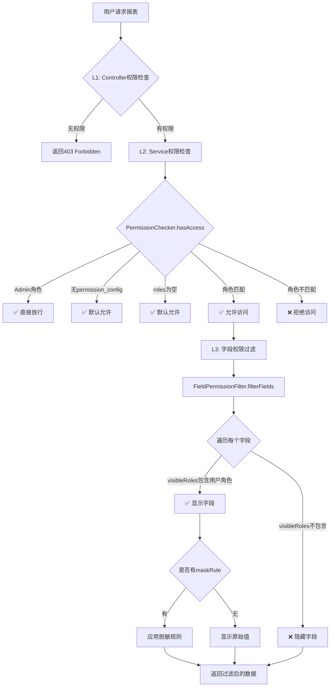

# 报表模块权限控制实现详解

**文档版本：** v1.0  
**最后更新：** 2026-04-30  
**适用范围：** 报表模块前后端权限控制  

---

## 📋 目录

1. [权限架构总览](#1-权限架构总览)
2. [后端权限控制](#2-后端权限控制)
3. [前端权限控制](#3-前端权限控制)
4. [权限配置流程](#4-权限配置流程)
5. [权限数据结构](#5-权限数据结构)
6. [安全机制](#6-安全机制)

---

## 1. 权限架构总览

### 1.1 权限控制层级

报表模块采用**三层权限控制架构**：

```
┌─────────────────────────────────────────────┐
│         L1: 菜单/按钮级权限 (Controller层)    │
│  @SaCheckPermission("report:config:add")     │
│  v-hasPermi="['report:permission:assign']"   │
└──────────────────┬──────────────────────────┘
                   │
┌──────────────────▼──────────────────────────┐
│      L2: 报表访问级权限 (Service层)           │
│  PermissionChecker.hasAccess()               │
│  - Admin角色全放行                            │
│  - 基于permission_config.roles匹配           │
└──────────────────┬──────────────────────────┘
                   │
┌──────────────────▼──────────────────────────┐
│      L3: 字段级权限 (Engine层)               │
│  FieldPermissionFilter.filterFields()        │
│  - visibleRoles控制字段可见性                 │
│  - maskRule控制数据脱敏                       │
└─────────────────────────────────────────────┘
```

---

### 1.2 权限控制流程图



---

## 2. 后端权限控制

### 2.1 L1: Controller层权限（菜单/按钮级）

#### 实现位置
- **文件：** `ReportConfigController.java`, `ReportExecuteController.java`
- **技术：** Sa-Token `@SaCheckPermission`

#### 示例代码

```java
// ReportConfigController.java - Line 98
@PostMapping
@SaCheckPermission("report:config:add")  // ✅ 新增报表权限
public R<Map<String, Object>> add(@RequestBody Map<String, Object> config) {
    // ...
}

// ReportConfigController.java - Line 165
@PutMapping
@SaCheckPermission("report:config:edit")  // ✅ 编辑报表权限
public R<Void> edit(@RequestBody Map<String, Object> config) {
    // ...
}

// ReportConfigController.java - Line 214
@DeleteMapping("/{reportId}")
@SaCheckPermission("report:config:remove")  // ✅ 删除报表权限
public R<Void> remove(@PathVariable Long reportId) {
    // ...
}

// ReportConfigController.java - Line 251
@PutMapping("/permission/{reportCode}")
@SaCheckPermission("report:permission:assign")  // ✅ 分配权限权限
public R<Void> updatePermission(
    @PathVariable String reportCode,
    @RequestBody Map<String, Object> permissionConfig
) {
    // ...
}
```

#### 权限标识列表

| 权限标识 | 说明 | 使用位置 |
|---------|------|---------|
| `report:config:add` | 新增报表配置 | ReportConfigController.add() |
| `report:config:edit` | 编辑报表配置 | ReportConfigController.edit(), toggleReportStatus() |
| `report:config:remove` | 删除报表配置 | ReportConfigController.remove() |
| `report:permission:assign` | 分配报表权限 | ReportConfigController.updatePermission() |
| `report:query:*` | 查询报表数据 | ReportTreeServiceImpl.convertToReportNode() |

---

### 2.2 L2: Service层权限（报表访问级）

#### 核心组件：PermissionChecker

**位置：** `com.ruoyi.report.service.PermissionChecker`

**职责：** 统一权限检查逻辑，确保所有报表访问点使用一致的权限判断

#### 核心方法

```java
/**
 * Check if user has access to a report
 * 
 * @param config Report configuration (Map format)
 * @param currentUser Current login user
 * @return true if user has access, false otherwise
 */
public boolean hasAccess(Map<String, Object> config, LoginUser currentUser)
```

#### 权限检查逻辑（7步）

```java
// PermissionChecker.java - Line 34-98
public boolean hasAccess(Map<String, Object> config, LoginUser currentUser) {
    String reportCode = (String) config.get("report_code");
    String reportName = (String) config.get("report_name");
    
    try {
        // Step 1: 获取权限配置
        String permissionConfigJson = (String) config.get("permission_config");
        if (permissionConfigJson == null || permissionConfigJson.trim().isEmpty()) {
            log.debug("No permission config for report '{}', allowing access", reportCode);
            return true;  // ✅ 无配置则允许访问
        }
        
        JSONObject permConfig = JSON.parseObject(permissionConfigJson);
        JSONObject reportLevel = permConfig.getJSONObject("reportLevel");
        
        if (reportLevel == null) {
            log.debug("No report-level permission for report '{}', allowing access", reportCode);
            return true;  // ✅ 无报表级权限则允许访问
        }
        
        JSONArray allowedRoles = reportLevel.getJSONArray("roles");
        if (allowedRoles == null || allowedRoles.isEmpty()) {
            log.debug("No role restriction for report '{}', allowing access", reportCode);
            return true;  // ✅ 无角色限制则允许访问
        }
        
        // Step 2: 获取当前用户角色
        List<String> userRoleKeys = currentUser.getRoles() != null ? 
            currentUser.getRoles().stream()
                .map(role -> role.getRoleKey())
                .collect(Collectors.toList()) : new ArrayList<>();
        
        // Step 3: Admin角色绕过所有权限检查
        if (userRoleKeys.contains("admin")) {
            log.info("Permission check PASSED: Admin user '{}' has full access to report '{}' ({})", 
                currentUser.getUsername(), reportCode, reportName);
            return true;  // ✅ Admin全放行
        }
        
        // Step 4: 检查用户是否拥有允许的角色
        for (int i = 0; i < allowedRoles.size(); i++) {
            String allowedRole = allowedRoles.getString(i);
            
            // 支持通配符 "*" 或精确角色匹配
            if ("*".equals(allowedRole)) {
                log.info("Permission check PASSED: User '{}' matched wildcard role for report '{}'", 
                    currentUser.getUsername(), reportCode);
                return true;  // ✅ 通配符匹配
            } else if (userRoleKeys.contains(allowedRole)) {
                log.info("Permission check PASSED: User '{}' has role '{}' for report '{}'", 
                    currentUser.getUsername(), allowedRole, reportCode);
                return true;  // ✅ 角色匹配
            }
        }
        
        // Step 5: 未匹配到任何角色 - 拒绝访问
        log.warn("Permission DENIED: User '{}' (roles={}) denied access to report '{}' ({})", 
            currentUser.getUsername(), userRoleKeys, reportCode, reportName);
        return false;  // ❌ 拒绝访问
        
    } catch (Exception e) {
        log.error("Parse permission config failed for report '{}', DENYING access", reportCode, e);
        return false;  // ❌ 解析失败则拒绝访问（Fail-closed策略）
    }
}
```

#### 使用场景

**场景1：报表查询前检查**
```java
// ReportEngineServiceImpl.java - Line 130
@Override
public Map<String, Object> executeReport(String reportCode, Map<String, Object> queryParams, LoginUser currentUser) {
    // 1. Get report configuration
    Map<String, Object> config = selectReportConfigByCode(reportCode);
    
    // 2. Check report status
    if (!ReportConstants.STATUS_ENABLED.equals(config.get("status"))) {
        throw new IllegalStateException("报表已禁用: " + reportCode);
    }
    
    // 3. ✅ Check role permission
    checkReportPermission(config, currentUser);
    
    // 4. Execute query...
}

private void checkReportPermission(Map<String, Object> config, LoginUser currentUser) {
    boolean hasAccess = permissionChecker.hasAccess(config, currentUser);
    
    if (!hasAccess) {
        String reportCode = (String) config.get("report_code");
        log.warn("Throwing NotRoleException for user '{}' accessing report '{}'", 
            currentUser.getUsername(), reportCode);
        throw new NotRoleException("您没有权限访问此报表，请联系管理员配置权限");
    }
}
```

**场景2：报表树构建时过滤**
```java
// ReportTreeServiceImpl.java - Line 136
private boolean hasReportPermission(Map<String, Object> report, List<String> userRoles) {
    LoginUser currentUser = LoginHelper.getLoginUser();
    if (currentUser == null) {
        log.warn("No login user found, denying access to report '{}'", report.get("report_code"));
        return false;
    }
    
    // Use unified permission checker
    return permissionChecker.hasAccess(report, currentUser);
}
```

**场景3：导出权限检查**
```java
// ReportExecuteController.java - Line 229
private void checkExportPermission(String reportCode, LoginUser user) {
    Map<String, Object> config = reportEngineService.getReportConfig(reportCode);
    if (config == null) {
        throw new IllegalStateException("报表配置不存在: " + reportCode);
    }
    
    String permissionConfigJson = (String) config.get("permission_config");
    if (permissionConfigJson == null || permissionConfigJson.trim().isEmpty()) {
        return; // No config, allow by default
    }
    
    try {
        JSONObject permConfig = JSON.parseObject(permissionConfigJson);
        Boolean canExport = permConfig.getBoolean("canExport");
        
        if (canExport != null && !canExport) {
            throw new NotRoleException("您没有导出此报表的权限");
        }
    } catch (Exception e) {
        log.error("Parse permission config failed, reportCode={}", reportCode, e);
        throw new IllegalStateException("报表权限配置异常，请联系管理员");
    }
}
```

---

### 2.3 L3: Engine层权限（字段级）

#### 核心组件：FieldPermissionFilter

**位置：** `com.ruoyi.report.engine.FieldPermissionFilter`

**职责：** 
1. 根据用户角色过滤不可见字段
2. 对敏感字段应用脱敏规则

#### 核心方法1：filterFields（数据过滤）

```java
/**
 * Filter sensitive fields in query results (including masking)
 * 
 * @param dataList Original data
 * @param fieldConfigJson Field configuration JSON string
 * @param userRoles User role list (RoleVO objects)
 * @return Filtered data
 */
public List<Map<String, Object>> filterFields(
    List<Map<String, Object>> dataList,
    String fieldConfigJson,
    List<RoleVO> userRoles
)
```

**处理流程：**
1. 解析权限配置，提取允许字段集合和脱敏规则
2. 遍历每行数据，只保留用户有权查看的字段
3. 对需要脱敏的字段应用脱敏策略

**使用示例：**
```java
// ReportEngineServiceImpl.java - Line 182
List<Map<String, Object>> filteredData = fieldPermissionFilter.filterFields(
    rawData,
    (String) config.get("permission_config"),
    currentUser.getRoles()
);
```

#### 核心方法2：buildVisibleColumns（元数据构建）

```java
/**
 * Build column definitions in metadata (with field permissions applied)
 * Merge field_config (label, width, format) with permission_config (visibleRoles, maskRule)
 * 
 * @param fieldConfigJson Field configuration JSON
 * @param permissionConfigJson Permission configuration JSON
 * @param userRoles User role list
 * @return Visible column definition list
 */
public List<Map<String, Object>> buildVisibleColumns(
    String fieldConfigJson, 
    String permissionConfigJson, 
    List<RoleVO> userRoles
)
```

**作用：** 生成前端表格列定义，只包含用户有权查看的字段

**使用示例：**
```java
// ReportEngineServiceImpl.java - Line 517
List<Map<String, Object>> columns = fieldPermissionFilter.buildVisibleColumns(
    (String) config.get("field_config"),      // Field configuration
    (String) config.get("permission_config"), // Permission configuration
    currentUser.getRoles()
);
metadata.put("columns", columns);
```

#### 脱敏策略

**支持的脱敏规则：**

| 规则值 | 说明 | 示例 |
|--------|------|------|
| `""` 或 `null` | 不脱敏 | `13800138000` → `13800138000` |
| `MASKED` | 完全隐藏 | `13800138000` → `***` |
| `show_first_3` | 显示前3位 | `13800138000` → `138******` |
| `show_last_4` | 显示后4位 | `13800138000` → `*******8000` |

**脱敏策略工厂：**
```java
// FieldPermissionFilter.java - Line 61
MaskStrategy strategy = MaskStrategyFactory.getStrategy(maskRule);
value = strategy.mask((String) value);
```

---

## 3. 前端权限控制

### 3.1 L1: 菜单/按钮级权限

#### 实现方式：v-hasPermi 指令

**位置：** `frontend/src/views/erp/report/ReportPermission.vue`

**示例：**
```vue
<!-- Line 32 -->
<el-button 
  v-hasPermi="['report:permission:assign']"
  type="primary" 
  @click="handleSave" 
  :loading="saving"
>
  保存配置
</el-button>
```

**工作原理：**
- `v-hasPermi` 是若依框架提供的自定义指令
- 检查当前用户是否拥有指定权限标识
- 无权限则隐藏按钮

---

### 3.2 L2: 报表访问级权限

#### 实现方式：后端统一控制

**说明：** 前端无需单独实现报表访问权限检查，由后端 `PermissionChecker` 统一控制

**流程：**
1. 前端调用 `/report/execute` 接口
2. 后端 `ReportEngineServiceImpl.executeReport()` 自动检查权限
3. 无权限则抛出 `NotRoleException`
4. 前端全局异常处理器捕获并提示用户

**前端错误处理：**
```javascript
// frontend/src/api/report.js
export function executeReport(data) {
  return request({
    url: '/report/execute',
    method: 'post',
    data: data
  })
}

// 全局异常处理（在 request.js 中）
service.interceptors.response.use(
  response => {
    const res = response.data
    if (res.code !== 200) {
      ElMessage.error(res.msg || 'Error')
      
      // 403 权限不足
      if (res.code === 403) {
        router.push('/403')
      }
      
      return Promise.reject(new Error(res.msg || 'Error'))
    }
    return res
  },
  error => {
    ElMessage.error(error.message || 'Network Error')
    return Promise.reject(error)
  }
)
```

---

### 3.3 L3: 字段级权限

#### 实现方式：后端过滤 + 前端渲染

**后端处理：**
```java
// ReportEngineServiceImpl.java - Line 182
List<Map<String, Object>> filteredData = fieldPermissionFilter.filterFields(
    rawData,
    (String) config.get("permission_config"),
    currentUser.getRoles()
);
```

**前端接收：**
- 前端只接收到用户有权查看的字段
- 无权字段已被后端过滤，不会出现在响应数据中

**元数据中的列定义：**
```javascript
// 前端从 metadata.columns 获取列定义
const columns = response.data.metadata.columns
// columns 只包含用户有权查看的字段
```

---

## 4. 权限配置流程

### 4.1 配置入口

**页面路径：** `/erp/report/permission`  
**组件：** `ReportPermission.vue`

### 4.2 配置步骤

#### Step 1: 选择报表

从左侧报表树中选择要配置的报表

```vue
<!-- ReportPermission.vue - Line 8-21 -->
<el-tree
  :data="reportTree"
  node-key="id"
  highlight-current
  :props="{ children: 'children', label: 'label' }"
  @node-click="handleSelectReport"
>
```

---

#### Step 2: 配置报表访问权限

**Tab：** "报表访问权限"

**配置项：** 允许角色（多选）

```vue
<!-- ReportPermission.vue - Line 46-62 -->
<el-form-item label="允许角色">
  <el-select
    v-model="permissionForm.reportLevel.roles"
    multiple
    collapse-tags
    :loading="roleLoading"
    placeholder="请选择角色"
    style="width: 100%"
  >
    <el-option 
      v-for="role in roleList" 
      :key="role.value" 
      :label="role.label" 
      :value="role.value" 
    />
  </el-select>
</el-form-item>
```

**角色来源：** 动态从系统加载（`/report/roles/enabled`）

```javascript
// ReportPermission.vue - Line 171-196
async function loadRoleList() {
  roleLoading.value = true
  try {
    const res = await getEnabledRoles()
    
    if (res.code === 200) {
      const roles = res.data || []
      
      // Transform to option format
      roleList.value = roles.map(role => ({
        value: role.roleKey,
        label: role.roleName
      }))
      
      // Add "All roles" option at the beginning
      roleList.value.unshift({
        value: '*',
        label: '所有角色'
      })
    }
  } catch (error) {
    console.error('加载角色列表异常:', error)
  }
}
```

---

#### Step 3: 配置字段权限

**Tab：** "字段权限配置"

**配置项：**
- 可见角色（多选）
- 脱敏规则（下拉选择）

```vue
<!-- ReportPermission.vue - Line 91-122 -->
<el-table :data="fieldPermissionList" border max-height="500">
  <el-table-column prop="fieldName" label="字段名" width="150" />
  <el-table-column prop="label" label="显示名" width="150" />
  <el-table-column label="可见角色" min-width="200">
    <template #default="{ row }">
      <el-select
        v-model="row.visibleRoles"
        multiple
        collapse-tags
        :loading="roleLoading"
        placeholder="选择角色"
      >
        <el-option 
          v-for="role in roleList" 
          :key="role.value" 
          :label="role.label" 
          :value="role.value" 
        />
      </el-select>
    </template>
  </el-table-column>
  <el-table-column label="脱敏规则" width="150">
    <template #default="{ row }">
      <el-select v-model="row.maskRule" placeholder="选择规则">
        <el-option label="不脱敏" value="" />
        <el-option label="完全隐藏" value="MASKED" />
        <el-option label="显示前3位" value="show_first_3" />
        <el-option label="显示后4位" value="show_last_4" />
      </el-select>
    </template>
  </el-table-column>
</el-table>
```

**字段来源：** 从报表配置的 `field_config` 解析

```javascript
// ReportPermission.vue - Line 296-316
if (Array.isArray(fieldConfig)) {
  fieldPermissionList.value = fieldConfig.map(field => {
    // Get permission configuration for this field from fieldLevel
    const fieldPerm = permissionForm.fieldLevel[field.fieldName] || {}
    
    return {
      fieldName: field.fieldName,
      label: field.label || field.fieldName,
      visibleRoles: fieldPerm.visibleRoles || ['*'],  // 默认所有角色可见
      maskRule: fieldPerm.maskRule || ''              // 默认不脱敏
    }
  })
}
```

---

#### Step 4: 保存配置

点击"保存配置"按钮

```javascript
// ReportPermission.vue - Line 326-358
async function handleSave() {
  if (!selectedReport.value) {
    ElMessage.warning('请先选择报表')
    return
  }
  
  saving.value = true
  try {
    // Build complete permission_config
    const permissionConfig = {
      reportLevel: permissionForm.reportLevel,
      fieldLevel: {}
    }
    
    // Build fieldLevel from field permission list
    fieldPermissionList.value.forEach(field => {
      permissionConfig.fieldLevel[field.fieldName] = {
        visibleRoles: field.visibleRoles,
        maskRule: field.maskRule || null
      }
    })
    
    const res = await request({
      url: `/report/config/permission/${selectedReport.value.reportCode}`,
      method: 'put',
      data: permissionConfig
    })
    
    if (res.code === 200) {
      ElMessage.success('权限配置保存成功')
    }
  } finally {
    saving.value = false
  }
}
```

**后端接口：** `PUT /report/config/permission/{reportCode}`

```java
// ReportConfigController.java - Line 250-276
@PutMapping("/permission/{reportCode}")
@SaCheckPermission("report:permission:assign")
public R<Void> updatePermission(
    @PathVariable String reportCode,
    @RequestBody Map<String, Object> permissionConfig
) {
    try {
        Map<String, Object> config = configRepository.selectByCode(reportCode);
        if (config == null) {
            return R.fail("报表配置不存在");
        }
        
        // Convert Map to JSON string
        String permissionJson = com.alibaba.fastjson2.JSON.toJSONString(permissionConfig);
        config.put("permission_config", permissionJson);
        config.put("update_by", LoginHelper.getUsername());
        config.put("update_time", new Date());
        
        configRepository.update(config);
        log.info("更新报表权限配置成功, reportCode={}", reportCode);
        
        return R.ok();
    } catch (Exception e) {
        log.error("更新报表权限配置失败, reportCode={}", reportCode, e);
        return R.fail("更新失败，请稍后重试");
    }
}
```

---

## 5. 权限数据结构

### 5.1 数据库存储

**表：** `rpt_report_config`  
**字段：** `permission_config` (TEXT类型，存储JSON字符串)

**示例数据：**
```json
{
  "reportLevel": {
    "roles": ["sales_manager", "finance_manager"]
  },
  "fieldLevel": {
    "customer_phone": {
      "visibleRoles": ["sales_manager", "admin"],
      "maskRule": "show_first_3"
    },
    "id_card": {
      "visibleRoles": ["hr_manager"],
      "maskRule": "MASKED"
    },
    "amount": {
      "visibleRoles": ["*"],
      "maskRule": null
    }
  }
}
```

---

### 5.2 数据结构说明

#### reportLevel（报表访问权限）

| 字段 | 类型 | 说明 |
|------|------|------|
| `roles` | Array\<String\> | 允许访问的角色列表，支持通配符 `"*"` |

**示例：**
```json
{
  "reportLevel": {
    "roles": ["sales_manager", "finance_manager"]
  }
}
```

---

#### fieldLevel（字段权限）

**结构：** `{ fieldName: { visibleRoles, maskRule } }`

| 字段 | 类型 | 说明 |
|------|------|------|
| `visibleRoles` | Array\<String\> | 可见角色列表，支持通配符 `"*"` |
| `maskRule` | String | 脱敏规则：`""`, `"MASKED"`, `"show_first_3"`, `"show_last_4"` |

**示例：**
```json
{
  "fieldLevel": {
    "customer_phone": {
      "visibleRoles": ["sales_manager", "admin"],
      "maskRule": "show_first_3"
    },
    "id_card": {
      "visibleRoles": ["hr_manager"],
      "maskRule": "MASKED"
    }
  }
}
```

---

## 6. 安全机制

### 6.1 Fail-Closed策略

**原则：** 配置错误或解析失败时，默认拒绝访问

**实现：**
```java
// PermissionChecker.java - Line 94-97
} catch (Exception e) {
    log.error("Parse permission config failed for report '{}', DENYING access", reportCode, e);
    return false; // ❌ Fail-closed: parse failure denies access
}

// FieldPermissionFilter.java - Line 47-51
if (allowedFields.isEmpty()) {
    // Fail-closed strategy: deny access when config is empty or parsing failed
    log.error("Field permission config error or empty, DENYING access to protect sensitive data");
    throw new IllegalStateException("报表字段权限配置错误，请联系管理员");
}
```

---

### 6.2 Admin角色特权

**规则：** Admin角色绕过所有权限检查

**实现：**
```java
// PermissionChecker.java - Line 66-71
if (userRoleKeys.contains("admin")) {
    log.info("Permission check PASSED: Admin user '{}' has full access to report '{}' ({})", 
        currentUser.getUsername(), reportCode, reportName);
    return true;  // ✅ Admin全放行
}
```

**注意：** Admin角色仍需通过L1层的 `@SaCheckPermission` 检查

---

### 6.3 通配符支持

**规则：** `"*"` 表示所有角色

**应用场景：**
- 报表访问权限：所有角色都可访问
- 字段可见性：所有角色都可见该字段

**示例：**
```json
{
  "reportLevel": {
    "roles": ["*"]  // 所有角色可访问
  },
  "fieldLevel": {
    "order_no": {
      "visibleRoles": ["*"],  // 所有角色可见
      "maskRule": null
    }
  }
}
```

---

### 6.4 权限日志记录

**记录内容：**
- 权限检查结果（PASSED/DENIED）
- 用户名、角色列表
- 报表代码、报表名称

**示例日志：**
```
[INFO] Permission check PASSED: Admin user 'admin' has full access to report 'SALES_ANALYSIS' (销售分析报表)
[WARN] Permission DENIED: User 'zhangsan' (roles=[sales_clerk]) denied access to report 'FINANCE_REPORT' (财务报表)
```

**实现：**
```java
// PermissionChecker.java - Line 68-70, 83-85, 90-91
log.info("Permission check PASSED: Admin user '{}' has full access to report '{}' ({})", 
    currentUser.getUsername(), reportCode, reportName);

log.info("Permission check PASSED: User '{}' has role '{}' for report '{}'", 
    currentUser.getUsername(), allowedRole, reportCode);

log.warn("Permission DENIED: User '{}' (roles={}) denied access to report '{}' ({})", 
    currentUser.getUsername(), userRoleKeys, reportCode, reportName);
```

---

### 6.5 性能优化

#### 优化1：预构建脱敏策略缓存

```java
// FieldPermissionFilter.java - Line 56-63
Map<String, MaskStrategy> maskStrategyCache = new HashMap<>();
for (Map.Entry<String, String> entry : maskRules.entrySet()) {
    String maskRule = entry.getValue();
    if (!maskStrategyCache.containsKey(maskRule)) {
        maskStrategyCache.put(maskRule, MaskStrategyFactory.getStrategy(maskRule));
    }
}
```

**效果：** 避免重复查找策略工厂，提升性能

---

#### 优化2：数组替代Set遍历

```java
// FieldPermissionFilter.java - Line 53-54
String[] allowedFieldsArray = allowedFields.toArray(new String[0]);
```

**效果：** 减少HashSet查找开销，提升遍历性能

---

#### 优化3：传统for循环替代Stream

```java
// FieldPermissionFilter.java - Line 66-84
List<Map<String, Object>> result = new ArrayList<>(dataList.size());
for (Map<String, Object> row : dataList) {
    Map<String, Object> filteredRow = new LinkedHashMap<>(allowedFields.size());
    for (String field : allowedFieldsArray) {
        // ...
    }
    result.add(filteredRow);
}
```

**效果：** 减少Stream对象创建开销，降低GC压力

---

## 7. 常见问题

### Q1: 如何配置报表对所有用户开放？

**方案1：** 不配置 `permission_config`（留空）
```json
{}
```

**方案2：** 配置通配符角色
```json
{
  "reportLevel": {
    "roles": ["*"]
  }
}
```

---

### Q2: 如何让某个字段对所有角色可见但不脱敏？

```json
{
  "fieldLevel": {
    "order_no": {
      "visibleRoles": ["*"],
      "maskRule": null
    }
  }
}
```

---

### Q3: 如何隐藏某个字段？

**方案：** 不在 `fieldLevel` 中配置该字段，或配置空的角色列表

```json
{
  "fieldLevel": {
    "secret_field": {
      "visibleRoles": [],  // 空列表 = 无人可见
      "maskRule": null
    }
  }
}
```

---

### Q4: Admin角色是否需要配置权限？

**回答：** 不需要。Admin角色自动绕过所有权限检查（L2和L3层），但仍需通过L1层的 `@SaCheckPermission` 检查。

---

### Q5: 权限配置修改后多久生效？

**回答：** 立即生效。每次报表查询都会实时读取 `rpt_report_config.permission_config` 字段并解析。

---

## 8. 总结

### 8.1 权限控制特点

1. **三层防护：** 菜单级 → 报表级 → 字段级
2. **统一管理：** 所有权限检查通过 `PermissionChecker` 统一入口
3. **Fail-Closed：** 配置错误默认拒绝访问
4. **灵活配置：** 支持角色匹配、通配符、脱敏规则
5. **性能优化：** 策略缓存、数组遍历、减少对象创建

---

### 8.2 最佳实践

1. **最小权限原则：** 只授予必要的角色和字段权限
2. **定期审计：** 检查权限配置是否符合业务需求
3. **敏感字段脱敏：** 手机号、身份证等必须配置脱敏规则
4. **Admin特权谨慎使用：** 仅在必要时使用Admin角色
5. **权限日志监控：** 定期检查权限拒绝日志，发现异常访问

---

**文档结束**
